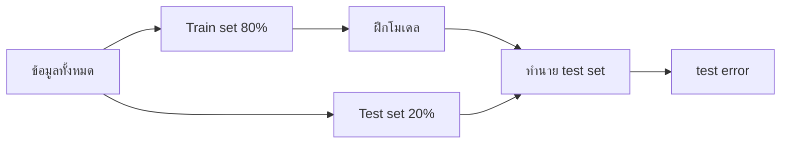
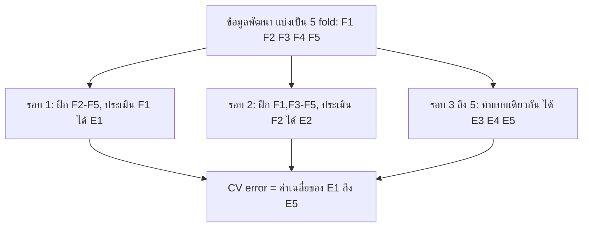
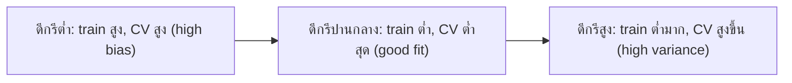
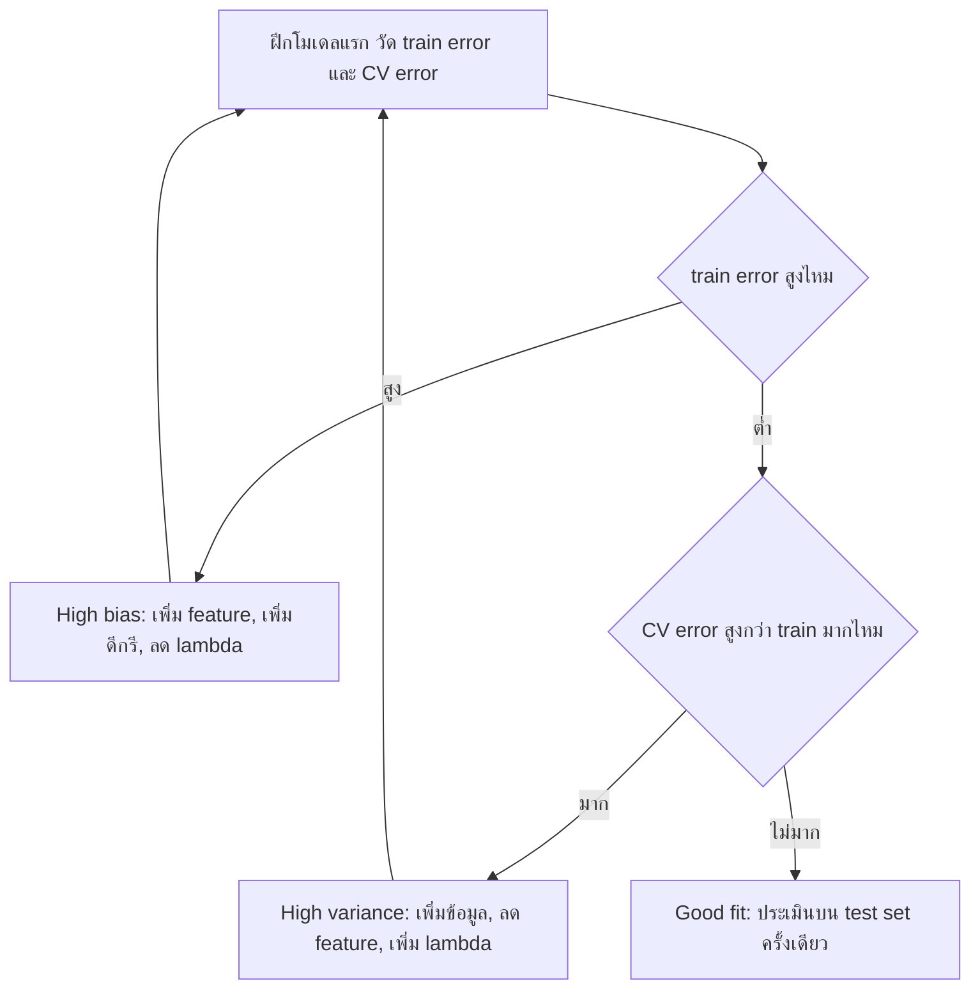

# บทที่ 7 การฝึกและประเมินโมเดล (Model Training and Evaluation)

โมเดลที่ดีไม่ใช่โมเดลที่ทำคะแนนบนข้อมูลฝึกได้สูงที่สุด แต่เป็นโมเดลที่ทำนายข้อมูลที่ไม่เคยเห็นได้ดี และถูกวัดด้วยตัวชี้วัดที่ตรงกับต้นทุนของความผิดพลาดในงานจริง บทนี้ตอบสองคำถามต่อเนื่องกัน คำถามแรกคือ **จะแบ่งข้อมูลและฝึกอย่างไรให้รู้ผลจริงของโมเดล** (hold-out, validation set, k-fold cross-validation) และใช้ผลนั้น **วินิจฉัยว่าโมเดล underfit หรือ overfit** เพื่อเลือกวิธีแก้ให้ถูกจุด (bias และ variance) คำถามที่สองคือ **จะวัดความเก่งของโมเดลจำแนกประเภทด้วยตัวเลขอะไร** (confusion matrix, accuracy, precision, recall, F1, MCC, ROC, AUC และ precision-recall curve)

**วิธีอ่าน:** บทนี้ต่อยอดจากบทที่ 3 (polynomial regression, MSE, feature scaling) บทที่ 4 (logistic regression ซึ่งให้ความน่าจะเป็นแล้วตัดด้วย threshold) และบทที่ 6 (overfitting, Ridge และค่า $\lambda$) ส่วนที่ 1 ถึง 3 คือการแบ่งข้อมูลและ cross-validation ส่วนที่ 4 ถึง 6 คือ bias, variance และการวินิจฉัย ส่วนที่ 7 ถึง 11 คือตัวชี้วัดของงานจำแนกประเภท ส่วนที่ 12 เป็นสคริปต์ Python ที่สร้างตัวเลขของการทดลองทุกตัวในบท ตัวอย่างที่เป็นตารางเล็กคำนวณด้วยมือได้ทั้งหมด และตรวจซ้ำกับสคริปต์แล้ว

---

## ส่วนที่ 0 ปูพื้นฐาน: ศัพท์ที่ต้องรู้ก่อน

| ศัพท์ที่วิชาใช้ | ศัพท์ทางการ/คำพ้อง | ความหมายสั้น |
|---|---|---|
| Train set | Training set | ข้อมูลที่ใช้หาพารามิเตอร์ $\theta$ ของโมเดล |
| Validation set | Development set, dev set | ข้อมูลที่ใช้เปรียบเทียบและเลือกโมเดลหรือ hyperparameter |
| Test set | Hold-out test set | ข้อมูลที่เก็บไว้ประเมินผลสุดท้ายครั้งเดียว ไม่ใช้ตัดสินใจใดๆ ก่อนหน้านั้น |
| Hold-out method | Train-test split, validation set approach | แบ่งข้อมูลครั้งเดียวเป็นส่วนฝึกและส่วนทดสอบ |
| Cross validation | k-fold cross-validation, CV | แบ่งข้อมูลเป็น $k$ ส่วน หมุนเวียนให้ทุกส่วนได้เป็นตัวประเมิน แล้วเฉลี่ยผล |
| Fold | ส่วนย่อยของ CV | ข้อมูลหนึ่งใน $k$ ส่วนที่แบ่งไว้ |
| Hyperparameter | Tuning parameter | ค่าที่ผู้ใช้ตั้งก่อนฝึก เช่น ดีกรีของ polynomial, $\lambda$, threshold |
| Generalization error | Test error, expected prediction error | ความคลาดเคลื่อนของโมเดลบนข้อมูลใหม่จากแหล่งเดียวกัน |
| Bias | ความเอนเอียงของโมเดล | ความผิดที่เกิดเพราะโมเดลง่ายเกินจับรูปแบบจริงไม่ได้ |
| Variance | ความแปรปรวนของโมเดล | ความอ่อนไหวของโมเดลต่อข้อมูลฝึกชุดที่ได้มา |
| Underfit / Overfit | High bias / High variance | ง่ายเกินไป / ยืดหยุ่นเกินไปจนจำ noise |
| Learning curve | — | กราฟ error เทียบกับจำนวนข้อมูลฝึก |
| Validation curve | — | กราฟ error เทียบกับค่าของ hyperparameter หนึ่งตัว |
| Positive / Negative | คลาส 1 / คลาส 0 | คลาสที่สนใจตรวจจับ (เช่น มีเนื้องอก) และคลาสที่เหลือ |
| Threshold | Decision threshold, cut-off | ค่าที่ใช้ตัดความน่าจะเป็นเป็นคลาส เช่น ทำนาย 1 เมื่อ $\hat{y}_{\mathrm{prob}} \ge 0.5$ |
| Confusion matrix | Contingency table, error matrix | ตารางนับว่าทำนายถูกและผิดแบบไหนกี่ราย |
| Recall | Sensitivity, True Positive Rate (TPR), hit rate | ในบรรดา positive จริง จับได้กี่ส่วน |
| Precision | Positive Predictive Value (PPV) | ในบรรดาที่ทำนายว่า positive ถูกจริงกี่ส่วน |
| Specificity | True Negative Rate (TNR) | ในบรรดา negative จริง ทำนายว่า negative ถูกกี่ส่วน |
| False Positive Rate (FPR) | Fall-out, $1 - \mathrm{specificity}$ | ในบรรดา negative จริง ถูกทำนายผิดเป็น positive กี่ส่วน |
| F1-Score | F-measure, $F_1$ | ค่าเฉลี่ยฮาร์มอนิกของ precision และ recall |
| MCC | Matthews Correlation Coefficient, phi coefficient | สหสัมพันธ์ระหว่างคลาสจริงกับคลาสที่ทำนาย ใช้ทั้งสี่ช่องของ confusion matrix |
| ROC | Receiver Operating Characteristic curve | กราฟ TPR เทียบกับ FPR เมื่อไล่ threshold |
| AUC | Area Under the ROC Curve, ROC AUC | พื้นที่ใต้ ROC มีค่า 0 ถึง 1 |
| PR-curve | Precision-Recall curve | กราฟ precision เทียบกับ recall เมื่อไล่ threshold |
| Imbalanced data | Class imbalance | ข้อมูลที่คลาสหนึ่งมีน้อยกว่าอีกคลาสมาก |

ข้อตกลงเรื่องสัญลักษณ์ (เหมือนบทก่อนหน้า): $N$ คือจำนวนแถว $y$ คือค่าจริง $\hat{y}$ คือค่าทำนาย ในงานจำแนกประเภท $\hat{y}_{\mathrm{prob}}$ คือความน่าจะเป็นที่โมเดลให้ว่าเป็นคลาส 1 และ $\hat{y}$ เฉยๆ คือคลาสหลังตัดด้วย threshold TP, FP, FN, TN คือจำนวนแถวในแต่ละช่องของ confusion matrix (นิยามในส่วนที่ 7)

---

## ส่วนที่ 1 ปัญหา: โมเดลไหนดีที่สุด

### 1.1 คำถามตั้งต้น

สมมติเรามีข้อมูล feature เดียว $x$ และต้องเลือกจากโมเดลสิบแบบ ตั้งแต่เส้นตรงไปจนถึง polynomial ดีกรี 10

$$h_\theta(x) = \theta_0 + \theta_1 x$$

$$h_\theta(x) = \theta_0 + \theta_1 x + \theta_2 x^2$$

$$\vdots$$

$$h_\theta(x) = \theta_0 + \theta_1 x + \theta_2 x^2 + \cdots + \theta_{10} x^{10}$$

แต่ละแบบต่างกันที่ **ดีกรี** ซึ่งเป็น hyperparameter คือผู้ใช้ต้องเลือกก่อนฝึก ส่วน $\theta$ ของแต่ละแบบหาได้จากการฝึก (normal equation หรือ gradient descent ตามบทที่ 2 และ 3) คำถามคือ จะใช้อะไรเป็นเกณฑ์เลือกดีกรี

### 1.2 ทำไมเลือกด้วย training error ไม่ได้

คำตอบแรกที่นึกถึงคือ ฝึกทุกแบบแล้วเลือกแบบที่ MSE บนข้อมูลฝึกต่ำที่สุด ปัญหาคือ **training error ลดลงเสมอเมื่อดีกรีเพิ่ม** เพราะโมเดลดีกรีสูงครอบคลุมโมเดลดีกรีต่ำทั้งหมด (ตั้ง $\theta$ ของพจน์ที่เกินเป็นศูนย์ก็ได้โมเดลดีกรีต่ำ) การฝึกจึงหาคำตอบที่ดีเท่าเดิมหรือดีกว่าได้เสมอ ถ้าเลือกด้วย training error เราจะเลือกดีกรีสูงสุดทุกครั้ง ซึ่งคือโมเดลที่ overfit (บทที่ 6 ส่วนที่ 1)

ตัวเลขจากการทดลอง: ข้อมูล 60 จุดจากเส้นโค้ง $y = \sin(1.5x) + 0.5x$ บวก noise ที่มีความแปรปรวน 0.09 กันไว้ 12 จุดเป็นข้อมูลทดสอบ ใช้ 48 จุดที่เหลือฝึก (ผลจากสคริปต์ในส่วนที่ 12)

| ดีกรี | Train MSE | CV MSE (ประมาณ error บนข้อมูลใหม่) |
|---|---|---|
| 1 | 0.2210 | 0.2505 |
| 2 | 0.1048 | 0.1314 |
| 3 | 0.0767 | 0.0911 |
| 4 | 0.0766 | 0.0933 |
| 6 | 0.0712 | **0.0875** |
| 9 | 0.0704 | 0.1121 |
| 12 | 0.0704 | 0.1629 |

คอลัมน์ Train MSE ลดลงทุกบรรทัด ส่วนคอลัมน์ขวาซึ่งประมาณ error บนข้อมูลที่โมเดลไม่เคยเห็น (วิธีคำนวณอยู่ในส่วนที่ 3) ลดลงแล้วกลับเพิ่ม เป็นรูปตัว U สิ่งที่เราต้องการคือจุดต่ำสุดของเส้นนี้ ไม่ใช่ของ training error

ดังนั้นปัญหาหลักของการเลือกโมเดลคือ **ต้องมีข้อมูลที่โมเดลไม่ได้ใช้ฝึก** เพื่อวัดผลอย่างซื่อตรง scikit-learn เรียกการเรียนพารามิเตอร์แล้วทดสอบบนข้อมูลชุดเดียวกันว่าเป็นความผิดพลาดเชิงวิธีการ เพราะโมเดลที่จำคำตอบได้ทั้งหมดจะได้คะแนนเต็มแต่ใช้งานกับข้อมูลใหม่ไม่ได้ ([scikit-learn: Cross-validation](https://scikit-learn.org/stable/modules/cross_validation.html)) วิธีจัดสรรข้อมูลมีสองแนวทางหลัก คือ hold-out (ส่วนที่ 2) และ cross-validation (ส่วนที่ 3)

### สรุปหัวข้อ

- ดีกรี, $\lambda$, threshold เป็น hyperparameter ต้องเลือกจากข้อมูลที่ไม่ได้ใช้ฝึก
- Training error ลดลงเสมอเมื่อโมเดลซับซ้อนขึ้น จึงใช้เลือกโมเดลไม่ได้
- Error บนข้อมูลใหม่เทียบกับความซับซ้อนมีรูปตัว U จุดต่ำสุดคือโมเดลที่ต้องการ

---

## ส่วนที่ 2 Hold-out Method

### 2.1 นิยามและขั้นตอน

Hold-out method คือการ **สุ่มแบ่งข้อมูลครั้งเดียว** เป็นสองส่วน สัดส่วนที่นิยมคือ **80% เป็น train set และ 20% เป็น test set**

1. สุ่มสลับลำดับแถว แล้วแบ่ง 80% แรกเป็น train set ที่เหลือเป็น test set
2. ฝึกโมเดลบน train set เท่านั้น ทุกขั้นที่ "เรียนจากข้อมูล" รวมถึงการหาค่า $\mu, \sigma$ สำหรับ standardize ต้องใช้ train set อย่างเดียว (บทที่ 3)
3. ใช้โมเดลที่ฝึกแล้วทำนาย test set แล้วคำนวณ error



วิธีอ่านแผนภาพ: ข้อมูลไหลแยกเป็นสองทางตั้งแต่ต้น test set ไม่ผ่านกล่อง "ฝึกโมเดล" เลย จึงเป็นข้อมูลใหม่จริงสำหรับโมเดล

### 2.2 ข้อดี: ง่ายและเร็ว

- **ง่าย (Simple):** มีการแบ่งครั้งเดียว ทำด้วยคำสั่งเดียว เช่น `train_test_split` และอธิบายผลให้คนทั่วไปเข้าใจได้ทันที
- **เร็ว (Fast):** ฝึกโมเดลเพียงหนึ่งครั้งต่อหนึ่งตัวเลือก เมื่อโมเดลใช้เวลาฝึกนาน (เป็นชั่วโมงหรือเป็นวัน) หรือข้อมูลใหญ่มาก วิธีนี้แทบเป็นทางเดียวที่ทำได้จริง เมื่อเทียบกับ k-fold ที่ต้องฝึก $k$ ครั้ง

### 2.3 ข้อเสีย: ผลขึ้นกับการสุ่มแบ่ง และเสี่ยง overfit ต่อ test set

ข้อเสียของ hold-out มาจากการที่ทุกอย่างขึ้นกับ **การแบ่งเพียงครั้งเดียว**

**ข้อ 1 ผลประเมินแกว่งตามการสุ่ม (variance ของการประเมินสูง):** test set 20% ของข้อมูลชุดเล็กมีไม่กี่แถว ถ้าบังเอิญได้แถวที่ง่าย error จะต่ำเกินจริง ได้แถวที่ยาก error จะสูงเกินจริง ทดลองกับข้อมูล 60 จุดข้างต้น ใช้ polynomial ดีกรี 3 เหมือนกันทุกครั้ง เปลี่ยนแค่การสุ่มแบ่ง 80/20

| การสุ่มแบ่งครั้งที่ | Test MSE |
|---|---|
| 1 | 0.0725 |
| 2 | 0.1382 |
| 3 | 0.0879 |
| 4 | 0.0457 |
| 5 | 0.0508 |

โมเดลเดียวกัน ข้อมูลชุดเดียวกัน แต่ผลต่างกันถึงสามเท่า (0.0457 ถึง 0.1382) ถ้าใช้ผลครั้งเดียวเปรียบเทียบสองโมเดล ความต่างที่เห็นอาจมาจากโชคของการแบ่ง ไม่ใช่จากความเก่งของโมเดล Raschka (2018) ชี้ว่าการประเมินแบบ hold-out ไม่แนะนำสำหรับข้อมูลขนาดเล็กด้วยเหตุนี้ ([Raschka, 2018](https://arxiv.org/abs/1811.12808))

**ข้อ 2 การประเมินมีความเอนเอียงไปทางแย่ (pessimistic bias):** โมเดลถูกฝึกด้วยข้อมูลเพียง 80% ขณะที่โมเดลที่จะใช้จริงสามารถฝึกด้วยข้อมูลทั้งหมด ผลที่วัดได้จึงมักแย่กว่าความสามารถของโมเดลสุดท้ายเล็กน้อย ยิ่งข้อมูลน้อยยิ่งเห็นผลชัด ([Raschka, 2018](https://arxiv.org/abs/1811.12808))

**ข้อ 3 Overfitting ต่อ test set เมื่อใช้มันเลือกโมเดล:** นี่คือความหมายที่สำคัญที่สุดของคำว่า "ข้อเสียคือ overfitting" ในบริบทของ hold-out ถ้ามีแค่ train และ test แล้วเราลองดีกรี 1 ถึง 10 แล้ว **เลือกดีกรีที่ test error ต่ำสุด** test set ก็ได้ถูกใช้ "ฝึก" hyperparameter ไปแล้ว ดีกรีที่เลือกได้คือดีกรีที่บังเอิญเข้ากับ 20% ชุดนั้นที่สุด test error ของโมเดลที่ถูกเลือกจึงต่ำเกินจริง และไม่มีข้อมูลใหม่เหลือให้วัดผลซื่อตรงอีกแล้ว ยิ่งลองหลายตัวเลือกยิ่งเสี่ยงมาก ([scikit-learn: Cross-validation](https://scikit-learn.org/stable/modules/cross_validation.html))

ข้อควรระวัง: hold-out เองไม่ได้ทำให้ **โมเดล** overfit ข้อมูลฝึก (นั่นขึ้นกับความซับซ้อนของโมเดล) สิ่งที่ overfit คือ **การตัดสินใจเลือกโมเดล** ที่ไปพึ่ง test set ชุดเดียว และผลประเมินที่แกว่งตามการแบ่ง ถ้าข้อสอบถามข้อเสียของ hold-out ตามศัพท์ของวิชา ให้ตอบว่า overfitting พร้อมอธิบายกลไกนี้

### 2.4 เมื่อไรใช้ hold-out ได้ดี

| สถานการณ์ | ใช้ hold-out ได้ไหม | เหตุผล |
|---|---|---|
| ข้อมูลหลายแสนแถวขึ้นไป | ได้ดี | test set 20% มีขนาดใหญ่พอ ผลไม่แกว่งมาก |
| โมเดลฝึกนานมาก (เช่น deep learning) | ได้ดี | ฝึกหลายรอบแบบ k-fold ไม่คุ้มเวลา |
| ข้อมูลไม่กี่ร้อยแถว | ไม่ควร | ผลแกว่งตามการแบ่ง ใช้ k-fold แทน |
| ต้องเลือก hyperparameter | ต้องมี validation set แยก หรือใช้ CV | กัน overfit ต่อ test set (ส่วนที่ 3) |
| ข้อมูลอนุกรมเวลา เช่น ยอดเบิกรายเดือน | แบ่งตามเวลา ไม่สุ่ม | ต้องฝึกด้วยอดีตทดสอบด้วยอนาคต ไม่ให้ข้อมูลอนาคตรั่วเข้าการฝึก |

ข้อควรระวังเรื่องคลาสไม่สมดุล: ถ้าคลาส positive มีน้อย (เช่น 2%) การสุ่มแบ่งอาจได้ test set ที่แทบไม่มี positive ให้ใช้การแบ่งแบบ **stratified** คือรักษาสัดส่วนคลาสในแต่ละส่วนให้เท่ากับข้อมูลทั้งหมด (`train_test_split(..., stratify=y)`) ([scikit-learn: Cross-validation](https://scikit-learn.org/stable/modules/cross_validation.html))

### สรุปหัวข้อ

- Hold-out: แบ่งครั้งเดียว 80% train / 20% test ข้อดีคือง่ายและเร็ว
- ข้อเสีย: ผลแกว่งตามการสุ่มแบ่ง, ประเมินแย่กว่าจริงเล็กน้อย, และถ้าใช้ test set เลือกโมเดลจะ overfit ต่อ test set
- เหมาะกับข้อมูลใหญ่หรือโมเดลที่ฝึกนาน

---

## ส่วนที่ 3 Validation Set และ Cross Validation

### 3.1 แยกหน้าที่: เลือกโมเดล กับ ประเมินโมเดล

ปัญหาข้อ 3 ของ hold-out แก้ได้ด้วยการแยกหน้าที่ของข้อมูลเป็นสามส่วน สัดส่วนที่นิยมคือ

| ส่วน | สัดส่วน | หน้าที่ |
|---|---|---|
| Training set | 60% | หา $\theta$ ของแต่ละตัวเลือก |
| Validation set | 20% | เปรียบเทียบตัวเลือก (ดีกรี, $\lambda$) แล้วเลือกตัวที่ดีที่สุด |
| Test set | 20% | ประเมินโมเดลที่เลือกแล้ว **ครั้งเดียว** เพื่อรายงานผล |

ขั้นตอน

1. ฝึกทุกตัวเลือกบน training set
2. คำนวณ error ของแต่ละตัวเลือกบน validation set แล้วเลือกตัวที่ validation error ต่ำสุด
3. (นิยม) ฝึกตัวที่เลือกใหม่ด้วย training + validation รวมกัน
4. วัดผลบน test set ครั้งเดียว ตัวเลขนี้คือสิ่งที่รายงาน

เพราะ test set ไม่เคยถูกใช้ตัดสินใจ ตัวเลขในขั้น 4 จึงเป็นการประมาณ error บนข้อมูลใหม่ที่ซื่อตรง ส่วน validation error ของตัวที่ถูกเลือกจะต่ำเกินจริงเล็กน้อย (ด้วยเหตุผลเดียวกับข้อ 3 ของ hold-out) ซึ่งเป็นสิ่งที่ยอมรับได้เพราะเราไม่ได้รายงานมัน

การแบ่งแบบนี้ (เรียกว่า three-way hold-out หรือ validation set approach) แก้ปัญหาการ overfit ต่อ test set ได้ แต่ยังเหลือปัญหาว่า **ข้อมูลที่ใช้ฝึกลดเหลือ 60%** และ **ผลยังขึ้นกับการสุ่มแบ่งครั้งเดียว** ของ training/validation ([scikit-learn: Cross-validation](https://scikit-learn.org/stable/modules/cross_validation.html)) ซึ่งเป็นแรงจูงใจของ k-fold cross-validation

### 3.2 k-fold Cross-Validation

ภาพในหัว: แทนที่จะให้ข้อมูลส่วนหนึ่งเป็นตัวประเมินถาวร ให้ **ทุกส่วนผลัดกันเป็นตัวประเมิน** แล้วเฉลี่ยผล คล้ายการสอบหลายครั้งด้วยข้อสอบคนละชุดแล้วเอาคะแนนเฉลี่ย ซึ่งน่าเชื่อกว่าสอบครั้งเดียว (อุปมานี้ผิดตรงที่ในการสอบจริงนักเรียนคนเดิมสอบทุกครั้ง แต่ใน CV แต่ละรอบเป็นโมเดลที่ฝึกใหม่บนข้อมูลคนละชุด)

ขั้นตอน (เริ่มหลังจากกัน test set ออกไปแล้ว ข้อมูลที่เหลือเรียกว่าข้อมูลพัฒนา)

1. สุ่มแบ่งข้อมูลพัฒนาเป็น $k$ ส่วนขนาดใกล้กัน เรียกว่า fold (นิยม $k = 5$ หรือ $10$)
2. รอบที่ $i$ ($i = 1, \ldots, k$): ใช้ fold ที่ $i$ เป็น validation ใช้อีก $k - 1$ fold ฝึก แล้วจด validation error $E_i$
3. CV error คือค่าเฉลี่ย

$$\mathrm{CV}_{(k)} = \frac{1}{k}\sum_{i=1}^{k} E_i$$

4. ทำข้อ 2 ถึง 3 กับทุกตัวเลือก (ทุกดีกรีหรือทุก $\lambda$) แล้วเลือกตัวที่ $\mathrm{CV}_{(k)}$ ต่ำสุด
5. ฝึกตัวที่เลือกใหม่บนข้อมูลพัฒนาทั้งหมด แล้วประเมินบน test set ครั้งเดียว



วิธีอ่านแผนภาพ: ทุกแถวของข้อมูลพัฒนาถูกใช้ประเมิน **หนึ่งครั้งพอดี** และถูกใช้ฝึก $k - 1$ ครั้ง แต่ละรอบเป็นโมเดลใหม่ที่ฝึกจากศูนย์ และไม่มีรอบไหนประเมินบนแถวที่ตัวเองใช้ฝึก

scikit-learn รายงานผลของ CV เป็นค่าเฉลี่ยของทุก fold และนิยมรายงานส่วนเบี่ยงเบนมาตรฐานคู่กันเพื่อบอกความแกว่ง ([scikit-learn: Cross-validation](https://scikit-learn.org/stable/modules/cross_validation.html))

### 3.3 Worked example: 5-fold CV เทียบกับ hold-out

ข้อมูล 60 จุดชุดเดียวกับข้อ 2.3 ดีกรี 3 เหมือนเดิม ทำ 5-fold CV ได้ error รายรอบ

| Fold | 1 | 2 | 3 | 4 | 5 |
|---|---|---|---|---|---|
| Validation MSE | 0.0725 | 0.1300 | 0.1096 | 0.0974 | 0.1356 |

$$\mathrm{CV}_{(5)} = \frac{0.0725 + 0.1300 + 0.1096 + 0.0974 + 0.1356}{5} = \frac{0.5451}{5} \approx 0.109$$

ส่วนเบี่ยงเบนมาตรฐานของห้าค่าคือ 0.023

ตีความ

1. ค่ารายรอบแกว่งในช่วงเดียวกับ hold-out (0.07 ถึง 0.14) เพราะแต่ละรอบก็คือ hold-out หนึ่งครั้ง
2. แต่ค่าเฉลี่ยของห้ารอบแกว่งน้อยกว่าค่าเดี่ยวมาก เพราะการเฉลี่ยหักล้างโชคดีและโชคร้ายของแต่ละรอบ และทุกแถวได้เป็นตัวประเมิน ถ้าสุ่มแบ่ง fold ใหม่ ค่าเฉลี่ยจะเปลี่ยนไม่มาก
3. ตัวเลขชุดนี้ทำให้รู้ทั้ง "ระดับ" ของ error (ประมาณ 0.11) และ "ความไม่แน่นอน" (ประมาณ $\pm 0.02$ ต่อรอบ) ซึ่ง hold-out ครั้งเดียวบอกไม่ได้

### 3.4 ข้อดีและข้อเสียของ cross validation

**ข้อดี: variance ลดลง** ในบริบทของวิชา คำว่า "variance (overfitting) is reduced" มีความหมายสองชั้นที่ควรแยกให้ชัด

1. **Variance ของการประเมินลดลง:** ผล CV ซึ่งเป็นค่าเฉลี่ยของ $k$ รอบ แกว่งตามการสุ่มแบ่งน้อยกว่า hold-out ครั้งเดียว การเปรียบเทียบโมเดลจึงน่าเชื่อถือกว่า
2. **ความเสี่ยงที่จะเลือกโมเดลที่ overfit ลดลง:** เมื่อการประเมินเชื่อถือได้ ตัวเลือกที่ดูดีเพียงเพราะโชค (เช่น ดีกรีสูงที่บังเอิญเข้ากับ validation ชุดเดียว) จะถูกเลือกน้อยลง และเพราะ test set ถูกกันไว้ จึงไม่ overfit ต่อ test set

ข้อควรระวัง: CV ไม่ได้ทำให้โมเดลตัวใดตัวหนึ่ง "overfit น้อยลง" โดยตรง โมเดลดีกรี 12 ก็ยัง overfit เท่าเดิม CV แค่ **ตรวจพบ** และทำให้เราไม่เลือกมัน ส่วนการลด overfitting ของตัวโมเดลทำด้วยวิธีในส่วนที่ 6 เช่น regularization

นอกจากนี้ CV **ใช้ข้อมูลคุ้มกว่า** เพราะทุกแถวได้ทั้งฝึกและประเมิน และแต่ละรอบฝึกด้วย $(k-1)/k$ ของข้อมูลพัฒนา (80% เมื่อ $k = 5$) มากกว่า 60% ของการแบ่งสามส่วน

**ข้อเสีย: ช้า** ต้องฝึก $k$ ครั้งต่อหนึ่งตัวเลือก ถ้าลองดีกรี 10 แบบด้วย 10-fold ต้องฝึก 100 ครั้ง (บวกอีกหนึ่งครั้งสำหรับโมเดลสุดท้าย) ขณะที่ hold-out ฝึก 10 ครั้ง

**การเลือก $k$:** $k$ ใหญ่ทำให้แต่ละรอบฝึกด้วยข้อมูลมากขึ้น (ประเมินแย่กว่าจริงน้อยลง) แต่ช้าขึ้น กรณีสุดโต่ง $k = N$ เรียกว่า leave-one-out (LOO) เอกสาร scikit-learn ระบุว่างานส่วนใหญ่และหลักฐานเชิงประจักษ์สนับสนุน 5-fold หรือ 10-fold มากกว่า LOO ([scikit-learn: Cross-validation](https://scikit-learn.org/stable/modules/cross_validation.html); [Raschka, 2018](https://arxiv.org/abs/1811.12808))

### 3.5 กติกาสำคัญ: preprocessing ต้องอยู่ในแต่ละ fold

ทุกขั้นที่เรียนจากข้อมูล (standardize, การเลือก feature, การเติมค่าว่างด้วยค่าเฉลี่ย) ต้องเรียนจาก **ส่วนฝึกของแต่ละรอบเท่านั้น** ถ้า standardize ทั้งชุดก่อนแบ่ง fold ค่า $\mu, \sigma$ จะมีข้อมูลของ validation fold ปนอยู่ (data leakage) ผล CV จะดีเกินจริง วิธีที่ถูกคือร้อย preprocessing กับโมเดลเป็น `Pipeline` แล้วส่งทั้ง pipeline เข้า CV ([scikit-learn: Cross-validation](https://scikit-learn.org/stable/modules/cross_validation.html))

### 3.6 Worked example: เลือกดีกรีด้วย CV แล้วประเมินครั้งเดียว

ตารางในข้อ 1.2 คือผลของขั้นตอนนี้ (5-fold บนข้อมูลพัฒนา 48 แถว กันข้อมูลทดสอบ 12 แถว)

1. CV MSE ต่ำสุดที่ดีกรี 6 (0.0875) ตามมาติดๆ ด้วยดีกรี 3 (0.0911) และ 4 (0.0933)
2. เลือกดีกรี 6 ฝึกใหม่บน 48 แถว แล้ววัดบนข้อมูลทดสอบ 12 แถวครั้งเดียว ได้ test MSE 0.1510

ตีความ: test MSE (0.1510) สูงกว่า CV MSE (0.0875) ด้วยสองเหตุผล เหตุแรก CV error ของตัวที่ถูกเลือกต่ำเกินจริงเล็กน้อยเพราะเราเลือกตัวที่ดีที่สุดจากหลายตัว เหตุที่สอง test set มีแค่ 12 แถว ผลจึงแกว่งมากแบบเดียวกับข้อ 2.3 ตัวเลข 0.1510 คือสิ่งที่ต้องรายงานตามจริง **ห้ามย้อนกลับไปเปลี่ยนดีกรีตามผลทดสอบ** เพราะจะเท่ากับใช้ test set เลือกโมเดล

ข้อสังเกตเชิงปฏิบัติ: เมื่อ CV error ของหลายตัวเลือกห่างกันน้อยกว่าความแกว่งของมันเอง (ในที่นี้ 0.0875 กับ 0.0911 ต่างกัน 0.004 ขณะที่ส่วนเบี่ยงเบนรายรอบประมาณ 0.02) การเลือกตัวที่ง่ายกว่า (ดีกรี 3) เป็นทางเลือกที่สมเหตุสมผล เพราะผลไม่ต่างกันอย่างมีนัย และโมเดลง่ายมีความเสี่ยงน้อยกว่า แนวคิดนี้เรียกว่า one-standard-error rule ([James et al., 2023](https://www.statlearning.com/))

### สรุปหัวข้อ

- แบ่งสามส่วน 60/20/20: train หา $\theta$, validation เลือกโมเดล, test ประเมินครั้งเดียว
- k-fold CV: ทุก fold ผลัดกันเป็น validation, $\mathrm{CV}_{(k)} = \frac{1}{k}\sum E_i$, นิยม $k = 5$ หรือ $10$
- ข้อดี: การประเมินแกว่งน้อยลง (variance ลด), ลดโอกาสเลือกโมเดลที่ overfit, ใช้ข้อมูลคุ้ม ข้อเสีย: ช้า ฝึก $k$ เท่า
- preprocessing ต้องอยู่ใน pipeline เพื่อไม่ให้ข้อมูล validation รั่ว และใช้ test set ครั้งเดียวตอนท้าย

---

## ส่วนที่ 4 Bias และ Variance

### 4.1 สองแหล่งของความผิดพลาด

ในบทที่ 6 เราเห็นอาการของ underfit และ overfit จาก training error และ test error ส่วนนี้ให้ชื่อกับ **ต้นเหตุ** ของสองอาการนั้น

ลองนึกการทดลองในความคิด: สมมติเราเก็บข้อมูลฝึกชุดใหม่จากแหล่งเดิมได้หลายร้อยครั้ง (แต่ละชุดมี noise คนละแบบ) แล้วฝึกโมเดลแบบเดียวกันบนทุกชุด จะได้โมเดลหลายร้อยตัว จากนั้นดูการทำนายที่จุด $x$ จุดหนึ่ง

- **Bias** คือ ค่าเฉลี่ยของคำทำนายจากโมเดลทุกตัว ห่างจากค่าจริงแค่ไหน ถ้าโมเดลเป็นเส้นตรงแต่ความจริงเป็นเส้นโค้ง ต่อให้ฝึกกี่ชุด เส้นตรงก็โค้งตามไม่ได้ ค่าเฉลี่ยจึงผิดอย่างเป็นระบบ นี่คือ bias สูง
- **Variance** คือ คำทำนายจากโมเดลแต่ละตัวกระจายรอบค่าเฉลี่ยของตัวเองมากแค่ไหน ถ้าโมเดลเป็น polynomial ดีกรี 12 แต่ละตัวจะไล่ตาม noise ของชุดตัวเอง รูปร่างเส้นจึงต่างกันมากในแต่ละชุด นี่คือ variance สูง

อุปมาที่ใช้กันมากคือการยิงเป้า: bias คือกลุ่มกระสุนเยื้องจากกลางเป้าไปทางเดียวกัน (ศูนย์เล็งเพี้ยน) variance คือกระสุนกระจายกว้าง (มือสั่น) จับคู่กับศัพท์จริง: กระสุนแต่ละนัดคือโมเดลที่ฝึกจากข้อมูลคนละชุด กลางเป้าคือค่าจริง อุปมานี้ผิดตรงที่ในงานจริงเรามีข้อมูลฝึกชุดเดียว จึงเห็นกระสุนนัดเดียว ต้องอนุมาน bias และ variance จาก training error และ validation error (ส่วนที่ 5)

### 4.2 การแยกส่วนของ error

สำหรับ regression ที่ใช้ MSE error ที่คาดหวังบนข้อมูลใหม่ที่จุด $x$ แยกได้เป็นสามส่วน ([James et al., 2023](https://www.statlearning.com/))

$$\mathrm{E}[(y - \hat{h}(x))^2] = \mathrm{Bias}[\hat{h}(x)]^2 + \mathrm{Var}[\hat{h}(x)] + \sigma^2$$

- $\hat{h}(x)$ คือคำทำนายของโมเดลที่ฝึกแล้ว ซึ่งเปลี่ยนไปตามชุดข้อมูลฝึกที่สุ่มได้ ค่าคาดหวัง $\mathrm{E}$ คือเฉลี่ยข้ามชุดข้อมูลฝึกทั้งหมดที่เป็นไปได้และข้าม noise ของ $y$
- $\mathrm{Bias}[\hat{h}(x)] = \mathrm{E}[\hat{h}(x)] - f(x)$ เมื่อ $f(x)$ คือค่าจริงที่ไม่มี noise
- $\mathrm{Var}[\hat{h}(x)] = \mathrm{E}[(\hat{h}(x) - \mathrm{E}[\hat{h}(x)])^2]$
- $\sigma^2$ คือความแปรปรวนของ noise ใน $y$ (irreducible error) ไม่มีโมเดลไหนลดได้ เพราะเป็นความสุ่มของข้อมูลเอง

สัญชาตญาณของสูตร: ทั้งสามพจน์เป็นบวกเสมอ error บนข้อมูลใหม่จึงไม่มีทางต่ำกว่า $\sigma^2$ และการลดพจน์หนึ่งมักทำให้อีกพจน์เพิ่ม โมเดลง่ายมี bias สูง variance ต่ำ โมเดลซับซ้อนมี bias ต่ำ variance สูง จุดที่ผลรวมต่ำสุดคือ good fit ซึ่งเรียกการแลกเปลี่ยนนี้ว่า **bias-variance trade-off**

ตัวอย่างตัวเลข: ในข้อมูลของบทนี้ noise มี $\sigma^2 = 0.09$ ดังนั้น MSE บนข้อมูลใหม่ของโมเดลใดๆ จะไม่ต่ำกว่าประมาณ 0.09 ซึ่งตรงกับตาราง CV ในข้อ 1.2 ที่ค่าต่ำสุดคือ 0.0875 (ต่ำกว่า 0.09 เล็กน้อยได้เพราะเป็นค่าประมาณจากข้อมูลจำกัด) แปลว่าดีกรี 3 ถึง 6 ทำได้ใกล้ขีดจำกัดแล้ว เหลือ bias และ variance น้อยมาก

### 4.3 สามสภาพของโมเดล

| สภาพ | ต้นเหตุ | ตัวอย่างโมเดล | Training error | Validation/Test error |
|---|---|---|---|---|
| Underfit | High bias | $\theta_0 + \theta_1 x$ เมื่อความจริงโค้ง | สูง | สูง ใกล้กับ training |
| Good fit | สมดุล | $\theta_0 + \theta_1 x + \theta_2 x^2$ เมื่อความจริงโค้งพอประมาณ | ต่ำ | ต่ำ ใกล้กับ training |
| Overfit | High variance | $\theta_0 + \theta_1 x + \theta_2 x^2 + \theta_3 x^3 + \theta_4 x^4$ เมื่อข้อมูลน้อย | ต่ำมาก | สูงกว่า training มาก |

ข้อควรระวัง: ดีกรีในตารางเป็นเพียงตัวอย่าง ดีกรีที่ "พอดี" ขึ้นกับรูปแบบจริงของข้อมูลและจำนวนข้อมูล ในการทดลองของบทนี้ดีกรี 3 ถึง 6 พอดี และดีกรี 4 ไม่ได้ overfit เพราะมีข้อมูล 48 แถว ดีกรีเดียวกันอาจ overfit ถ้ามีข้อมูลแค่ 6 แถว ในข้อสอบที่ใช้ตัวอย่างตามตาราง ให้ตอบตามตาราง

### สรุปหัวข้อ

- Bias = ผิดอย่างเป็นระบบเพราะโมเดลง่ายเกิน, Variance = ผลเปลี่ยนมากตามชุดข้อมูลฝึกเพราะโมเดลยืดหยุ่นเกิน
- Error บนข้อมูลใหม่ = $\mathrm{Bias}^2 + \mathrm{Variance} + \sigma^2$ โดย $\sigma^2$ ลดไม่ได้
- Underfit = high bias, overfit = high variance, good fit = ผลรวมต่ำสุด

---

## ส่วนที่ 5 การวินิจฉัย Bias และ Variance

เราไม่เห็น bias และ variance โดยตรง แต่ดูได้จาก **training error** เทียบกับ **validation error** (หรือ CV error) เมื่อเปลี่ยนสิ่งใดสิ่งหนึ่ง สามสิ่งที่วิชานี้ใช้คือ ดีกรีของ polynomial, ค่า $\lambda$ และจำนวนข้อมูลฝึก กราฟที่ใช้ดู error เทียบกับ hyperparameter เรียกว่า **validation curve** และกราฟเทียบกับจำนวนข้อมูลเรียกว่า **learning curve** ([scikit-learn: Validation curves and learning curves](https://scikit-learn.org/stable/modules/learning_curve.html))

### 5.1 วินิจฉัยด้วยดีกรีของ polynomial

กลับไปที่ตารางข้อ 1.2 แล้วอ่านตามแนวของ bias และ variance

| ช่วงดีกรี | Training error | CV error | ช่องว่าง (CV ลบ train) | การวินิจฉัย |
|---|---|---|---|---|
| ต่ำ (1) | 0.2210 สูง | 0.2505 สูง | 0.03 แคบ | Underfitting, high bias |
| ปานกลาง (3 ถึง 6) | ประมาณ 0.07 ถึง 0.08 | ประมาณ 0.09 ต่ำสุด | ประมาณ 0.015 | Good fit |
| สูง (12) | 0.0704 ต่ำ | 0.1629 สูง | 0.09 กว้าง | Overfitting, high variance |

กฎการอ่าน

1. ถ้า **training error สูง** แปลว่าโมเดลจับรูปแบบในข้อมูลฝึกเองยังไม่ได้ ต้นเหตุคือ bias
2. ถ้า **training error ต่ำ แต่ validation error สูงกว่ามาก** (ช่องว่างกว้าง) แปลว่าโมเดลเรียนสิ่งที่ใช้ได้เฉพาะข้อมูลฝึก ต้นเหตุคือ variance
3. ถ้า **ทั้งสองต่ำและใกล้กัน** (และใกล้ระดับ noise) คือ good fit



วิธีอ่านแผนภาพ: ลูกศรคือการเพิ่มดีกรี training error ลดลงตลอดทาง ส่วน CV error ลดลงในช่วงแรกแล้วเพิ่มขึ้น จุดกลางคือจุดที่เลือก

### 5.2 วินิจฉัยด้วย $\lambda$ ของ Ridge

จากบทที่ 6 cost function ของ Ridge คือ

$$J(\theta) = \frac{1}{N}\sum_{i=1}^{N}(h_\theta(x_i) - y_i)^2 + \lambda\sum_{j=1}^{d}\theta_j^2$$

$\lambda$ ทำงานในทิศตรงข้ามกับดีกรี: $\lambda$ ใหญ่บังคับ $\theta_j$ ให้เล็ก โมเดลจึงเรียบง่ายลง

- **เพิ่ม $\lambda$:** variance ลดลง แต่ bias เพิ่มขึ้น
- **ลด $\lambda$:** bias ลดลง แต่ variance เพิ่มขึ้น

ผลการทดลอง: polynomial ดีกรี 12 (ซึ่งไม่มี regularization แล้ว overfit) บนข้อมูลพัฒนา 48 แถว เติม Ridge ด้วย `alpha` ต่างๆ (`alpha` ของ scikit-learn เท่ากับ $N\lambda$ ของวิชา ตามบทที่ 6 ข้อ 4.4 ทิศทางของผลเหมือนกัน)

| `alpha` | Train MSE | CV MSE | การวินิจฉัย |
|---|---|---|---|
| 0.000001 | 0.0707 | 0.1189 | ปรับน้อยไป ยังมี variance สูง |
| 0.0001 | 0.0709 | 0.1005 | ดีขึ้น |
| 0.01 | 0.0755 | **0.0962** | จุดที่ดีที่สุด |
| 1 | 0.1006 | 0.1287 | เริ่ม underfit |
| 100 | 0.2109 | 0.2371 | high bias ชัดเจน |

ตีความ: training error เพิ่มขึ้นทุกครั้งที่เพิ่ม `alpha` (เพราะค่าปรับดึงออกจากคำตอบที่เข้ากับข้อมูลฝึกที่สุด) ส่วน CV error เป็นรูปตัว U กลับด้านจากกราฟของดีกรี: ด้านซ้าย ($\lambda$ เล็ก) คือ high variance ด้านขวา ($\lambda$ ใหญ่) คือ high bias การเลือก $\lambda$ จึงใช้ขั้นตอนเดียวกับการเลือกดีกรี คือไล่ค่าแบบลอการิทึมแล้วเลือกค่าที่ CV error ต่ำสุด

| สิ่งที่ปรับ | ไปทาง high bias (underfit) | ไปทาง high variance (overfit) |
|---|---|---|
| ดีกรีของ polynomial | ลดดีกรี | เพิ่มดีกรี |
| $\lambda$ ของ Ridge | เพิ่ม $\lambda$ | ลด $\lambda$ |

### 5.3 วินิจฉัยด้วยจำนวนข้อมูลฝึก: learning curve

**วิธีสร้าง:** ฝึกโมเดลแบบเดียวกันด้วยข้อมูลฝึก $n$ แถว โดยไล่ $n$ จากน้อยไปมาก ทุกค่า $n$ วัด training error (บน $n$ แถวที่ใช้ฝึก) และ validation error (บนข้อมูลที่ไม่ได้ใช้ฝึก) แล้ววาดทั้งสองเส้นเทียบกับ $n$

**ทำไมสองเส้นวิ่งเข้าหากัน:** เมื่อ $n$ น้อย โมเดลไล่ตามไม่กี่จุดได้ง่าย training error ต่ำ แต่สิ่งที่เรียนไม่ทั่วไป validation error สูง เมื่อ $n$ มากขึ้น การไล่ตามทุกจุดยากขึ้น training error จึง **เพิ่มขึ้น** ขณะที่สิ่งที่เรียนทั่วไปขึ้น validation error **ลดลง** ทั้งสองเส้นเข้าหาระดับเดียวกัน

ผลการทดลอง: ข้อมูล 400 จุดจากแหล่งเดิม ($\sigma^2 = 0.09$) 5-fold CV

| $n$ | ดีกรี 1: train | ดีกรี 1: validation | ดีกรี 12: train | ดีกรี 12: validation |
|---|---|---|---|---|
| 15 | 0.3199 | 0.3190 | 0.0434 | 0.6691 |
| 40 | 0.2544 | 0.3173 | 0.0552 | 0.1137 |
| 100 | 0.2880 | 0.3034 | 0.0673 | 0.1012 |
| 200 | 0.3174 | 0.3029 | 0.0905 | 0.0975 |
| 320 | 0.3005 | 0.3024 | 0.0874 | 0.0940 |

ตีความ

1. **ดีกรี 1 (high bias):** ทั้งสองเส้นอยู่ที่ประมาณ 0.30 ตั้งแต่ข้อมูลน้อย และไม่ลดลงแม้เพิ่มเป็น 320 แถว ระดับ 0.30 สูงกว่า noise (0.09) มาก เพราะเส้นตรงจับความโค้งไม่ได้ ช่องว่างแคบตลอด **การเพิ่มข้อมูลไม่ช่วย** (ค่า training ที่ขึ้นลงเล็กน้อยระหว่างแถวมาจากการสุ่มของข้อมูลชุดเล็ก ไม่ใช่แนวโน้ม)
2. **ดีกรี 12 (high variance เมื่อข้อมูลน้อย):** ที่ $n = 15$ ช่องว่างกว้างมาก (0.04 กับ 0.67) เมื่อ $n$ เพิ่ม validation error ลดลงอย่างรวดเร็ว และ training error เพิ่มขึ้น จนที่ $n = 320$ ทั้งสองเส้นอยู่ใกล้ 0.09 ซึ่งคือระดับ noise **การเพิ่มข้อมูลช่วยมาก**

สรุปเป็นกฎ: **การเพิ่มข้อมูลฝึกลด variance แต่ไม่ลด bias** เพราะ variance มาจากการที่โมเดลมีอิสระมากเกินเมื่อเทียบกับข้อมูล (ข้อมูลมากขึ้นตรึงโมเดลไว้) ส่วน bias มาจากรูปร่างของโมเดลเอง ข้อมูลมากเท่าไรเส้นตรงก็ยังเป็นเส้นตรง ([scikit-learn: Validation curves and learning curves](https://scikit-learn.org/stable/modules/learning_curve.html))

| รูปของ learning curve | การวินิจฉัย | เพิ่มข้อมูลช่วยไหม |
|---|---|---|
| สองเส้นบรรจบกันเร็วที่ระดับสูง ช่องว่างแคบ | High bias | ไม่ช่วย |
| ช่องว่างกว้าง validation ยังลดลงอยู่เมื่อเพิ่ม $n$ | High variance | ช่วย |
| สองเส้นบรรจบกันที่ระดับต่ำใกล้ noise | Good fit | ช่วยไม่มากแล้ว |

ความหมายในงานจริง: ก่อนลงทุนเก็บข้อมูลเพิ่ม (ซึ่งมักแพงและช้า เช่น ขอดึงข้อมูลย้อนหลังจากหลายระบบ) ให้วาด learning curve ก่อน ถ้าเป็น high bias การเก็บข้อมูลเพิ่มคือการเสียเวลา ต้องเปลี่ยนโมเดลหรือเพิ่ม feature แทน

### สรุปหัวข้อ

- Train สูง + validation สูง ช่องว่างแคบ = high bias, train ต่ำ + validation สูงกว่ามาก = high variance
- เพิ่มดีกรีหรือลด $\lambda$ = ลด bias เพิ่ม variance, ลดดีกรีหรือเพิ่ม $\lambda$ = ลด variance เพิ่ม bias
- Learning curve: เพิ่มข้อมูลฝึกลด variance แต่ไม่ลด bias

---

## ส่วนที่ 6 เลือกวิธีแก้ให้ตรงกับปัญหา

### 6.1 หกทางเลือกและปัญหาที่แต่ละทางแก้

เมื่อโมเดลทำนายข้อมูลใหม่ได้ไม่ดี มีทางเลือกที่มักลองหกทาง ข้อสำคัญคือ **แต่ละทางแก้ได้เพียงปัญหาเดียว** ถ้าวินิจฉัยผิดแล้วเลือกทางผิด จะเสียเวลาเปล่าหรือทำให้แย่ลง

| ทางเลือก | แก้ปัญหา | กลไก |
|---|---|---|
| เพิ่มข้อมูลฝึก (get more training data) | High variance | ข้อมูลมากขึ้นตรึงโมเดลไม่ให้ไล่ตาม noise ของจุดไม่กี่จุด (ข้อ 5.3) |
| ใช้ feature น้อยลง (smaller sets of features) | High variance | ลดอิสระของโมเดล จำนวน $\theta$ ที่ต้องประมาณลดลง |
| เพิ่ม feature ใหม่ (additional features) | High bias | ให้ข้อมูลที่โมเดลขาดอยู่ เช่น ทำนายยอดเบิกโดยเพิ่มจำนวนเตียงที่เปิดใช้ |
| เพิ่ม polynomial features ($x^2$, $x_1 x_2$) | High bias | ให้โมเดลโค้งได้ จับความสัมพันธ์ไม่เป็นเส้นตรง |
| ลด $\lambda$ (Ridge penalty) | High bias | ปล่อยให้ $\theta$ มีขนาดได้มากขึ้น โมเดลยืดหยุ่นขึ้น |
| เพิ่ม $\lambda$ (Ridge penalty) | High variance | บังคับ $\theta$ ให้เล็ก โมเดลเรียบขึ้น |

จำง่ายๆ: ทุกอย่างที่ทำให้โมเดล **ยืดหยุ่นขึ้น** (feature มากขึ้น, ดีกรีสูงขึ้น, $\lambda$ เล็กลง) แก้ high bias ทุกอย่างที่ทำให้ **ยืดหยุ่นน้อยลง** หรือ **ให้ข้อมูลมากขึ้น** แก้ high variance

### 6.2 ขั้นตอนการทำงานจริง



วิธีอ่านแผนภาพ: เริ่มจากด้านบน ตอบคำถามในกล่องเพชรทีละข้อ ทางที่เลือกแล้วจะวนกลับไปฝึกและวัดใหม่ จนถึงกล่อง good fit จึงแตะ test set ข้อสำคัญคือคำถามแรกดูที่ training error ก่อน เพราะถ้าโมเดลยังทำข้อมูลฝึกได้ไม่ดี เรื่อง variance ยังไม่ใช่ปัญหาหลัก

"สูง" ในที่นี้เทียบกับอะไร: เทียบกับระดับที่ยอมรับได้ในงาน หรือระดับที่ดีที่สุดที่คาดว่าทำได้ (เช่น ระดับ noise หรือความแม่นของผู้เชี่ยวชาญ) ไม่มีตัวเลขสากล

### 6.3 Worked example: วินิจฉัยแล้วเลือกทาง

ทีมสร้างโมเดลทำนายปริมาณการเบิกน้ำเกลือรายสัปดาห์ของหอผู้ป่วย ได้ผลสองกรณี

**กรณี ก:** train MSE 410, CV MSE 425 และหัวหน้ายอมรับ MSE ได้ไม่เกิน 150

1. Train error สูงกว่าเป้าหมายมาก แปลว่าโมเดลยังทำข้อมูลฝึกเองไม่ได้ ต้นเหตุคือ high bias
2. ช่องว่าง 15 แคบ ยืนยันว่าไม่ใช่ variance
3. ทางที่ควรลอง: เพิ่ม feature (จำนวนผู้ป่วยในหอ, สัดส่วนผู้ป่วยผ่าตัด), เพิ่มพจน์ไม่เชิงเส้น, หรือลด $\lambda$ ถ้าใช้ regularization อยู่
4. ทางที่ไม่ควรลอง: ขอข้อมูลย้อนหลังเพิ่มอีกสามปี เพราะข้อ 5.3 บอกว่าข้อมูลเพิ่มไม่ลด bias

**กรณี ข:** train MSE 40, CV MSE 300

1. Train error ต่ำมาก แต่ CV สูงกว่า 7 เท่า ช่องว่างกว้าง ต้นเหตุคือ high variance
2. ทางที่ควรลอง: เพิ่ม $\lambda$, ตัด feature ที่ไม่จำเป็นออก (หรือใช้ Lasso ตามบทที่ 6), เพิ่มข้อมูลฝึก
3. ทางที่ไม่ควรลอง: เพิ่มพจน์ polynomial หรือลด $\lambda$ ซึ่งจะทำให้ variance สูงขึ้นอีก

### สรุปหัวข้อ

- High variance แก้ด้วย: เพิ่มข้อมูล, ลด feature, เพิ่ม $\lambda$
- High bias แก้ด้วย: เพิ่ม feature, เพิ่ม polynomial features, ลด $\lambda$
- วินิจฉัยก่อนแก้เสมอ ดู training error ก่อน แล้วดูช่องว่างกับ validation error

---

## ส่วนที่ 7 Confusion Matrix

### 7.1 ทำไม MSE ใช้กับงานจำแนกประเภทไม่ได้ตรงๆ

ส่วนที่ 1 ถึง 6 ใช้ MSE วัด error ของ regression ในงานจำแนกประเภท (เช่น logistic regression ในบทที่ 4) คำตอบเป็นคลาส 0 หรือ 1 ความผิดมีสองแบบที่ **ต้นทุนไม่เท่ากัน** ตัวอย่างในโรงพยาบาล: ระบบคัดกรองที่บอกว่าผู้ป่วยไม่มีเนื้องอกทั้งที่มี (พลาดผู้ป่วย) มีผลร้ายแรงกว่าระบบที่บอกว่ามีทั้งที่ไม่มี (ส่งตรวจเพิ่มโดยไม่จำเป็น) มาก ในงานจัดซื้อ: ระบบเตือนว่าสินค้าจะขาดสต็อกทั้งที่ไม่ขาด ทำให้สั่งเกิน ส่วนระบบที่ไม่เตือนทั้งที่จะขาด ทำให้หอผู้ป่วยไม่มียาใช้ ตัวเลขเดียวอย่าง "ถูกกี่เปอร์เซ็นต์" จึงไม่พอ ต้องนับแยกว่าผิดแบบไหนกี่ราย ตารางที่นับแบบนี้คือ confusion matrix

### 7.2 นิยามสี่ช่อง

ก่อนอื่นต้องตกลงว่าคลาสไหนคือ **positive** ปกติคือคลาสที่เราสนใจตรวจจับ (มีเนื้องอก, สินค้าจะขาด, ธุรกรรมทุจริต) แม้ชื่อจะฟังดูดี positive ไม่ได้แปลว่าเรื่องดี

|  | Actual Positive | Actual Negative |
|---|---|---|
| **Predicted Positive** | TP (True Positive) | FP (False Positive) |
| **Predicted Negative** | FN (False Negative) | TN (True Negative) |

วิธีอ่านชื่อ: คำหลัง (Positive/Negative) คือ **สิ่งที่โมเดลทำนาย** คำหน้า (True/False) คือ **ทำนายถูกหรือไม่**

- **TP:** ทำนายว่า positive และถูก (มีเนื้องอกจริง ระบบจับได้)
- **FP:** ทำนายว่า positive แต่ผิด เพราะจริงๆ เป็น negative (ไม่มีเนื้องอก แต่ระบบเตือน) เรียกอีกชื่อว่า false alarm หรือ Type I error
- **FN:** ทำนายว่า negative แต่ผิด เพราะจริงๆ เป็น positive (มีเนื้องอก แต่ระบบปล่อยผ่าน) เรียกว่า miss หรือ Type II error
- **TN:** ทำนายว่า negative และถูก

ข้อควรระวังเรื่องการวางตาราง: ตารางข้างบนวางแถวเป็นค่าที่ทำนายและคอลัมน์เป็นค่าจริง ซึ่งเป็นแบบที่วิชานี้ใช้ แต่ `confusion_matrix` ของ scikit-learn วาง **แถวเป็นค่าจริง และคอลัมน์เป็นค่าที่ทำนาย** และเรียงคลาส 0 ก่อน 1 ผลลัพธ์จึงเป็น `[[TN, FP], [FN, TP]]` ([scikit-learn: Confusion matrix](https://scikit-learn.org/stable/modules/model_evaluation.html#confusion-matrix)) ก่อนอ่านตารางจากแหล่งใดก็ตามให้ดูหัวแถวหัวคอลัมน์ก่อนเสมอ อย่าจำตำแหน่ง ให้จำความหมายของชื่อ

### 7.3 ตัวชี้วัดทั้งหมดมาจากสี่ช่องนี้

ทุกตัวชี้วัดในส่วนที่ 8 และ 9 คือการเลือกช่องมาหารกัน เคล็ดลับคือให้ถามว่า **ตัวส่วนคือกลุ่มไหน**

| ตัวชี้วัด | สูตร | ตัวส่วนคือ | คำถามที่ตอบ |
|---|---|---|---|
| Accuracy | $\frac{TP + TN}{TP + FP + TN + FN}$ | ทุกแถว | ทำนายถูกกี่ส่วนของทั้งหมด |
| Recall | $\frac{TP}{TP + FN}$ | positive จริงทั้งหมด (คอลัมน์ซ้าย) | positive จริงถูกจับได้กี่ส่วน |
| Precision | $\frac{TP}{TP + FP}$ | ที่ทำนายว่า positive ทั้งหมด (แถวบน) | ที่เตือนไป ถูกกี่ส่วน |
| Sensitivity (TPR) | $\frac{TP}{TP + FN}$ | positive จริงทั้งหมด | ชื่อเดียวกับ recall |
| Specificity (TNR) | $\frac{TN}{TN + FP}$ | negative จริงทั้งหมด (คอลัมน์ขวา) | negative จริงถูกปล่อยผ่านถูกต้องกี่ส่วน |
| False Positive Rate (FPR) | $\frac{FP}{FP + TN}$ | negative จริงทั้งหมด | negative จริงถูกเตือนผิดกี่ส่วน ($= 1 - \mathrm{specificity}$) |
| MCC | $\frac{TP \times TN - FP \times FN}{\sqrt{(TP + FP)(TP + FN)(TN + FP)(TN + FN)}}$ | ทั้งสี่กลุ่ม | คลาสที่ทำนายสอดคล้องกับคลาสจริงแค่ไหน |

สังเกตว่า recall กับ sensitivity คือสูตรเดียวกัน วงการ machine learning นิยมเรียก recall วงการแพทย์นิยมเรียก sensitivity ส่วน TPR เป็นชื่อที่ใช้บนแกนของ ROC (ส่วนที่ 10)

### สรุปหัวข้อ

- เลือก positive = คลาสที่สนใจตรวจจับ, True/False = ถูก/ผิด, Positive/Negative = สิ่งที่ทำนาย
- FP = เตือนผิด (Type I), FN = พลาด (Type II)
- scikit-learn วางแถวเป็นค่าจริง: `[[TN, FP], [FN, TP]]` ต่างจากตารางของวิชา
- ทุกตัวชี้วัด: ถามว่าตัวส่วนคือกลุ่มไหน

---

## ส่วนที่ 8 Accuracy, Recall และ Precision

### 8.1 ความหมายและสิ่งที่แต่ละตัวมองไม่เห็น

**Accuracy** ตอบว่าถูกกี่ส่วนของทั้งหมด เข้าใจง่ายที่สุด แต่ให้น้ำหนักทุกแถวเท่ากัน จึงไม่แยกว่าผิดแบบ FP หรือ FN และถูกครอบงำโดยคลาสที่มีมาก (ข้อ 8.3)

**Recall** ตอบว่าในบรรดา positive จริง โมเดลจับได้กี่ส่วน recall สูงคือ **พลาดน้อย** (FN น้อย) recall มองไม่เห็น FP เลย เพราะ FP ไม่อยู่ในสูตร โมเดลที่ทายว่า positive ทุกแถวได้ recall = 1 เสมอ

**Precision** ตอบว่าในบรรดาที่โมเดลเตือน ถูกจริงกี่ส่วน precision สูงคือ **เตือนแล้วเชื่อได้** (FP น้อย) precision มองไม่เห็น FN เลย โมเดลที่เตือนเฉพาะรายที่มั่นใจที่สุดเพียงรายเดียวและถูก ได้ precision = 1 แม้จะพลาดรายอื่นทั้งหมด

เพราะ recall และ precision ต่างคนต่างมองไม่เห็นความผิดคนละแบบ จึงต้องรายงานคู่กันเสมอ และทั้งสองมักสวนทางกัน (ข้อ 8.2)

| งาน | ความผิดที่แพงกว่า | ให้ความสำคัญกับ |
|---|---|---|
| คัดกรองเนื้องอก | FN (พลาดผู้ป่วย) | Recall |
| ตรวจธุรกรรมทุจริตก่อนส่งให้ทีมตรวจสอบที่มีคนจำกัด | FP (ทีมเสียเวลากับรายที่ไม่ทุจริต) | Precision |
| เตือนยาจะขาดสต็อก | FN (หอผู้ป่วยไม่มียา) มักแพงกว่า FP (สั่งเกิน) | Recall โดยคุม precision ไม่ให้ต่ำจนคนไม่เชื่อการเตือน |
| กรองอีเมลสแปม | FP (อีเมลสำคัญหายไปในถังสแปม) | Precision |

### 8.2 Worked example: เจ็ดแถว และผลของ threshold

โมเดล logistic regression ให้ความน่าจะเป็น $\hat{y}_{\mathrm{prob}}$ แล้วตัดด้วย threshold 0.5 คือทำนาย 1 เมื่อ $\hat{y}_{\mathrm{prob}} \ge 0.5$ (เครื่องหมายมากกว่าหรือเท่ากับ แถวที่ได้ 0.5 พอดีจึงเป็น 1)

| id | $y$ | $\hat{y}_{\mathrm{prob}}$ | $\hat{y}$ (threshold $\ge 0.5$) | ช่อง |
|---|---|---|---|---|
| 1 | 0 | 0.5 | 1 | FP |
| 2 | 1 | 0.9 | 1 | TP |
| 3 | 0 | 0.7 | 1 | FP |
| 4 | 1 | 0.7 | 1 | TP |
| 5 | 1 | 0.3 | 0 | FN |
| 6 | 0 | 0.4 | 0 | TN |
| 7 | 1 | 0.5 | 1 | TP |

**ขั้น 1 นับแต่ละช่อง:** เทียบ $y$ กับ $\hat{y}$ ทีละแถวตามคอลัมน์ขวาสุด ได้ TP = 3 (id 2, 4, 7), FP = 2 (id 1, 3), FN = 1 (id 5), TN = 1 (id 6) ตรวจผลรวม $3 + 2 + 1 + 1 = 7$ เท่าจำนวนแถว

|  | Actual Positive | Actual Negative |
|---|---|---|
| Predicted Positive | TP = 3 | FP = 2 |
| Predicted Negative | FN = 1 | TN = 1 |

**ขั้น 2 คำนวณ**

$$\mathrm{Accuracy} = \frac{3 + 1}{7} = \frac{4}{7} \approx 0.5714$$

$$\mathrm{Recall} = \frac{3}{3 + 1} = 0.75$$

$$\mathrm{Precision} = \frac{3}{3 + 2} = 0.60$$

ตัวชี้วัดอื่นจากตารางเดียวกัน: specificity $= 1/(1 + 2) \approx 0.3333$ และ FPR $= 2/3 \approx 0.6667$

**ขั้น 3 ตีความ:** โมเดลจับ positive ได้ 3 ใน 4 ราย (recall 0.75) แต่ในทุก 5 รายที่เตือน มี 2 รายที่เตือนผิด (precision 0.60) และปล่อย negative ผ่านถูกเพียง 1 ใน 3 (specificity 0.33) แปลว่าโมเดลนี้ "ขี้เตือน" ตัวเลขทั้งหมดนี้ขึ้นกับ threshold 0.5 ถ้าเปลี่ยน threshold ตัวเลขจะเปลี่ยน

**ขั้น 4 ลองเปลี่ยน threshold เป็น 0.6:** แถวที่ $\hat{y}_{\mathrm{prob}} = 0.5$ (id 1 และ 7) กลายเป็น 0 id 1 เปลี่ยนจาก FP เป็น TN และ id 7 เปลี่ยนจาก TP เป็น FN

| Threshold | TP | FP | FN | TN | Accuracy | Recall | Precision |
|---|---|---|---|---|---|---|---|
| 0.5 | 3 | 2 | 1 | 1 | 0.5714 | 0.7500 | 0.6000 |
| 0.6 | 2 | 1 | 2 | 2 | 0.5714 | 0.5000 | 0.6667 |

การเพิ่ม threshold ทำให้โมเดล "เตือนยากขึ้น" precision เพิ่มขึ้น แต่ recall ลดลง ขณะที่ accuracy เท่าเดิมพอดี (คนละช่องที่เปลี่ยน หักล้างกัน) นี่คือ **precision-recall trade-off** ซึ่งเป็นที่มาของ PR-curve ในส่วนที่ 11 และตัวอย่างนี้ยังแสดงว่า accuracy เพียงตัวเดียวมองไม่เห็นการเปลี่ยนแปลงที่สำคัญ

### 8.3 Worked example: สิบแถว และกับดักของ accuracy

ข้อมูล 10 แถว มี positive จริงเพียง 2 แถว (id 9 และ 10) เทียบโมเดลสามตัว

| id | $y$ | $\hat{y}_1$ | $\hat{y}_2$ | $\hat{y}_3$ |
|---|---|---|---|---|
| 1 ถึง 8 | 0 | 0 | 0 | 1 |
| 9 | 1 | 0 | 1 | 1 |
| 10 | 1 | 0 | 0 | 1 |

(แถว 1 ถึง 8 มีค่าเหมือนกันทุกคอลัมน์จึงรวมเป็นบรรทัดเดียว)

**นับช่องและคำนวณ**

| โมเดล | พฤติกรรม | TP | FP | FN | TN | Accuracy | Recall | Precision |
|---|---|---|---|---|---|---|---|---|
| $\hat{y}_1$ | ทายว่า 0 ทุกแถว | 0 | 0 | 2 | 8 | $8/10 = 0.80$ | $0/2 = 0$ | $0/0$ หาค่าไม่ได้ |
| $\hat{y}_2$ | จับได้ 1 ราย ไม่เตือนผิด | 1 | 0 | 1 | 8 | $9/10 = 0.90$ | $1/2 = 0.50$ | $1/1 = 1.00$ |
| $\hat{y}_3$ | ทายว่า 1 ทุกแถว | 2 | 8 | 0 | 0 | $2/10 = 0.20$ | $2/2 = 1.00$ | $2/10 = 0.20$ |

ตีความ

1. **$\hat{y}_1$ ได้ accuracy 80% ทั้งที่ไม่มีประโยชน์เลย** มันไม่เคยจับ positive ได้แม้แต่รายเดียว accuracy สูงเพียงเพราะ negative มีถึง 80% ของข้อมูล นี่คือกับดักของ accuracy เมื่อคลาสไม่สมดุล (accuracy paradox) ในข้อมูลที่ positive มีแค่ 1% โมเดลที่ทาย 0 ทุกแถวจะได้ accuracy 99% (ดูการทดลองในข้อ 11.4)
2. **precision ของ $\hat{y}_1$ หาค่าไม่ได้** เพราะไม่มีการทำนาย positive เลย ตัวส่วน $TP + FP = 0$ ในทางปฏิบัติ scikit-learn คืนค่า 0 พร้อมคำเตือนตามค่าเริ่มต้น และเปลี่ยนพฤติกรรมได้ด้วยพารามิเตอร์ `zero_division` ([scikit-learn: Precision, recall and F-measures](https://scikit-learn.org/stable/modules/model_evaluation.html#precision-recall-and-f-measures)) ในข้อสอบให้เขียนว่าหาค่าไม่ได้ (undefined) พร้อมเหตุผล หรือตอบตามข้อตกลงที่โจทย์กำหนด
3. **$\hat{y}_3$ ได้ recall เต็ม แต่ไร้ประโยชน์เท่ากัน** เพราะเตือนทุกราย precision จึงเท่ากับสัดส่วน positive ในข้อมูล (0.20) พอดี
4. **$\hat{y}_2$ คือโมเดลเดียวที่มีประโยชน์จริง** และเป็นตัวเดียวที่ทั้ง recall และ precision ไม่เป็นศูนย์และไม่เป็นค่าสุดโต่งที่ได้มาฟรี

บทเรียน: **ตัวชี้วัดใดๆ ที่โกงได้ด้วยโมเดลโง่ๆ (ทาย 0 ทั้งหมด หรือ 1 ทั้งหมด) ไม่ควรใช้ตัวเดียว** accuracy โกงได้ด้วยการทายคลาสที่มีมาก recall โกงได้ด้วยการทาย 1 ทั้งหมด precision โกงได้ด้วยการเตือนน้อยมาก ทางแก้คือรายงานหลายตัวคู่กัน หรือใช้ตัวชี้วัดที่รวมหลายช่อง เช่น F1 และ MCC (ส่วนที่ 9)

### 8.4 ภาพของ precision และ recall: การตรวจจับเนื้องอก

ลองนึกภาพภาพถ่ายทางการแพทย์ที่แต่ละพิกเซลต้องถูกจำแนกว่าเป็นเนื้องอก (positive) หรือไม่ใช่ (negative) บริเวณสีเหลืองคือเนื้องอกจริง บริเวณสีแดงคือส่วนที่โมเดลทำนายว่าเป็นเนื้องอก (พื้นที่ที่ทำนายเป็น positive) วงกลมนอกคืออวัยวะทั้งหมด จับคู่กับ confusion matrix: พื้นที่ที่แดงทับเหลืองคือ TP, แดงที่ไม่ทับเหลืองคือ FP, เหลืองที่ไม่ถูกแดงทับคือ FN และพื้นที่ที่เหลือในวงกลมนอกคือ TN

$$\mathrm{Recall} = \frac{\text{พื้นที่แดงทับเหลือง}}{\text{พื้นที่เหลืองทั้งหมด}}, \qquad \mathrm{Precision} = \frac{\text{พื้นที่แดงทับเหลือง}}{\text{พื้นที่แดงทั้งหมด}}$$

| โมเดล | ภาพ | Recall | Precision |
|---|---|---|---|
| M1 | วงแดงเล็กอยู่ข้างในวงเหลือง | ต่ำ (คลุมเนื้องอกได้ส่วนน้อย) | สูงมาก (ทุกพิกเซลที่ทำนายเป็นเนื้องอกจริง เกือบเป็น 1) |
| M2 | วงแดงขนาดใกล้เคียงวงเหลือง แต่เยื้องไปข้างหนึ่ง | ปานกลาง | ปานกลาง (ส่วนที่เยื้องออกนอกเป็น FP ส่วนที่ไม่คลุมเป็น FN) |
| M3 | วงแดงใหญ่คลุมวงเหลืองทั้งหมด | สูงมาก (คลุมเนื้องอกครบ เกือบเป็น 1) | ต่ำ (พิกเซลแดงจำนวนมากเป็นเนื้อเยื่อปกติ) |

Accuracy ในงานนี้ใช้ประโยชน์ได้น้อย เพราะพิกเซลที่ไม่ใช่เนื้องอก (TN) มีจำนวนมากกว่าพิกเซลเนื้องอกมาก ทุกโมเดลจึงได้ accuracy สูงใกล้กัน แม้ M1 จะพลาดเนื้องอกส่วนใหญ่ และ M3 จะตัดเนื้อเยื่อปกติออกจำนวนมากถ้านำไปใช้วางแผนผ่าตัด ในงานแบ่งส่วนภาพทางการแพทย์จึงนิยมใช้ตัวชี้วัดที่ไม่นับ TN เช่น F1 (ซึ่งในบริบทนี้มีชื่อว่า Dice coefficient)

### สรุปหัวข้อ

- Accuracy = ถูกทั้งหมด, Recall = จับ positive จริงได้กี่ส่วน (FN น้อย), Precision = ที่เตือนถูกกี่ส่วน (FP น้อย)
- เพิ่ม threshold: precision มักเพิ่ม recall ลด
- Accuracy หลอกได้เมื่อคลาสไม่สมดุล, precision หาค่าไม่ได้เมื่อไม่มีการทำนาย positive
- รายงาน precision และ recall คู่กันเสมอ และเลือกตามต้นทุนของ FP และ FN

---

## ส่วนที่ 9 F1-Score และ MCC

### 9.1 ปัญหา: จะรวม precision และ recall เป็นตัวเลขเดียวอย่างไร

การเลือกโมเดลหรือ threshold สะดวกกว่ามากถ้ามีตัวเลขเดียว คำถามคือจะเฉลี่ย precision ($P$) กับ recall ($R$) อย่างไร

**ค่าเฉลี่ยเลขคณิต (arithmetic mean)**

$$\mathrm{Average} = \frac{P + R}{2}$$

**ค่าเฉลี่ยฮาร์มอนิก (harmonic mean) ซึ่งคือ $F_1$ score**

$$F_1 = \frac{2 \times P \times R}{P + R}$$

ที่มาของสูตร $F_1$: ค่าเฉลี่ยฮาร์มอนิกของสองจำนวนคือส่วนกลับของค่าเฉลี่ยของส่วนกลับ

$$F_1 = \frac{2}{\frac{1}{P} + \frac{1}{R}} = \frac{2}{\frac{R + P}{PR}} = \frac{2PR}{P + R}$$

ถ้าแทน $P$ และ $R$ ด้วยนิยาม จะได้รูปที่ใช้ช่องของ confusion matrix ตรงๆ ([scikit-learn: Precision, recall and F-measures](https://scikit-learn.org/stable/modules/model_evaluation.html#precision-recall-and-f-measures))

$$F_1 = \frac{2TP}{2TP + FP + FN}$$

รูปนี้แสดงชัดว่า $F_1$ **ไม่ใช้ TN เลย**

### 9.2 Worked example: เฉลี่ยแบบไหนดีกว่า

| Model | Precision ($P$) | Recall ($R$) | Avg $\frac{P + R}{2}$ | $F_1$ |
|---|---|---|---|---|
| 1 | 0.5 | 0.4 | 0.4500 | 0.4444 |
| 2 | 0.7 | 0.1 | 0.4000 | 0.1750 |
| 3 | 0.02 | 1.0 | **0.5100** | 0.0392 |

การคำนวณ $F_1$ ทีละแถว

1. Model 1: $\frac{2 \times 0.5 \times 0.4}{0.5 + 0.4} = \frac{0.40}{0.90} \approx 0.4444$
2. Model 2: $\frac{2 \times 0.7 \times 0.1}{0.7 + 0.1} = \frac{0.14}{0.80} = 0.1750$
3. Model 3: $\frac{2 \times 0.02 \times 1.0}{0.02 + 1.0} = \frac{0.04}{1.02} \approx 0.0392$

ตีความ

1. **ค่าเฉลี่ยเลขคณิตเลือก Model 3** ซึ่งเป็นโมเดลที่แทบไม่มีประโยชน์ recall 1.0 กับ precision 0.02 คือพฤติกรรมของการทาย positive เกือบทุกแถว (เหมือน $\hat{y}_3$ ในข้อ 8.3) แต่ค่าเฉลี่ยกลับสูงที่สุด เพราะค่าเฉลี่ยเลขคณิตยอมให้ค่าสูงตัวหนึ่ง "ชดเชย" ค่าต่ำอีกตัวได้เต็มที่
2. **$F_1$ เลือก Model 1** ซึ่งสมดุลที่สุด ค่าเฉลี่ยฮาร์มอนิกถูกดึงเข้าหาค่าที่ **ต่ำกว่า** เสมอ ถ้าตัวใดตัวหนึ่งต่ำมาก $F_1$ จะต่ำตามไปด้วย ไม่ว่าอีกตัวจะสูงแค่ไหน
3. $F_1$ จะสูงได้ก็ต่อเมื่อ **ทั้ง** precision และ recall สูง ซึ่งเป็นสิ่งที่เราต้องการ และ $F_1 \le$ ค่าเฉลี่ยเลขคณิตเสมอ (เท่ากันเมื่อ $P = R$)

สัญชาตญาณ: ค่าเฉลี่ยฮาร์มอนิกใช้เมื่อสองปริมาณ "ต้องดีทั้งคู่" เช่นเดียวกับการหาความเร็วเฉลี่ยไป-กลับระยะทางเท่ากัน ถ้าขาไปเร็วมากแต่ขากลับช้ามาก ความเร็วเฉลี่ยจริงจะใกล้ความเร็วขาช้า

**รูปทั่วไป $F_\beta$:** ถ้าต้องการให้ recall สำคัญกว่า precision ใช้ $F_\beta = \frac{(1 + \beta^2)PR}{\beta^2 P + R}$ โดย $\beta > 1$ ให้น้ำหนัก recall มากขึ้น (เช่น $F_2$ สำหรับงานคัดกรอง) และ $\beta < 1$ ให้น้ำหนัก precision มากขึ้น $F_1$ คือกรณี $\beta = 1$ ([scikit-learn: Precision, recall and F-measures](https://scikit-learn.org/stable/modules/model_evaluation.html#precision-recall-and-f-measures))

### 9.3 Matthews Correlation Coefficient (MCC)

**ปัญหาที่ MCC แก้:** $F_1$ ไม่ใช้ TN และ "positive คือคลาสไหน" มีผลต่อค่า ถ้าสลับชื่อคลาส $F_1$ เปลี่ยน MCC ใช้ **ทั้งสี่ช่อง** และให้น้ำหนักทั้งสองคลาสสมมาตรกัน

$$\mathrm{MCC} = \frac{TP \times TN - FP \times FN}{\sqrt{(TP + FP)(TP + FN)(TN + FP)(TN + FN)}}$$

**อ่านสูตร:** ตัวเศษคือ "ผลคูณของช่องที่ถูก ลบผลคูณของช่องที่ผิด" ถ้าถูกมากกว่าผิดจะเป็นบวก ตัวส่วนคือรากของผลคูณของผลรวมสี่แถวและคอลัมน์ ทำหน้าที่ปรับขนาดให้ค่าอยู่ในช่วง $-1$ ถึง $+1$ ซึ่งเหมือนกับสัมประสิทธิ์สหสัมพันธ์ของเพียร์สันระหว่าง $y$ กับ $\hat{y}$ (เมื่อทั้งคู่เป็น 0/1)

| MCC | ความหมาย |
|---|---|
| $+1$ | ทำนายถูกทุกแถว |
| $0$ | ไม่ดีกว่าการเดาสุ่ม |
| $-1$ | ทำนายกลับด้านทุกแถว |

([scikit-learn: Matthews correlation coefficient](https://scikit-learn.org/stable/modules/model_evaluation.html#matthews-correlation-coefficient))

**Worked example:** ใช้ตัวอย่างในส่วนที่ 8

1. เจ็ดแถว threshold 0.5 (TP = 3, FP = 2, FN = 1, TN = 1)

$$\mathrm{MCC} = \frac{3 \times 1 - 2 \times 1}{\sqrt{(3 + 2)(3 + 1)(1 + 2)(1 + 1)}} = \frac{1}{\sqrt{5 \times 4 \times 3 \times 2}} = \frac{1}{\sqrt{120}} \approx 0.0913$$

แม้ accuracy 0.57, recall 0.75 และ $F_1 = 2(0.6)(0.75)/1.35 \approx 0.6667$ จะดูพอใช้ได้ MCC บอกว่าโมเดลนี้ดีกว่าการเดาสุ่มเพียงเล็กน้อย เพราะมันทำ negative ผิดเกือบหมด (specificity 0.33)

2. สิบแถว $\hat{y}_2$ (TP = 1, FP = 0, FN = 1, TN = 8)

$$\mathrm{MCC} = \frac{1 \times 8 - 0 \times 1}{\sqrt{(1)(2)(8)(9)}} = \frac{8}{\sqrt{144}} = \frac{8}{12} \approx 0.6667$$

3. สิบแถว $\hat{y}_1$ และ $\hat{y}_3$: ตัวส่วนเป็นศูนย์ ($TP + FP = 0$ สำหรับ $\hat{y}_1$ และ $TN + FN = 0$ สำหรับ $\hat{y}_3$) MCC จึงหาค่าไม่ได้ตามสูตร scikit-learn ให้ค่าเป็น 0 ซึ่งตรงกับความหมาย: โมเดลที่ทายคลาสเดียวตลอดไม่มีความสามารถในการแยกคลาสเลย ขณะที่ accuracy ของ $\hat{y}_1$ ยังสูงถึง 0.80

Chicco และ Jurman (2020) แสดงด้วยตัวอย่างหลายกรณีว่า MCC ให้คะแนนสูงได้ก็ต่อเมื่อโมเดลทำได้ดีในทั้งสี่ช่องของ confusion matrix ต่างจาก accuracy และ $F_1$ ที่อาจให้ค่าสูงเกินจริงกับข้อมูลไม่สมดุล จึงแนะนำ MCC สำหรับงานจำแนกสองคลาส ([Chicco and Jurman, 2020](https://doi.org/10.1186/s12864-019-6413-7))

### 9.4 สรุปการเลือกตัวชี้วัดแบบตัวเลขเดียว

| ตัวชี้วัด | ใช้ TN | สมมาตรเมื่อสลับคลาส | เหมาะเมื่อ |
|---|---|---|---|
| Accuracy | ใช้ | ใช่ | คลาสสมดุล และต้นทุน FP กับ FN ใกล้กัน |
| $F_1$ | ไม่ใช้ | ไม่ | สนใจคลาส positive เป็นหลัก และ TN มีมากจนไม่มีความหมาย (เช่น พิกเซลพื้นหลัง) |
| MCC | ใช้ | ใช่ | ต้องการตัวเลขเดียวที่ยุติธรรมกับทั้งสองคลาส โดยเฉพาะข้อมูลไม่สมดุล |

### สรุปหัวข้อ

- $F_1 = \frac{2PR}{P + R} = \frac{2TP}{2TP + FP + FN}$ ค่าเฉลี่ยฮาร์มอนิกถูกดึงเข้าหาค่าที่ต่ำกว่า
- ค่าเฉลี่ยเลขคณิตหลอกได้ด้วยโมเดลที่ $P$ หรือ $R$ สุดโต่ง
- MCC ใช้ทั้งสี่ช่อง อยู่ในช่วง $-1$ ถึง $+1$, 0 คือเดาสุ่ม

---

## ส่วนที่ 10 Threshold, ROC และ AUC

### 10.1 ปัญหา: ตัวชี้วัดในส่วนที่ 8 ถึง 9 ขึ้นกับ threshold

โมเดลอย่าง logistic regression ไม่ได้ให้คลาสโดยตรง แต่ให้ **คะแนน** (ความน่าจะเป็น) ที่บอกว่ามั่นใจแค่ไหน การตัดด้วย threshold เป็นการตัดสินใจทางธุรกิจที่ทำทีหลังได้ ตัวอย่างในข้อ 8.2 แสดงว่าเปลี่ยน threshold แล้ว recall และ precision เปลี่ยน ถ้าจะเปรียบเทียบโมเดลสองตัวด้วย precision ที่ threshold 0.5 อาจไม่ยุติธรรม เพราะ threshold ที่ดีที่สุดของแต่ละโมเดลต่างกัน

คำถามที่ต้องการตอบจึงเปลี่ยนเป็น **"โมเดลนี้เรียงลำดับคะแนนให้ positive อยู่สูงกว่า negative ได้ดีแค่ไหน ไม่ว่าจะเลือก threshold ไหน"** ROC curve และ AUC ตอบคำถามนี้

### 10.2 ROC curve: นิยามและวิธีสร้าง

ROC (Receiver Operating Characteristic) curve คือกราฟที่ ([Fawcett, 2006](https://doi.org/10.1016/j.patrec.2005.10.010))

- แกนนอนคือ **False Positive Rate** $\mathrm{FPR} = \frac{FP}{FP + TN}$ (negative จริงที่ถูกเตือนผิด)
- แกนตั้งคือ **True Positive Rate** $\mathrm{TPR} = \frac{TP}{TP + FN}$ (positive จริงที่จับได้ คือ recall)
- แต่ละจุดบนกราฟคือ threshold หนึ่งค่า

ขั้นตอนสร้าง

1. เรียงแถวตามคะแนนจากมากไปน้อย
2. เริ่มจาก threshold สูงกว่าคะแนนสูงสุด: ไม่มีแถวไหนถูกทำนายเป็น positive ได้จุด $(0, 0)$
3. ลด threshold ลงทีละแถว ทุกครั้งที่แถวหนึ่งข้ามเส้นมาเป็น positive: ถ้าเป็น positive จริง TPR เพิ่มขึ้น (จุดขยับขึ้น) ถ้าเป็น negative จริง FPR เพิ่มขึ้น (จุดขยับไปทางขวา)
4. เมื่อ threshold ต่ำกว่าคะแนนต่ำสุด ทุกแถวเป็น positive ได้จุด $(1, 1)$

ดังนั้น ROC คือ "บันทึกการเดิน" จาก $(0, 0)$ ไป $(1, 1)$ ที่ขึ้นเมื่อเจอ positive และไปทางขวาเมื่อเจอ negative โมเดลที่เรียงลำดับดีจะเจอ positive ก่อน เส้นจึงพุ่งขึ้นเกือบตรงตั้งก่อนเลี้ยวขวา

### 10.3 Worked example: ROC สิบแถว

ข้อมูล 10 แถว positive 4 ราย ($P = 4$) negative 6 ราย ($N_{\mathrm{neg}} = 6$) เรียงตามคะแนนแล้ว

| ลำดับ | คะแนน | $y$ | threshold $\ge$ คะแนนนี้: TP | FP | TPR $= TP/4$ | FPR $= FP/6$ | Precision |
|---|---|---|---|---|---|---|---|
| (เริ่ม) | — | — | 0 | 0 | 0.00 | 0.0000 | หาค่าไม่ได้ |
| 1 | 0.95 | 1 | 1 | 0 | 0.25 | 0.0000 | 1.0000 |
| 2 | 0.85 | 1 | 2 | 0 | 0.50 | 0.0000 | 1.0000 |
| 3 | 0.80 | 0 | 2 | 1 | 0.50 | 0.1667 | 0.6667 |
| 4 | 0.70 | 1 | 3 | 1 | 0.75 | 0.1667 | 0.7500 |
| 5 | 0.55 | 0 | 3 | 2 | 0.75 | 0.3333 | 0.6000 |
| 6 | 0.45 | 1 | 4 | 2 | 1.00 | 0.3333 | 0.6667 |
| 7 | 0.40 | 0 | 4 | 3 | 1.00 | 0.5000 | 0.5714 |
| 8 | 0.30 | 0 | 4 | 4 | 1.00 | 0.6667 | 0.5000 |
| 9 | 0.20 | 0 | 4 | 5 | 1.00 | 0.8333 | 0.4444 |
| 10 | 0.10 | 0 | 4 | 6 | 1.00 | 1.0000 | 0.4000 |

วิธีอ่านแต่ละบรรทัด: บรรทัดลำดับ $k$ หมายถึงใช้ threshold เท่ากับคะแนนของแถวนั้น ซึ่งทำให้ $k$ แถวแรกถูกทำนายเป็น positive ตัวอย่างบรรทัดที่ 4: threshold 0.70 ทำให้แถว 1 ถึง 4 เป็น positive ในนั้นมี positive จริง 3 แถว (TP = 3) และ negative จริง 1 แถว (FP = 1)

ROC คือการลากเส้นผ่านจุด (FPR, TPR): $(0, 0) \to (0, 0.25) \to (0, 0.5) \to (0.1667, 0.5) \to (0.1667, 0.75) \to (0.3333, 0.75) \to (0.3333, 1) \to \cdots \to (1, 1)$ ซึ่งเป็นขั้นบันได

**การเลือก threshold ในงานจริง:** ถ้างานคัดกรองต้องการ recall อย่างน้อย 1.0 ต้องใช้ threshold 0.45 ยอมรับ FPR 0.33 (เตือนผิด 2 ใน 6 ของ negative) ถ้ายอมรับ recall 0.5 ได้ threshold 0.85 ให้ FPR เป็นศูนย์ ROC แสดงทางเลือกทั้งหมดในภาพเดียว ผู้ใช้งานเลือกจุดตามต้นทุนของ FP และ FN

### 10.4 AUC: พื้นที่ใต้ ROC

AUC (Area Under the ROC Curve) คือพื้นที่ใต้เส้น ROC มีค่าระหว่าง 0 ถึง 1 ([scikit-learn: Receiver operating characteristic](https://scikit-learn.org/stable/modules/model_evaluation.html#receiver-operating-characteristic-roc))

**คำนวณจากตัวอย่างข้อ 10.3** เส้นเป็นขั้นบันได จึงหาพื้นที่เป็นสี่เหลี่ยมผืนผ้าตามช่วงของแกนนอน

| ช่วง FPR | ความกว้าง | ความสูง (TPR) | พื้นที่ |
|---|---|---|---|
| 0 ถึง 1/6 | 1/6 | 0.50 | 0.0833 |
| 1/6 ถึง 2/6 | 1/6 | 0.75 | 0.1250 |
| 2/6 ถึง 1 | 4/6 | 1.00 | 0.6667 |
| รวม | | | **0.8750** |

**ความหมายเชิงความน่าจะเป็น (สำคัญที่สุด):** AUC เท่ากับความน่าจะเป็นที่ ถ้าสุ่มแถว positive หนึ่งแถวและแถว negative หนึ่งแถว โมเดลจะให้คะแนน positive สูงกว่า negative ([Fawcett, 2006](https://doi.org/10.1016/j.patrec.2005.10.010))

ตรวจกับตัวอย่าง: มีคู่ (positive, negative) ทั้งหมด $4 \times 6 = 24$ คู่ นับคู่ที่ positive ได้คะแนนสูงกว่า

| Positive (คะแนน) | ชนะ negative กี่ตัวจาก 6 | negative ที่คะแนนสูงกว่า |
|---|---|---|
| 0.95 | 6 | ไม่มี |
| 0.85 | 6 | ไม่มี |
| 0.70 | 5 | 0.80 |
| 0.45 | 4 | 0.80, 0.55 |
| รวม | 21 | |

$$\mathrm{AUC} = \frac{21}{24} = 0.875$$

ตรงกับพื้นที่พอดี (ถ้ามีคู่ที่คะแนนเท่ากัน นับเป็นครึ่งคู่) การตีความนี้ทำให้อธิบายให้ผู้บริหารเข้าใจได้ว่า "ถ้าหยิบผู้ป่วยที่มีเนื้องอกหนึ่งรายกับที่ไม่มีหนึ่งราย โมเดลจัดลำดับรายที่มีเนื้องอกไว้สูงกว่าได้ถูก 87.5% ของคู่"

| AUC | ความหมาย |
|---|---|
| 1.0 | แยกได้สมบูรณ์ มี threshold ที่ได้ TPR = 1 และ FPR = 0 |
| 0.5 | เท่ากับเดาสุ่ม (เส้นทแยง No Skill) |
| ต่ำกว่า 0.5 | แย่กว่าสุ่ม ถ้ากลับคำทำนายจะได้ AUC เท่ากับ 1 ลบค่าเดิม (มักแปลว่าสลับป้ายคลาสผิด) |

### 10.5 อ่านกราฟ ROC ของ logistic regression

ภาพ ROC ทั่วไปของ logistic regression บนข้อมูลที่คลาสสมดุล มีสองเส้น

- **เส้นประทแยงจาก $(0, 0)$ ไป $(1, 1)$ ชื่อ No Skill:** โมเดลที่ให้คะแนนสุ่ม ทุก threshold ได้ TPR เท่ากับ FPR เพราะสุ่มเตือนแต่ละคลาสในสัดส่วนเดียวกัน AUC = 0.5
- **เส้นของ Logistic:** พุ่งขึ้นชันในช่วง FPR ต่ำ เช่น ที่ FPR ประมาณ 0.2 ได้ TPR ประมาณ 0.85 แล้วค่อยๆ แบนเข้าหา 1.0 แปลว่าในช่วง threshold สูง โมเดลจับ positive ได้มากโดยแทบไม่เตือนผิด และระยะห่างจากเส้นทแยงยิ่งมาก AUC ยิ่งสูง

มุมบนซ้าย $(0, 1)$ คือจุดในอุดมคติ จุดบน ROC ที่ใกล้มุมนี้ที่สุดเป็นทางเลือก threshold ที่นิยมเมื่อต้นทุน FP และ FN ใกล้กัน

### 10.6 ข้อดีและข้อจำกัดของ ROC/AUC

ข้อดี

- ไม่ขึ้นกับ threshold ใช้เปรียบเทียบโมเดลก่อนตัดสินใจเรื่อง threshold
- TPR และ FPR คำนวณภายในคลาสของตัวเอง (หารด้วยจำนวน positive จริงและ negative จริงตามลำดับ) ROC จึงไม่เปลี่ยนเมื่อสัดส่วนคลาสในข้อมูลทดสอบเปลี่ยน ([Fawcett, 2006](https://doi.org/10.1016/j.patrec.2005.10.010))

ข้อจำกัด

- คุณสมบัติข้อหลังเป็นทั้งข้อดีและข้อเสีย เมื่อ negative มีมากมหาศาล FPR เล็กๆ เช่น 0.01 อาจหมายถึง FP หลายพันราย ซึ่งมากกว่า TP หลายเท่า ROC ดูดีแต่ precision ในงานจริงต่ำ (ส่วนที่ 11)
- AUC สรุปทุก threshold รวมถึงช่วงที่ไม่มีใครใช้จริง สองโมเดลที่ AUC เท่ากันอาจต่างกันมากในช่วง FPR ต่ำที่งานต้องการ

### สรุปหัวข้อ

- ROC: แกนนอน FPR แกนตั้ง TPR แต่ละจุดคือ threshold หนึ่งค่า เดินจาก $(0, 0)$ ไป $(1, 1)$
- AUC = พื้นที่ใต้ ROC = ความน่าจะเป็นที่ positive สุ่มได้คะแนนสูงกว่า negative สุ่ม, 0.5 = สุ่ม, 1 = สมบูรณ์
- ROC ไม่ขึ้นกับ threshold และสัดส่วนคลาส แต่จึงซ่อนปัญหา FP จำนวนมากในข้อมูลไม่สมดุล

---

## ส่วนที่ 11 Precision-Recall Curve

### 11.1 นิยามและวิธีสร้าง

PR-curve (Precision-Recall curve) สร้างแบบเดียวกับ ROC คือไล่ threshold แต่ใช้แกนต่างกัน

- แกนนอนคือ **Recall** (คือ TPR เดียวกับ ROC)
- แกนตั้งคือ **Precision**

ความต่างสำคัญคือ precision มี FP อยู่ในตัวส่วน และ **ไม่ใช้ TN เลย** เมื่อ negative มีจำนวนมหาศาล ROC (ซึ่งหาร FP ด้วยจำนวน negative ทั้งหมด) จะแทบไม่ขยับ แต่ precision (ซึ่งเทียบ FP กับ TP) จะลดลงชัดเจน

### 11.2 Worked example: PR จากตารางเดิม

ใช้คอลัมน์ TPR (= recall) และ precision จากตารางข้อ 10.3

| Threshold | 0.95 | 0.85 | 0.80 | 0.70 | 0.55 | 0.45 | 0.40 | 0.10 |
|---|---|---|---|---|---|---|---|---|
| Recall | 0.25 | 0.50 | 0.50 | 0.75 | 0.75 | 1.00 | 1.00 | 1.00 |
| Precision | 1.0000 | 1.0000 | 0.6667 | 0.7500 | 0.6000 | 0.6667 | 0.5714 | 0.4000 |

ข้อสังเกต

1. Precision ไม่ได้ลดลงทางเดียว เมื่อ threshold ลดจาก 0.80 เป็น 0.70 precision **เพิ่มขึ้น** จาก 0.6667 เป็น 0.75 เพราะแถวที่เพิ่มเข้ามาเป็น positive จริง เส้น PR จริงจึงเป็นฟันเลื่อย ไม่ใช่เส้นเรียบ (ตรงกับภาพ PR-curve ของ logistic regression ที่เห็นเส้นกระตุกขึ้นลงเป็นช่วงๆ)
2. ที่ recall = 1 (ปลายขวา) precision ต่ำสุดคือ 0.40 ซึ่งเท่ากับสัดส่วน positive ในข้อมูล ($4/10$) เพราะเมื่อทำนายทุกแถวเป็น positive precision ก็คือสัดส่วนนั้น

**Average Precision (AP)** สรุป PR-curve เป็นตัวเลขเดียว นิยามของ scikit-learn คือผลรวมของ precision ที่แต่ละ threshold คูณด้วยระยะที่ recall เพิ่มขึ้น ([scikit-learn: Precision, recall and F-measures](https://scikit-learn.org/stable/modules/model_evaluation.html#precision-recall-and-f-measures))

$$\mathrm{AP} = \sum_{n}(R_n - R_{n-1})P_n$$

คำนวณ: recall เพิ่มขึ้นเพียงสี่ครั้ง (ที่ threshold 0.95, 0.85, 0.70, 0.45) ครั้งละ 0.25

$$\mathrm{AP} = 0.25(1.0) + 0.25(1.0) + 0.25(0.75) + 0.25(0.6667) = 0.25 + 0.25 + 0.1875 + 0.1667 \approx 0.8542$$

### 11.3 เส้น No Skill ของ PR ไม่ใช่เส้นทแยง

โมเดลที่ให้คะแนนสุ่มจะมี precision เท่ากับ **สัดส่วน positive ในข้อมูล** ทุกค่าของ recall เส้น No Skill ของ PR จึงเป็นเส้นแนวนอนที่ระดับสัดส่วนนั้น และ AP ของโมเดลสุ่มเท่ากับสัดส่วน positive ([scikit-learn: Precision, recall and F-measures](https://scikit-learn.org/stable/modules/model_evaluation.html#precision-recall-and-f-measures)) ภาพ PR-curve ของ logistic regression ที่มีเส้น No Skill อยู่ที่ precision 0.5 แปลว่าข้อมูลชุดนั้นมี positive ครึ่งหนึ่ง (สมดุล) และเส้นของโมเดลที่เริ่มที่ precision 1.0 ในช่วง recall ต่ำ แล้วค่อยๆ ลดลงจนดิ่งลงใกล้ 0.55 ที่ recall 1.0 คือพฤติกรรมปกติ: threshold สูงเตือนเฉพาะรายที่มั่นใจมาก (precision สูง recall ต่ำ) threshold ต่ำเตือนเกือบทุกราย (recall สูง precision เข้าใกล้สัดส่วน positive)

| | ROC | PR |
|---|---|---|
| แกนนอน | FPR | Recall |
| แกนตั้ง | TPR (= recall) | Precision |
| ใช้ TN | ใช้ (ใน FPR) | ไม่ใช้ |
| เส้น No Skill | ทแยง, AUC = 0.5 | แนวนอนที่สัดส่วน positive, AP = สัดส่วน positive |
| มุมอุดมคติ | บนซ้าย $(0, 1)$ | บนขวา $(1, 1)$ |
| เปลี่ยนเมื่อสัดส่วนคลาสเปลี่ยน | ไม่เปลี่ยน | เปลี่ยน |

### 11.4 ผลการทดลอง: คลาสสมดุลกับไม่สมดุล

ฝึก logistic regression บนข้อมูลจำลอง 20,000 แถว แบ่งครึ่งเป็นฝึกและทดสอบ (stratified) ทำสองแบบ แบบแรก positive 50% แบบที่สอง positive ประมาณ 1.4% (โจทย์ที่ยากพอสมควรทั้งสองแบบ)

| สัดส่วน positive ใน test | ROC AUC | AP | Accuracy (threshold 0.5) | Recall (threshold 0.5) | Accuracy ของโมเดลที่ทาย 0 ทุกแถว |
|---|---|---|---|---|---|
| 0.5000 | 0.7574 | 0.7944 | 0.7039 | 0.6884 | 0.5000 |
| 0.0143 | 0.6789 | 0.0602 | 0.9857 | 0.0000 | 0.9857 |

ตีความ

1. **Accuracy หลอกได้สมบูรณ์แบบ:** ในข้อมูลไม่สมดุล โมเดลได้ accuracy 98.57% ซึ่งเท่ากับโมเดลที่ทาย 0 ทุกแถวพอดี เพราะที่ threshold 0.5 โมเดลไม่ทำนาย positive เลยสักแถว recall จึงเป็นศูนย์ เป็นกรณีเดียวกับ $\hat{y}_1$ ในข้อ 8.3 ในขนาดใหญ่ขึ้น
2. **ROC AUC ดูพอใช้ได้ (0.68) แต่ AP ต่ำมาก (0.06):** ROC บอกว่าโมเดลเรียงลำดับดีกว่าสุ่มพอสมควร แต่ AP บอกว่าถ้าจะจับ positive ให้ได้ ทุกครั้งที่เตือนจะถูกเพียงไม่กี่เปอร์เซ็นต์ เพราะ negative มีมากจน FP ท่วม TP
3. **ต้องเทียบ AP กับ baseline ของมัน:** AP 0.06 ฟังดูแย่ แต่ baseline ของโมเดลสุ่มคือ 0.0143 โมเดลจึงดีกว่าสุ่มราว 4 เท่า ส่วน ROC AUC เทียบกับ 0.5 เสมอ การอ่าน AP โดยไม่รู้สัดส่วน positive จึงตีความผิดได้

Saito และ Rehmsmeier (2015) แสดงด้วยการจำลองและกรณีศึกษาว่าเมื่อข้อมูลไม่สมดุล PR plot ให้ข้อมูลที่ตรงกับประสิทธิภาพในการใช้งานจริงมากกว่า ROC plot เพราะ ROC ทำให้ผลดูดีเกินจริงได้ ([Saito and Rehmsmeier, 2015](https://doi.org/10.1371/journal.pone.0118432))

### 11.5 เลือกใช้ ROC หรือ PR

| สถานการณ์ | ใช้ |
|---|---|
| คลาสใกล้สมดุล สนใจทั้งสองคลาส | ROC และ AUC |
| Positive หายาก และสนใจว่าเมื่อเตือนแล้วถูกแค่ไหน (ทุจริต, โรคหายาก, สินค้าจะขาด) | PR-curve และ AP |
| สัดส่วนคลาสในข้อมูลทดสอบไม่เหมือนการใช้งานจริง | ROC (ไม่ขึ้นกับสัดส่วน) แล้วคำนวณ precision ที่สัดส่วนจริงแยก |
| ต้องรายงานตัวเลขเดียวหลังเลือก threshold แล้ว | $F_1$ หรือ MCC ที่ threshold นั้น พร้อม confusion matrix |

ในทางปฏิบัติ รายงานทั้ง ROC AUC และ AP พร้อมสัดส่วน positive แล้วเลือก threshold ตามต้นทุนของ FP และ FN บนข้อมูล validation (ไม่ใช่ test) เพราะ threshold ก็เป็น hyperparameter ตัวหนึ่ง

### สรุปหัวข้อ

- PR-curve: แกนนอน recall แกนตั้ง precision ไม่ใช้ TN
- No Skill ของ PR = เส้นแนวนอนที่สัดส่วน positive, AP $= \sum(R_n - R_{n-1})P_n$
- ข้อมูลไม่สมดุล: accuracy และ ROC อาจดูดีเกินจริง PR และ AP สะท้อนปัญหา FP ได้ชัดกว่า
- Threshold เป็น hyperparameter เลือกบนข้อมูล validation

---

## ส่วนที่ 12 ลงมือด้วย Python

สคริปต์เดียวนี้สร้างตัวเลขของการทดลองทุกตัวในบท และตรวจตัวอย่างที่คำนวณด้วยมือ ต้องใช้ `numpy` และ `scikit-learn` (ติดตั้งด้วย `pip install numpy scikit-learn`) ใช้ random seed คงที่ จึงรันซ้ำได้ผลเท่าเดิม

```python
import numpy as np
from sklearn.linear_model import LinearRegression, Ridge, LogisticRegression
from sklearn.preprocessing import PolynomialFeatures, StandardScaler
from sklearn.pipeline import make_pipeline
from sklearn.metrics import (mean_squared_error, confusion_matrix, accuracy_score,
                             precision_score, recall_score, f1_score, matthews_corrcoef,
                             roc_curve, roc_auc_score, precision_recall_curve,
                             average_precision_score)
from sklearn.model_selection import train_test_split, KFold, cross_val_score, learning_curve
from sklearn.datasets import make_classification

np.set_printoptions(precision=4, suppress=True)


def f(v):
    return np.sin(1.5 * v) + 0.5 * v


def poly_model(degree, alpha=None):
    last = LinearRegression() if alpha is None else Ridge(alpha=alpha)
    return make_pipeline(PolynomialFeatures(degree, include_bias=False), StandardScaler(), last)


# ---------------------------------------------------------------
# A) Hold-out: one split vs many splits; k-fold CV
# ---------------------------------------------------------------
rng = np.random.default_rng(3)
x_all = rng.uniform(0, 3, 60)
y_all = f(x_all) + rng.normal(0, 0.3, 60)
X_all = x_all[:, None]

print('A) Hold-out 80/20 with degree 3, five different random splits')
scores = []
for seed in range(5):
    X_tr, X_te, y_tr, y_te = train_test_split(X_all, y_all, test_size=0.2, random_state=seed)
    m = poly_model(3).fit(X_tr, y_tr)
    s = mean_squared_error(y_te, m.predict(X_te))
    scores.append(s)
    print(f'   split seed={seed}: test MSE = {s:.4f}')
print(f'   min = {min(scores):.4f}  max = {max(scores):.4f}')

cv = KFold(n_splits=5, shuffle=True, random_state=0)
cv_scores = -cross_val_score(poly_model(3), X_all, y_all, cv=cv, scoring='neg_mean_squared_error')
print('   5-fold CV MSE per fold:', cv_scores, ' mean =', round(cv_scores.mean(), 4),
      ' std =', round(cv_scores.std(), 4))

# ---------------------------------------------------------------
# B) Choosing the polynomial degree: train vs CV error
# ---------------------------------------------------------------
X_dev, X_test, y_dev, y_test = train_test_split(X_all, y_all, test_size=0.2, random_state=42)
print('\nB) Degree selection (48 dev rows, 12 test rows kept aside)')
best = None
for d in (1, 2, 3, 4, 6, 9, 12):
    m = poly_model(d).fit(X_dev, y_dev)
    tr = mean_squared_error(y_dev, m.predict(X_dev))
    cvm = -cross_val_score(poly_model(d), X_dev, y_dev, cv=cv,
                           scoring='neg_mean_squared_error').mean()
    print(f'   degree {d:>2}: train MSE = {tr:.4f}   CV MSE = {cvm:.4f}')
    if best is None or cvm < best[1]:
        best = (d, cvm)
final = poly_model(best[0]).fit(X_dev, y_dev)
print(f'   chosen degree = {best[0]}, test MSE (used once) = '
      f'{mean_squared_error(y_test, final.predict(X_test)):.4f}')

# ---------------------------------------------------------------
# C) Choosing lambda for degree 12 with Ridge
# ---------------------------------------------------------------
print('\nC) Degree 12 + Ridge: train vs CV error')
for a in (1e-6, 1e-4, 1e-2, 1, 100):
    m = poly_model(12, a).fit(X_dev, y_dev)
    tr = mean_squared_error(y_dev, m.predict(X_dev))
    cvm = -cross_val_score(poly_model(12, a), X_dev, y_dev, cv=cv,
                           scoring='neg_mean_squared_error').mean()
    print(f'   alpha={a:<7g}: train MSE = {tr:.4f}   CV MSE = {cvm:.4f}')

# ---------------------------------------------------------------
# D) Learning curves: high bias vs high variance
# ---------------------------------------------------------------
rng = np.random.default_rng(5)
x_big = rng.uniform(0, 3, 400)
y_big = f(x_big) + rng.normal(0, 0.3, 400)
print('\nD) Learning curves (5-fold CV), noise variance = 0.09')
for d in (1, 12):
    sizes, tr_s, va_s = learning_curve(poly_model(d), x_big[:, None], y_big,
                                       train_sizes=[15, 40, 100, 200, 320], cv=cv,
                                       scoring='neg_mean_squared_error')
    print(f'   degree {d}')
    for n, t, v in zip(sizes, -tr_s.mean(axis=1), -va_s.mean(axis=1)):
        print(f'      n={n:>3}: train MSE = {t:.4f}   validation MSE = {v:.4f}')

# ---------------------------------------------------------------
# E) Classification metrics on the small tables
# ---------------------------------------------------------------


def report(y, p, label):
    tn, fp, fn, tp = confusion_matrix(y, p, labels=[0, 1]).ravel()
    acc = accuracy_score(y, p)
    rec = recall_score(y, p, zero_division=0)
    pre = precision_score(y, p, zero_division=0)
    f1 = f1_score(y, p, zero_division=0)
    mcc = matthews_corrcoef(y, p)
    print(f'   {label:<8} TP={tp} FP={fp} FN={fn} TN={tn}  acc={acc:.4f} rec={rec:.4f} '
          f'prec={pre:.4f} f1={f1:.4f} mcc={mcc:.4f}')


print('\nE1) Seven rows, threshold 0.5')
y7 = np.array([0, 1, 0, 1, 1, 0, 1])
p7 = np.array([0.5, 0.9, 0.7, 0.7, 0.3, 0.4, 0.5])
report(y7, (p7 >= 0.5).astype(int), 't=0.5')
report(y7, (p7 >= 0.6).astype(int), 't=0.6')

print('\nE2) Ten rows, three models')
y10 = np.array([0] * 8 + [1, 1])
report(y10, np.zeros(10, dtype=int), 'y_hat1')
report(y10, np.array([0] * 8 + [1, 0]), 'y_hat2')
report(y10, np.ones(10, dtype=int), 'y_hat3')

print('\nE3) Average vs F1')
for P, R in ((0.5, 0.4), (0.7, 0.1), (0.02, 1.0)):
    print(f'   P={P} R={R}: avg={(P + R) / 2:.4f}  F1={2 * P * R / (P + R):.4f}')

# ---------------------------------------------------------------
# F) ROC and PR by hand-sized example
# ---------------------------------------------------------------
yr = np.array([1, 1, 0, 1, 0, 1, 0, 0, 0, 0])
sr = np.array([0.95, 0.85, 0.80, 0.70, 0.55, 0.45, 0.40, 0.30, 0.20, 0.10])
print('\nF) Threshold sweep (predict 1 if score >= t)')
for t in (1.0, 0.95, 0.85, 0.80, 0.70, 0.55, 0.45, 0.40, 0.10):
    p = (sr >= t).astype(int)
    tn, fp, fn, tp = confusion_matrix(yr, p, labels=[0, 1]).ravel()
    prec = tp / (tp + fp) if tp + fp else float('nan')
    print(f'   t={t:<4}: TP={tp} FP={fp} TPR={tp / 4:.2f} FPR={fp / 6:.4f} precision={prec:.4f}')
fpr, tpr, thr = roc_curve(yr, sr)
print('   roc_curve FPR:', fpr)
print('   roc_curve TPR:', tpr)
print('   ROC AUC =', round(roc_auc_score(yr, sr), 4))
pos = sr[yr == 1]
neg = sr[yr == 0]
pairs = sum(1.0 if a > b else 0.5 if a == b else 0.0 for a in pos for b in neg)
print('   pairs ranked correctly =', pairs, 'of', len(pos) * len(neg))
print('   average precision =', round(average_precision_score(yr, sr), 4))

# ---------------------------------------------------------------
# G) Imbalanced data: ROC AUC vs average precision
# ---------------------------------------------------------------
print('\nG) Balanced vs imbalanced test data')
for w in (0.5, 0.01):
    Xc, yc = make_classification(n_samples=20000, n_features=10, n_informative=4,
                                 weights=[1 - w], class_sep=0.8, random_state=0)
    Xa, Xb, ya, yb = train_test_split(Xc, yc, test_size=0.5, stratify=yc, random_state=0)
    clf = LogisticRegression(max_iter=1000).fit(Xa, ya)
    s = clf.predict_proba(Xb)[:, 1]
    p = (s >= 0.5).astype(int)
    print(f'   positive rate={yb.mean():.4f}: ROC AUC={roc_auc_score(yb, s):.4f}  '
          f'AP={average_precision_score(yb, s):.4f}  accuracy={accuracy_score(yb, p):.4f}  '
          f'recall={recall_score(yb, p):.4f}  accuracy of all-zero={1 - yb.mean():.4f}')
```

**อธิบายทีละส่วน**

- **ฟังก์ชัน `poly_model(degree, alpha=None)`:** สร้าง `Pipeline` สามขั้น คือ `PolynomialFeatures` (สร้างพจน์ $x, x^2, \ldots$) แล้ว `StandardScaler` แล้วโมเดล ถ้าไม่ส่ง `alpha` ใช้ `LinearRegression` ถ้าส่งใช้ `Ridge(alpha=alpha)` การร้อยเป็น pipeline ทำให้เมื่อส่งเข้า CV ค่า $\mu, \sigma$ ถูกคำนวณจากส่วนฝึกของแต่ละ fold เท่านั้น (ข้อ 3.5)
- **ส่วน A:** `train_test_split(X_all, y_all, test_size=0.2, random_state=seed)` คือ hold-out 80/20 เปลี่ยน `random_state` ห้าค่าเพื่อดูว่าผลแกว่งแค่ไหน (ข้อ 2.3) `KFold(n_splits=5, shuffle=True, random_state=0)` กำหนดวิธีแบ่ง 5 fold แบบสุ่ม `cross_val_score(..., scoring='neg_mean_squared_error')` คืนค่า MSE **ติดลบ** หนึ่งค่าต่อ fold เพราะ scikit-learn ถือว่าคะแนนยิ่งมากยิ่งดี จึงใส่เครื่องหมายลบนำหน้าเพื่อแปลงกลับเป็น MSE
- **ส่วน B:** แยก test set 20% ออกก่อนด้วย `random_state=42` แล้วทำทุกอย่างบน `X_dev` เท่านั้น ลูปไล่ดีกรี จด train MSE (ฝึกและวัดบนข้อมูลชุดเดียวกัน) และ CV MSE เก็บดีกรีที่ CV ต่ำสุดใน `best` แล้วฝึกใหม่บน `X_dev` ทั้งหมด และแตะ `X_test` ครั้งเดียวในบรรทัดสุดท้าย (ข้อ 3.6)
- **ส่วน C:** โครงเดียวกับ B แต่ไล่ `alpha` ของ Ridge กับดีกรี 12 (ข้อ 5.2)
- **ส่วน D:** `learning_curve(model, X, y, train_sizes=[...], cv=cv, scoring=...)` ฝึกโมเดลด้วยข้อมูลฝึกจำนวนตามที่กำหนดในแต่ละ fold คืนค่าสามตัว คือจำนวนแถวที่ใช้จริง, คะแนนบนส่วนฝึก และคะแนนบน validation รูปร่างเป็น `(จำนวน train_sizes, จำนวน fold)` จึงเฉลี่ยด้วย `.mean(axis=1)` (ข้อ 5.3)
- **ส่วน E:** ฟังก์ชัน `report` ใช้ `confusion_matrix(y, p, labels=[0, 1]).ravel()` ซึ่งคืนค่าตามลำดับ `tn, fp, fn, tp` (แถวเป็นค่าจริง ตามข้อ 7.2) การใส่ `labels=[0, 1]` บังคับให้ตารางเป็น 2x2 เสมอแม้โมเดลจะทายคลาสเดียว `zero_division=0` กำหนดให้คืน 0 แทนคำเตือนเมื่อตัวส่วนเป็นศูนย์ `(p7 >= 0.5).astype(int)` คือการตัดด้วย threshold
- **ส่วน F:** ตาราง threshold คำนวณ TP และ FP ด้วยมือ แล้วตรวจกับ `roc_curve` ซึ่งคืน FPR และ TPR เฉพาะจุดที่จำเป็น (ตัดจุดที่อยู่บนเส้นตรงเดียวกันออก) `roc_auc_score` และ `average_precision_score` รับ **คะแนน** ไม่ใช่คลาสที่ตัดแล้ว ลูปนับคู่ยืนยันการตีความเชิงความน่าจะเป็นของ AUC (ข้อ 10.4)
- **ส่วน G:** `make_classification(..., weights=[1 - w])` สร้างข้อมูลจำลองที่มีสัดส่วนคลาส 0 เท่ากับ `1 - w` `stratify=yc` รักษาสัดส่วนคลาสเมื่อแบ่ง `predict_proba(Xb)[:, 1]` ดึงความน่าจะเป็นของคลาส 1 (ข้อ 11.4)

**ผลที่ได้จากการรันจริง** (Python 3.13, numpy 2.5.3, scikit-learn 1.9.1)

```text
A) Hold-out 80/20 with degree 3, five different random splits
   split seed=0: test MSE = 0.0725
   split seed=1: test MSE = 0.1382
   split seed=2: test MSE = 0.0879
   split seed=3: test MSE = 0.0457
   split seed=4: test MSE = 0.0508
   min = 0.0457  max = 0.1382
   5-fold CV MSE per fold: [0.0725 0.13   0.1096 0.0974 0.1356]  mean = 0.109  std = 0.0229

B) Degree selection (48 dev rows, 12 test rows kept aside)
   degree  1: train MSE = 0.2210   CV MSE = 0.2505
   degree  2: train MSE = 0.1048   CV MSE = 0.1314
   degree  3: train MSE = 0.0767   CV MSE = 0.0911
   degree  4: train MSE = 0.0766   CV MSE = 0.0933
   degree  6: train MSE = 0.0712   CV MSE = 0.0875
   degree  9: train MSE = 0.0704   CV MSE = 0.1121
   degree 12: train MSE = 0.0704   CV MSE = 0.1629
   chosen degree = 6, test MSE (used once) = 0.1510

C) Degree 12 + Ridge: train vs CV error
   alpha=1e-06  : train MSE = 0.0707   CV MSE = 0.1189
   alpha=0.0001 : train MSE = 0.0709   CV MSE = 0.1005
   alpha=0.01   : train MSE = 0.0755   CV MSE = 0.0962
   alpha=1      : train MSE = 0.1006   CV MSE = 0.1287
   alpha=100    : train MSE = 0.2109   CV MSE = 0.2371

D) Learning curves (5-fold CV), noise variance = 0.09
   degree 1
      n= 15: train MSE = 0.3199   validation MSE = 0.3190
      n= 40: train MSE = 0.2544   validation MSE = 0.3173
      n=100: train MSE = 0.2880   validation MSE = 0.3034
      n=200: train MSE = 0.3174   validation MSE = 0.3029
      n=320: train MSE = 0.3005   validation MSE = 0.3024
   degree 12
      n= 15: train MSE = 0.0434   validation MSE = 0.6691
      n= 40: train MSE = 0.0552   validation MSE = 0.1137
      n=100: train MSE = 0.0673   validation MSE = 0.1012
      n=200: train MSE = 0.0905   validation MSE = 0.0975
      n=320: train MSE = 0.0874   validation MSE = 0.0940

E1) Seven rows, threshold 0.5
   t=0.5    TP=3 FP=2 FN=1 TN=1  acc=0.5714 rec=0.7500 prec=0.6000 f1=0.6667 mcc=0.0913
   t=0.6    TP=2 FP=1 FN=2 TN=2  acc=0.5714 rec=0.5000 prec=0.6667 f1=0.5714 mcc=0.1667

E2) Ten rows, three models
   y_hat1   TP=0 FP=0 FN=2 TN=8  acc=0.8000 rec=0.0000 prec=0.0000 f1=0.0000 mcc=0.0000
   y_hat2   TP=1 FP=0 FN=1 TN=8  acc=0.9000 rec=0.5000 prec=1.0000 f1=0.6667 mcc=0.6667
   y_hat3   TP=2 FP=8 FN=0 TN=0  acc=0.2000 rec=1.0000 prec=0.2000 f1=0.3333 mcc=0.0000

E3) Average vs F1
   P=0.5 R=0.4: avg=0.4500  F1=0.4444
   P=0.7 R=0.1: avg=0.4000  F1=0.1750
   P=0.02 R=1.0: avg=0.5100  F1=0.0392

F) Threshold sweep (predict 1 if score >= t)
   t=1.0 : TP=0 FP=0 TPR=0.00 FPR=0.0000 precision=nan
   t=0.95: TP=1 FP=0 TPR=0.25 FPR=0.0000 precision=1.0000
   t=0.85: TP=2 FP=0 TPR=0.50 FPR=0.0000 precision=1.0000
   t=0.8 : TP=2 FP=1 TPR=0.50 FPR=0.1667 precision=0.6667
   t=0.7 : TP=3 FP=1 TPR=0.75 FPR=0.1667 precision=0.7500
   t=0.55: TP=3 FP=2 TPR=0.75 FPR=0.3333 precision=0.6000
   t=0.45: TP=4 FP=2 TPR=1.00 FPR=0.3333 precision=0.6667
   t=0.4 : TP=4 FP=3 TPR=1.00 FPR=0.5000 precision=0.5714
   t=0.1 : TP=4 FP=6 TPR=1.00 FPR=1.0000 precision=0.4000
   roc_curve FPR: [0.     0.     0.     0.1667 0.1667 0.3333 0.3333 1.    ]
   roc_curve TPR: [0.   0.25 0.5  0.5  0.75 0.75 1.   1.  ]
   ROC AUC = 0.875
   pairs ranked correctly = 21.0 of 24
   average precision = 0.8542

G) Balanced vs imbalanced test data
   positive rate=0.5000: ROC AUC=0.7574  AP=0.7944  accuracy=0.7039  recall=0.6884  accuracy of all-zero=0.5000
   positive rate=0.0143: ROC AUC=0.6789  AP=0.0602  accuracy=0.9857  recall=0.0000  accuracy of all-zero=0.9857
```

**Error และปัญหาที่พบบ่อย**

- ได้ค่า MSE ติดลบจาก `cross_val_score` แล้วคิดว่าโมเดลผิด: เป็นเพราะ `scoring='neg_mean_squared_error'` ให้ค่าติดลบโดยตั้งใจ ใส่เครื่องหมายลบกลับก่อนรายงาน
- `UndefinedMetricWarning: Precision is ill-defined and being set to 0.0` เกิดเมื่อโมเดลไม่ทำนาย positive เลย (ข้อ 8.3) ไม่ใช่บั๊กของโค้ด แต่เป็นสัญญาณว่า threshold สูงเกินหรือโมเดลไม่ได้เรียนคลาส positive
- ส่งคลาสที่ตัดแล้ว (`model.predict(X)`) เข้า `roc_auc_score` แทนคะแนน: ได้ AUC จาก threshold เดียว ซึ่งไม่ใช่ ROC ทั้งเส้น ต้องส่ง `model.predict_proba(X)[:, 1]`
- อ่าน `confusion_matrix` ด้วยตำแหน่งของตารางในวิชา ทำให้สลับ FP กับ FN: ผลของ scikit-learn คือ `[[TN, FP], [FN, TP]]`
- `StandardScaler().fit_transform(X)` ทั้งชุดก่อน `cross_val_score`: ข้อมูล validation รั่วเข้าการ scale ให้ส่ง pipeline เข้า CV แทน
- เลือก threshold หรือดีกรีโดยดูผลบน test set: ผลรายงานจะดีเกินจริง ให้ทำบนข้อมูล validation หรือด้วย CV

**ลองปรับค่าเพื่อเข้าใจ**

1. ในส่วน A เปลี่ยน `KFold(n_splits=5, ...)` เป็น 10 และ `random_state` หลายค่า แล้วดูว่าค่าเฉลี่ย CV เปลี่ยนน้อยกว่าผล hold-out รายครั้งแค่ไหน
2. ในส่วน D เพิ่มดีกรี 3 เข้าไปในลูป แล้วดูว่าสองเส้นบรรจบที่ระดับใกล้ 0.09 ตั้งแต่ข้อมูลไม่มาก
3. ในส่วน E ลอง threshold 0.35 และ 0.8 กับข้อมูลเจ็ดแถว แล้ววาด recall เทียบกับ precision ด้วยมือ
4. ในส่วน G ลดสัดส่วน positive เป็น 0.1 และ 0.05 แล้วดูว่า AP และ baseline (สัดส่วน positive) เปลี่ยนอย่างไรเทียบกับ ROC AUC (ผลขึ้นกับการรัน ไม่ได้แสดงในบท)

---

## ส่วนที่ 13 แนวคิดที่มักเข้าใจผิด

| ความเข้าใจผิด | ความจริง |
|---|---|
| เลือกโมเดลที่ training error ต่ำสุดได้ | Training error ลดลงเสมอเมื่อโมเดลซับซ้อนขึ้น ต้องเลือกด้วย validation หรือ CV error |
| ใช้ test set เลือกดีกรีหรือ $\lambda$ ได้ ถ้าไม่ได้ใช้ฝึก | การเลือกคือการใช้ข้อมูลตัดสินใจ test error ของตัวที่ถูกเลือกจะต่ำเกินจริง ต้องใช้ validation set หรือ CV |
| Cross-validation ทำให้โมเดล overfit น้อยลง | CV ทำให้ **การประเมิน** แกว่งน้อยลงและช่วยไม่ให้เลือกโมเดลที่ overfit แต่โมเดลแต่ละตัว overfit เท่าเดิม |
| การแบ่ง 60/20/20 คือ k-fold cross-validation | 60/20/20 คือการแบ่งสามส่วนครั้งเดียว k-fold คือการหมุนเวียน fold แล้วเฉลี่ย (ในวิชานี้ทั้งสองอยู่ในกลุ่มวิธีที่มี validation) |
| Hold-out ใช้ไม่ได้เลย | ใช้ได้ดีกับข้อมูลใหญ่หรือโมเดลที่ฝึกนาน ข้อเสียชัดเจนเมื่อข้อมูลน้อย |
| เพิ่มข้อมูลแก้ได้ทุกปัญหา | เพิ่มข้อมูลลด variance เท่านั้น ไม่ลด bias |
| Training error สูงแก้ด้วยการเพิ่ม $\lambda$ | Training error สูงคือ high bias ต้อง **ลด** $\lambda$ หรือเพิ่ม feature |
| High bias แปลว่าข้อมูลมีอคติ | ในบทนี้ bias คือความผิดเชิงระบบของ **รูปแบบโมเดล** ที่ง่ายเกิน ไม่ใช่อคติของข้อมูลหรือการเลือกปฏิบัติ |
| Accuracy 95% แปลว่าโมเดลดี | ถ้า negative มี 95% โมเดลที่ทาย 0 ทุกแถวก็ได้ 95% ต้องเทียบกับ baseline และดู recall, precision |
| Recall กับ precision คือสิ่งเดียวกัน | Recall หารด้วย positive จริง (ตัวส่วนคือคอลัมน์) precision หารด้วยที่ทำนายว่า positive (ตัวส่วนคือแถว) |
| Recall สูงพอแล้ว | โมเดลที่ทาย 1 ทุกแถวได้ recall = 1 ต้องดู precision คู่กัน |
| เฉลี่ย precision กับ recall ด้วยค่าเฉลี่ยธรรมดาก็ได้ | ค่าเฉลี่ยเลขคณิตหลอกได้ด้วยค่าสุดโต่ง ใช้ $F_1$ (ค่าเฉลี่ยฮาร์มอนิก) |
| $F_1$ ใช้ทุกช่องของ confusion matrix | $F_1 = 2TP/(2TP + FP + FN)$ ไม่ใช้ TN ตัวที่ใช้ทุกช่องคือ MCC |
| แกนนอนของ ROC คือ specificity | แกนนอนคือ FPR $= 1 - \mathrm{specificity}$ |
| AUC = 0.5 คือโมเดลถูกครึ่งหนึ่ง | AUC = 0.5 คือเรียงลำดับไม่ดีกว่าสุ่ม ไม่เกี่ยวกับ accuracy 50% |
| ROC AUC สูงแปลว่าเตือนแล้วเชื่อได้ | ในข้อมูลไม่สมดุล AUC อาจสูงขณะที่ precision ต่ำมาก ต้องดู PR-curve |
| เส้น No Skill ของ PR-curve คือเส้นทแยง | คือเส้นแนวนอนที่ระดับสัดส่วน positive |
| Threshold ต้องเป็น 0.5 เสมอ | Threshold เป็น hyperparameter เลือกตามต้นทุนของ FP และ FN บนข้อมูล validation |

---

## ส่วนที่ 14 Cheat Sheet

**การแบ่งข้อมูล**

| วิธี | การแบ่ง | ข้อดี | ข้อเสีย |
|---|---|---|---|
| Hold-out | 80% train / 20% test ครั้งเดียว | ง่าย, เร็ว | ผลแกว่งตามการแบ่ง, overfit ต่อ test set ถ้าใช้เลือกโมเดล |
| Validation set | 60% train / 20% validation / 20% test | แยกการเลือกออกจากการประเมิน | ฝึกด้วยข้อมูลน้อยลง, ยังขึ้นกับการแบ่งครั้งเดียว |
| k-fold CV | test แยกไว้ ที่เหลือแบ่ง $k$ fold ผลัดกันเป็น validation | variance ของการประเมินลดลง, ใช้ข้อมูลคุ้ม | ช้า ฝึก $k$ เท่า |

$\mathrm{CV}_{(k)} = \frac{1}{k}\sum_{i=1}^{k} E_i$, นิยม $k = 5$ หรือ $10$, preprocessing อยู่ใน pipeline, test ใช้ครั้งเดียว

**Bias และ variance**

- Error ใหม่ $= \mathrm{Bias}^2 + \mathrm{Variance} + \sigma^2$
- Train สูง, validation สูง, ช่องว่างแคบ = high bias (underfit)
- Train ต่ำ, validation สูงกว่ามาก = high variance (overfit)

| ทางแก้ | แก้ |
|---|---|
| เพิ่มข้อมูลฝึก | High variance |
| ลด feature | High variance |
| เพิ่ม $\lambda$ | High variance |
| เพิ่ม feature | High bias |
| เพิ่ม polynomial features | High bias |
| ลด $\lambda$ | High bias |

**Confusion matrix (แบบของวิชา: แถว = ทำนาย, คอลัมน์ = จริง)**

|  | Actual + | Actual - |
|---|---|---|
| Pred + | TP | FP |
| Pred - | FN | TN |

scikit-learn: `[[TN, FP], [FN, TP]]` (แถว = จริง)

**สูตร**

| ตัวชี้วัด | สูตร |
|---|---|
| Accuracy | $(TP + TN)/(TP + FP + TN + FN)$ |
| Recall = Sensitivity = TPR | $TP/(TP + FN)$ |
| Precision | $TP/(TP + FP)$ |
| Specificity = TNR | $TN/(TN + FP)$ |
| FPR | $FP/(FP + TN) = 1 - \mathrm{specificity}$ |
| $F_1$ | $2PR/(P + R) = 2TP/(2TP + FP + FN)$ |
| MCC | $(TP \cdot TN - FP \cdot FN)/\sqrt{(TP + FP)(TP + FN)(TN + FP)(TN + FN)}$, ช่วง $-1$ ถึง $1$ |
| AP | $\sum_n (R_n - R_{n-1})P_n$ |

**ROC และ PR**

- ROC: แกนนอน FPR แกนตั้ง TPR, No Skill = ทแยง, AUC 0.5 = สุ่ม, 1 = สมบูรณ์
- AUC = ความน่าจะเป็นที่ positive สุ่มได้คะแนนสูงกว่า negative สุ่ม = คู่ที่เรียงถูก / ($P \times N_{\mathrm{neg}}$)
- PR: แกนนอน recall แกนตั้ง precision, No Skill = แนวนอนที่สัดส่วน positive
- ข้อมูลไม่สมดุล: ใช้ PR/AP, ระวัง accuracy และ ROC ที่ดูดีเกินจริง
- เพิ่ม threshold: precision มักเพิ่ม, recall ลด

---

## ส่วนที่ 15 โจทย์ฝึกพร้อมแนวตอบ

### โจทย์ปลายเปิด

**ข้อ 1 (คำนวณจาก confusion matrix):** ระบบคัดกรองผู้ป่วย 1,000 ราย มีผู้ป่วยที่เป็นโรคจริง 50 ราย ระบบเตือน 130 ราย ในนั้นเป็นโรคจริง 40 ราย (ก) สร้าง confusion matrix (ข) คำนวณ accuracy, recall, precision, specificity, FPR, $F_1$ และ MCC (ค) ระบบนี้ดีกว่าการทายว่า "ไม่เป็นโรค" ทุกรายหรือไม่ ใช้ตัวเลขใดตอบ

แนวตอบ:

1. TP = 40 (เตือนและเป็นจริง), FP = $130 - 40 = 90$, FN = $50 - 40 = 10$, TN = $1000 - 40 - 90 - 10 = 860$
2. Accuracy $= (40 + 860)/1000 = 0.90$, Recall $= 40/50 = 0.80$, Precision $= 40/130 \approx 0.3077$, Specificity $= 860/950 \approx 0.9053$, FPR $= 90/950 \approx 0.0947$
3. $F_1 = 2(40)/(80 + 90 + 10) = 80/180 \approx 0.4444$
4. MCC $= (40 \times 860 - 90 \times 10)/\sqrt{130 \times 50 \times 950 \times 870} = 33500/\sqrt{5{,}372{,}250{,}000} \approx 33500/73296 \approx 0.4571$
5. (ค) การทาย "ไม่เป็นโรค" ทุกรายได้ accuracy $950/1000 = 0.95$ สูงกว่าระบบนี้ (0.90) แต่ recall เป็นศูนย์ และ MCC เป็นศูนย์ ระบบนี้จับผู้ป่วยได้ 80% และ MCC 0.46 แสดงว่ามีความสามารถแยกคลาสจริง ระบบจึงมีประโยชน์กว่าแม้ accuracy ต่ำกว่า ส่วน precision 0.31 บอกว่าในทุก 10 รายที่เตือน ประมาณ 7 รายไม่เป็นโรค ต้องมีขั้นตรวจยืนยันต่อ

ตัวเลือกที่ผิดพลาดง่าย: ใช้ 130 เป็นจำนวน positive จริง (130 คือที่ทำนาย), สรุปว่าระบบแย่เพราะ accuracy ต่ำกว่าการทายคลาสเดียว

เกณฑ์ให้คะแนน: confusion matrix ถูก (2) ตัวชี้วัดห้าตัวแรก (3) $F_1$ และ MCC (2) การเทียบกับ baseline พร้อมเหตุผล (3)

**ข้อ 2 (ROC และ AUC ด้วยมือ):** คะแนนของโมเดลบนข้อมูลหกแถว: positive มีคะแนน 0.9, 0.6, 0.4 และ negative มีคะแนน 0.7, 0.3, 0.2 (ก) ไล่ threshold แล้วเขียนจุด (FPR, TPR) ทั้งหมด (ข) หา AUC สองวิธี (ค) หา AP

แนวตอบ:

1. เรียงคะแนน: 0.9 (1), 0.7 (0), 0.6 (1), 0.4 (1), 0.3 (0), 0.2 (0)
2. จุด ROC: $(0, 0)$, threshold 0.9 ได้ $(0, 1/3)$, 0.7 ได้ $(1/3, 1/3)$, 0.6 ได้ $(1/3, 2/3)$, 0.4 ได้ $(1/3, 1)$, 0.3 ได้ $(2/3, 1)$, 0.2 ได้ $(1, 1)$
3. AUC จากพื้นที่: ช่วง FPR 0 ถึง 1/3 สูง 1/3 ได้ $1/9$ ช่วง 1/3 ถึง 1 สูง 1 ได้ $2/3$ รวม $1/9 + 6/9 = 7/9 \approx 0.7778$
4. AUC จากการนับคู่: 0.9 ชนะ negative 3 ตัว, 0.6 ชนะ 2 ตัว (แพ้ 0.7), 0.4 ชนะ 2 ตัว รวม 7 จาก $3 \times 3 = 9$ คู่ ได้ $7/9$ ตรงกัน
5. AP: recall เพิ่มที่ threshold 0.9 (precision 1), 0.6 (precision $2/3$), 0.4 (precision $3/4$) ครั้งละ $1/3$ ได้ $\frac{1}{3}(1 + 0.6667 + 0.75) \approx 0.8056$

เกณฑ์ให้คะแนน: เรียงและจุด ROC (3) AUC จากพื้นที่ (2) AUC จากการนับคู่ (2) AP (3)

**ข้อ 3 (วินิจฉัยด้วย learning curve):** ทีมฝึกโมเดลสองตัวด้วยข้อมูลฝึก 100, 1,000 และ 10,000 แถว ได้ผล (train MSE / validation MSE) โมเดล A: 52/55, 54/56, 55/56 โมเดล B: 3/60, 8/35, 15/24 เป้าหมายคือ validation MSE ไม่เกิน 20 วินิจฉัยแต่ละโมเดลและแนะนำว่าควรขอข้อมูลเพิ่มหรือไม่

แนวตอบ: โมเดล A train และ validation อยู่ใกล้กันตั้งแต่ 100 แถวและบรรจบที่ประมาณ 55 ซึ่งสูงกว่าเป้า 20 มาก คือ high bias การเพิ่มข้อมูลไม่ช่วย (เพิ่ม 100 เท่าแล้ว validation แทบไม่ลด) ให้เพิ่ม feature, เพิ่มพจน์ไม่เชิงเส้น หรือลด $\lambda$ โมเดล B ช่องว่างกว้างที่ข้อมูลน้อย (3 กับ 60) และแคบลงเรื่อยๆ validation ลดจาก 60 เป็น 24 คือ high variance ที่กำลังดีขึ้นด้วยข้อมูล การขอข้อมูลเพิ่มน่าจะพาไปถึงเป้า ระหว่างรอข้อมูลอาจเพิ่ม $\lambda$ หรือลด feature

เกณฑ์ให้คะแนน: วินิจฉัย A (2) วินิจฉัย B (2) เหตุผลจากรูปของ learning curve (3) คำแนะนำที่สอดคล้อง (3)

**ข้อ 4 (ออกแบบการประเมิน):** ข้อมูล 500 แถว ต้องเลือกดีกรีจาก 1, 2, 3, 4, 5 และ $\lambda$ จาก 4 ค่า แล้วรายงานผลของโมเดลสุดท้าย จงออกแบบขั้นตอนด้วย 5-fold CV ระบุว่าต้องฝึกโมเดลกี่ครั้ง และอธิบายว่าทำไมไม่ใช้ hold-out 80/20 แบบเดียว

แนวตอบ:

1. แบ่ง test set 20% (100 แถว) ออกก่อน (stratified ถ้าเป็นงานจำแนกประเภท) ไม่แตะจนจบ
2. บนข้อมูลพัฒนา 400 แถว สร้าง pipeline (polynomial, standardize, Ridge) แล้วทำ 5-fold CV กับทุกคู่ (ดีกรี, $\lambda$) $5 \times 4 = 20$ คู่ คู่ละ 5 รอบ รวม 100 ครั้ง
3. เลือกคู่ที่ CV error เฉลี่ยต่ำสุด (หรือคู่ที่ง่ายที่สุดที่อยู่ในหนึ่งส่วนเบี่ยงเบนมาตรฐานจากค่าต่ำสุด) ฝึกใหม่บน 400 แถว อีก 1 ครั้ง รวม 101 ครั้ง
4. วัดบน test set ครั้งเดียวแล้วรายงาน
5. เหตุผลที่ไม่ใช้ hold-out แบบเดียว: ถ้าใช้ test 20% เลือก 20 ตัวเลือก ผลที่รายงานจะต่ำเกินจริงเพราะ overfit ต่อ test set และกับข้อมูล 500 แถว ผลจากการแบ่งครั้งเดียวแกว่งมาก การเปรียบเทียบ 20 ตัวเลือกจะขึ้นกับโชค

เกณฑ์ให้คะแนน: แยก test ก่อน (2) CV ใน pipeline (2) นับครั้งถูก (2) ฝึกใหม่และใช้ test ครั้งเดียว (2) เหตุผลเรื่อง hold-out (2)

**ข้อ 5 (เลือกตัวชี้วัด):** ระบบเตือนล่วงหน้าว่ายารายการใดจะขาดสต็อกในสัปดาห์หน้า จากประวัติ 3% ของรายการ-สัปดาห์เคยขาดสต็อก ทีมจัดซื้อตรวจสอบรายการที่ถูกเตือนได้สัปดาห์ละไม่เกิน 50 รายการ ควรใช้ตัวชี้วัดใดในการเลือกโมเดล และควรเลือก threshold อย่างไร

แนวตอบ: ไม่ควรใช้ accuracy เพราะทาย "ไม่ขาด" ทุกรายการได้ 97% ข้อมูลไม่สมดุลมาก PR-curve และ AP สะท้อนผลจริงได้ดีกว่า ROC AUC (รายงาน AP คู่กับ baseline 0.03) ต้นทุนของ FN (ยาขาด กระทบผู้ป่วย) สูงกว่า FP (ตรวจเกิน) จึงให้ความสำคัญกับ recall แต่ข้อจำกัด 50 รายการต่อสัปดาห์กำหนดว่าจำนวนที่เตือน ($TP + FP$) ต้องไม่เกิน 50 วิธีเลือก threshold: บนข้อมูล validation หา threshold ที่ทำให้จำนวนเตือนต่อสัปดาห์ไม่เกิน 50 แล้วเลือกค่าที่ recall สูงสุดในเงื่อนไขนั้น (หรือใช้ $F_2$ ถ้าต้องการตัวเลขเดียวที่เน้น recall) จากนั้นรายงาน recall, precision และ confusion matrix บน test set ที่ threshold นั้น

ตัวเลือกที่ผิดพลาดง่าย: เลือกโมเดลจาก accuracy, ใช้ threshold 0.5 โดยไม่ตรวจว่ามีการเตือนเลยหรือไม่, เลือก threshold บน test set

**ข้อ 6 (อธิบายเหตุผล):** อธิบายว่าทำไม $F_1$ ใช้ค่าเฉลี่ยฮาร์มอนิกแทนค่าเฉลี่ยเลขคณิต พร้อมยกตัวอย่างตัวเลขที่ค่าเฉลี่ยเลขคณิตเลือกโมเดลผิด

แนวตอบ: ค่าเฉลี่ยเลขคณิตให้ค่าสูงตัวหนึ่งชดเชยค่าต่ำอีกตัวได้เต็มที่ โมเดลที่ทาย positive เกือบทุกแถวได้ recall ใกล้ 1 แม้ precision ใกล้ศูนย์ ค่าเฉลี่ยจึงยังได้ประมาณ 0.5 ค่าเฉลี่ยฮาร์มอนิกถูกดึงเข้าหาค่าที่ต่ำกว่า จะสูงได้ต้องสูงทั้งคู่ ตัวอย่าง $P = 0.02, R = 1.0$ ได้ค่าเฉลี่ย 0.51 แต่ $F_1 \approx 0.039$ ขณะที่ $P = 0.5, R = 0.4$ ได้ค่าเฉลี่ย 0.45 และ $F_1 \approx 0.444$ ค่าเฉลี่ยเลือกโมเดลแรก $F_1$ เลือกโมเดลหลังซึ่งมีประโยชน์จริง

### แบบฝึกเช็กตัวเอง (ตอบสั้น)

1. Hold-out แบ่งข้อมูลกี่ครั้ง สัดส่วนที่นิยมคือเท่าไร
2. ทำ 10-fold CV กับ 6 ตัวเลือก ต้องฝึกกี่ครั้ง (ไม่นับโมเดลสุดท้าย)
3. Train error 0.02, validation error 0.40 คืออาการอะไร
4. ข้อ 3 ควรเพิ่มหรือลด $\lambda$
5. การเพิ่มข้อมูลฝึกลด bias หรือ variance
6. TP = 30, FP = 10, FN = 20 หา recall และ precision
7. จากข้อ 6 หา $F_1$
8. Specificity 0.85 แปลว่า FPR เท่าไร
9. ROC AUC = 0.5 หมายความว่าอะไร
10. Positive มี 5% ของข้อมูล เส้น No Skill ของ PR-curve อยู่ที่เท่าไร
11. Metric ใดใช้ทั้งสี่ช่องของ confusion matrix: $F_1$ หรือ MCC
12. `confusion_matrix(y, p).ravel()` ของ scikit-learn คืนค่าตามลำดับใด

**เฉลย:** (1) ครั้งเดียว, 80/20 (2) $10 \times 6 = 60$ (3) high variance (overfit) (4) เพิ่ม (5) variance (6) recall $= 30/50 = 0.6$, precision $= 30/40 = 0.75$ (7) $2(30)/(60 + 10 + 20) = 60/90 \approx 0.6667$ (8) 0.15 (9) เรียงลำดับไม่ดีกว่าการเดาสุ่ม (10) precision 0.05 (11) MCC (12) TN, FP, FN, TP

---

## ส่วนที่ 16 โฟกัสที่น่าจะออกสอบ

ส่วนนี้อนุมานจากน้ำหนักของเนื้อหาในบท ไม่ได้มาจากข้อสอบจริง

1. **เปรียบเทียบ hold-out กับ cross-validation** สัดส่วนการแบ่ง ข้อดีข้อเสีย และหน้าที่ของ train, validation, test
2. **จับคู่ทางแก้กับปัญหา** หกทาง (เพิ่มข้อมูล, ลดหรือเพิ่ม feature, เพิ่ม polynomial, ลดหรือเพิ่ม $\lambda$) กับ high bias หรือ high variance
3. **วินิจฉัย underfit และ overfit** จาก train error, validation error, ดีกรี, $\lambda$ และขนาดข้อมูล
4. **คำนวณ accuracy, recall, precision** จากตารางที่มีความน่าจะเป็นและ threshold รวมกรณีคลาสไม่สมดุลและกรณีหาค่าไม่ได้
5. **คำนวณ $F_1$ เทียบกับค่าเฉลี่ยเลขคณิต** และอธิบายว่าทำไมใช้ค่าเฉลี่ยฮาร์มอนิก
6. **อ่านกราฟ ROC และ PR-curve** ความหมายของแกน เส้น No Skill และ AUC รวมถึงตีความภาพ precision/recall ของการตรวจจับเนื้องอก

---

## ส่วนที่ 17 ข้อควรระวังและคำถามที่ควรถามอาจารย์

- คำว่า "Cross validation Method" ที่แบ่ง 60/20/20 ในวิชานี้ หมายถึงการแบ่งสามส่วนครั้งเดียว หรือ k-fold cross-validation หรือรวมทั้งสองแบบ ถ้าข้อสอบถามขั้นตอนของ cross-validation ควรอธิบายทั้งการแบ่งสามส่วนและการหมุนเวียน fold
- ข้อเสียของ hold-out ที่วิชาเรียกว่า "overfitting" ต้องการคำอธิบายแบบใด (ในบทนี้อธิบายว่าเป็นการ overfit ต่อ test set ชุดเดียวและผลแกว่งตามการแบ่ง)
- กรณี precision หาค่าไม่ได้ (ไม่มีการทำนาย positive เลย) ข้อสอบต้องการให้ตอบว่า undefined, 0 หรือเว้นว่าง
- Threshold ในการตัดคลาสใช้ $\ge$ หรือ $>$ (มีผลกับแถวที่ความน่าจะเป็นเท่ากับ threshold พอดี ในบทนี้ใช้ $\ge$ ตามตารางของวิชา)
- ภาพการตรวจจับเนื้องอก (M1, M2, M3) ต้องการคำตอบเชิงคุณภาพ (สูง/ต่ำ) หรือให้คำนวณจากพื้นที่ที่กำหนด และป้ายของพื้นที่ที่ทำนายในโจทย์หมายถึงพื้นที่ที่ทำนายเป็น positive ใช่หรือไม่

---

## ส่วนที่ 18 อ่านเพิ่มเติม (Further Study)

- Raschka (2018) ทบทวนวิธีประเมินและเลือกโมเดลอย่างละเอียด รวมถึง bootstrap, nested cross-validation (ใช้เมื่อต้องทั้งเลือก hyperparameter และประเมินผลด้วย CV พร้อมกัน) และการทดสอบทางสถิติเพื่อเปรียบเทียบสองโมเดล ([Raschka, 2018](https://arxiv.org/abs/1811.12808))
- James et al. (2023) บทที่ 2 (bias-variance trade-off) และบทที่ 5 (resampling methods: validation set, LOOCV, k-fold, bootstrap) พร้อม lab ภาษา Python ([James et al., 2023](https://www.statlearning.com/))
- Fawcett (2006) อธิบาย ROC ครบถ้วน รวมถึงการเลือกจุดบน ROC ตามต้นทุนของความผิดพลาด และ ROC สำหรับหลายคลาส ([Fawcett, 2006](https://doi.org/10.1016/j.patrec.2005.10.010))
- ตัวชี้วัดสำหรับงานหลายคลาส (macro, micro, weighted average) และการปรับเทียบความน่าจะเป็น (probability calibration) อยู่ในเอกสาร scikit-learn ([scikit-learn: Metrics and scoring](https://scikit-learn.org/stable/modules/model_evaluation.html))

---

## References

- Chicco, D., and Jurman, G. (2020). The advantages of the Matthews correlation coefficient (MCC) over F1 score and accuracy in binary classification evaluation. *BMC Genomics*, 21, 6. https://doi.org/10.1186/s12864-019-6413-7
- Fawcett, T. (2006). An introduction to ROC analysis. *Pattern Recognition Letters*, 27(8), 861-874. https://doi.org/10.1016/j.patrec.2005.10.010
- James, G., Witten, D., Hastie, T., Tibshirani, R., and Taylor, J. (2023). *An Introduction to Statistical Learning with Applications in Python*, Chapters 2 and 5. Springer. https://www.statlearning.com/
- Raschka, S. (2018). Model Evaluation, Model Selection, and Algorithm Selection in Machine Learning. arXiv:1811.12808. https://arxiv.org/abs/1811.12808
- Saito, T., and Rehmsmeier, M. (2015). The Precision-Recall Plot Is More Informative than the ROC Plot When Evaluating Binary Classifiers on Imbalanced Datasets. *PLOS ONE*, 10(3), e0118432. https://doi.org/10.1371/journal.pone.0118432
- scikit-learn developers. *Cross-validation: evaluating estimator performance* (version 1.9). https://scikit-learn.org/stable/modules/cross_validation.html
- scikit-learn developers. *Metrics and scoring: quantifying the quality of predictions* (version 1.9). https://scikit-learn.org/stable/modules/model_evaluation.html
- scikit-learn developers. *Validation curves: plotting scores to evaluate models* (version 1.9). https://scikit-learn.org/stable/modules/learning_curve.html
