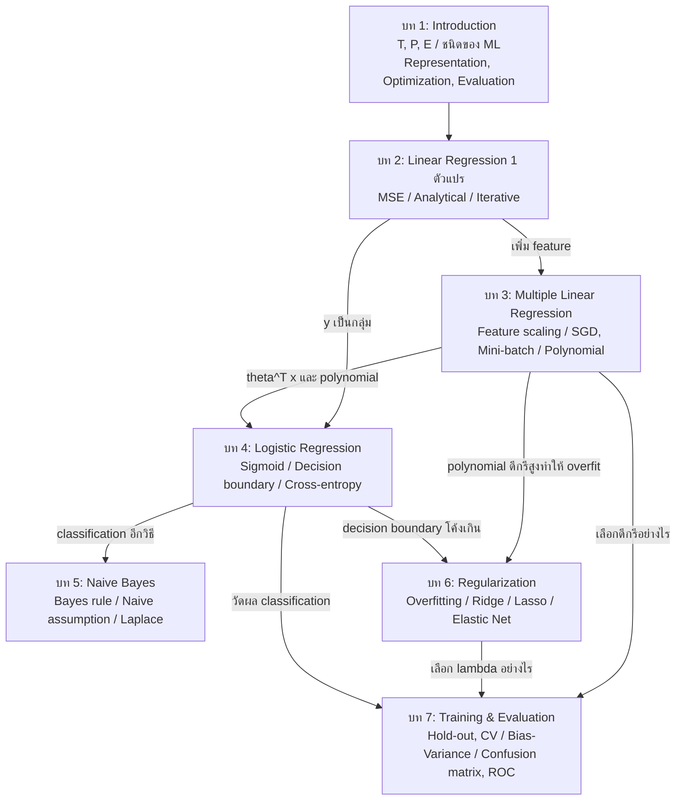

# สรุปเชื่อมโยง บทที่ 1–7: Applied Machine Learning (DADS6003)
### ฉบับเตรียมสอบ: ตรวจเทียบกับสไลด์บรรยายทั้ง 7 บทแล้ว

เอกสารนี้ตรวจเทียบกับไฟล์สไลด์ lecture01 ถึง lecture07 ทีละหน้า เนื้อหาหลักทั้งหมดมาจากสไลด์ ส่วนที่ไม่ได้อยู่ในสไลด์มีสามประเภทและทำเครื่องหมายไว้ชัดเจน

- *อธิบายเพิ่ม:* คำอธิบายสั้นๆ ว่าทำไมสิ่งที่สไลด์เขียนจึงเป็นเช่นนั้น ใช้ประกอบการเขียนตอบ ไม่ใช่หัวข้อใหม่
- **เฉลย:** คำตอบของแบบฝึกที่สไลด์เว้นช่องว่างไว้ให้คำนวณในห้อง
- ⚠ จุดที่สไลด์อาจพิมพ์ผิดหรือขัดกันเอง ควรถามอาจารย์

ลำดับบทในเอกสารนี้ใช้ตามชื่อไฟล์ (lecture04 คือ Logistic Regression, lecture05 คือ Naive Bayes) แม้หน้า Course Outline ในบทที่ 1 จะเรียง Naive Bayes ก่อน Logistic Regression

---

## ส่วนที่ 0 ภาพรวม: เส้นเรื่องของทั้งวิชา

บทที่ 1 วางกรอบว่า ML คืออะไร และอัลกอริทึมประกอบด้วย Representation, Optimization และ Evaluation บทที่ 2 ใช้กรอบนี้กับโมเดลแรก คือเส้นตรงที่วัดความผิดด้วย MSE และหาคำตอบได้สองวิธี บทที่ 3 ขยายเป็นหลายตัวแปร แก้ปัญหาของ gradient descent ด้วย feature scaling, SGD, learning rate scheduling และ mini-batch แล้วทำเส้นโค้งด้วย polynomial regression บทที่ 4 เปลี่ยนงานเป็น classification โดยครอบเส้นตรงด้วย sigmoid และใช้ cross-entropy บทที่ 5 จำแนกด้วยอีกวิธีหนึ่ง คือกฎของเบย์ บทที่ 6 แก้ overfitting ด้วย regularization และบทที่ 7 ตอบว่าจะเลือกโมเดลและวัดผลอย่างไร

วิธีอ่านแผนภาพ: ข้อความบนลูกศรคือปัญหาที่บทต้นทางทิ้งไว้ และบทปลายทางเป็นผู้ตอบ

**ใช้สามองค์ประกอบของบทที่ 1 อ่านทุกบท**

| บท | Representation | Evaluation (ตอนฝึก) | Optimization |
|---|---|---|---|
| 2 | $\theta_0 + \theta_1 x$ | MSE | Normal equation หรือ Batch GD |
| 3 | $\theta^{T}x$ (รวมพจน์ polynomial) | MSE | BGD, SGD, Mini-batch |
| 4 | $\sigma(\theta^{T}x)$ | Cross-entropy (NLLL) | Gradient descent |
| 5 | $P(Y)\prod_j P(x_j \mid Y)$ | เลือกกลุ่มที่ posterior สูงสุด | การนับจากข้อมูล |
| 6 | เหมือนบท 2–4 | Loss เดิม + ค่าปรับ (Ridge, Lasso, Elastic Net) | SGD (Lasso ใช้ sub-gradient) |
| 7 | ไม่ได้เพิ่มโมเดลใหม่ | Accuracy, Precision, Recall, F1, MCC, ROC/AUC | แบ่งข้อมูลเพื่อเลือกโมเดล |

---

## ส่วนที่ 1 บทที่ 1: Introduction

### 1.1 Traditional approach กับ ML approach

สไลด์เปรียบเทียบสองแนวทาง (Figure: Traditional VS ML approach) การเขียนโปรแกรมแบบเดิมป้อน **ข้อมูลและโปรแกรม (กฎ)** แล้วได้ **คำตอบ** ส่วน ML ป้อน **ข้อมูลและคำตอบ** แล้วได้ **โปรแกรม (โมเดล)**

### 1.2 นิยาม

**Arthur Samuel (1959):** Machine Learning is a field of study that gives computers the ability to learn without being explicitly programmed.

**Tom Mitchell (1998) Well-posed learning problem:** A computer program is said to learn from Experience **E** with respect to some Task **T** and some Performance measure **P**, if its performance on T, as measured by P, improves with experience E.

| ตัวอย่าง | T | P | E |
|---|---|---|---|
| ลายมือ | Classifying handwritten digits from images | Percentage of digits classified correctly | Dataset of digits given classifications (เช่น MNIST) |
| Checkers | Playing checkers | Percentage of games won against an arbitrary opponent | Playing practice games against itself |
| Autonomous driving | Driving on four-lane highways using vision sensors | Average distance traveled before a human-judged error | A sequence of images and steering commands recorded while observing a human driver |
| Spam detection | Categorize email messages as spam or legitimate | Percentage of email messages correctly classified | Database of emails, some with human-given labels |

### 1.3 Types of Machine Learning

**Supervised learning:** Given $D = \{(x_1, y_1), \ldots, (x_n, y_n)\}$ โดย $x_i \in \mathbb{R}^d$ คือ vector of attributes และ $y_i$ คือ label ถ้า $y_i \in \mathbb{R}$ เป็น **regression problem** ถ้า $y_i \in \{C_1, \ldots, C_K\}$ เป็น **classification problem** Objective: หา $\theta$ ที่ทำให้ expected loss $L(y, f(x; \theta))$ ต่ำสุด โดย $f$ คือโมเดลและ $L$ คือ loss function

**Unsupervised learning:** Given $D = \{x_1, \ldots, x_N\}$ โดย $x_i \in \mathbb{R}^d$ Objective: To understand and extract patterns, structures, or relationships from unlabeled data งานหลักคือ Clustering, Dimensionality Reduction และ Anomaly Detection อัลกอริทึมคือ K-means, DBScan และ PCA

**Reinforcement learning:** Given a sequence of states, actions, and rewards → Output an **optimal policy** (a mapping from states to actions)

*อธิบายเพิ่ม:* regression หรือ classification ดูจาก **ชนิดของ $y$** ตามนิยามข้างบน ไม่ได้ดูจาก feature

**Machine Learning Applications:** Email spam detection, Face detection and recognition, Sport analytics, Zip code recognition, Credit card fraud detection, Stock prediction, Smart assistants (เช่น ChatGPT), Recommendations, Self-driving cars

### 1.4 Machine Learning Process (เจ็ดคำถาม)

1. What is the desired outcome? (Business Requirement)
2. What could the dataset look like? (**E**)
3. Is this a supervised/unsupervised/reinforcement problem? (**T**)
4. What algorithms would you use? (Solutions)
5. How would you measure success? (**P**)
6. How to maintain the generated models?
7. What are potential challenges or pitfalls?

### 1.5 Machine Learning Operations (workflow เก้าขั้น)

Model Requirements → Data Collection → Data Cleaning → Data Labeling → Feature Engineering → Model Training → Model Evaluation → Model Deployment → Model Monitoring

คำบรรยายรูปในสไลด์: บางขั้นเป็น **data-oriented** (collection, cleaning, labeling) ส่วนที่เหลือเป็น **model-oriented** (requirements, feature engineering, training, evaluation, deployment, monitoring) มี feedback loop หลายจุด ลูกศรใหญ่คือ model evaluation และ monitoring อาจวนกลับไปขั้นใดก่อนหน้าก็ได้ ลูกศรเล็กคือ model training อาจวนกลับไป feature engineering

### 1.6 Components of Machine Learning Algorithms

**1. Representation**
- Numerical functions: Linear regression $y = \theta_0 + \theta_1 x$ หรือ $\theta^{T}x$; Logistic regression $y = \sigma(\theta_0 + \theta_1 x)$ หรือ $\sigma(\theta^{T}x)$ โดย $\sigma$ คือ activation function
- Symbolic functions: Decision tree, Rule-based systems (If A == B, then C)
- Instance-based functions: k-Nearest Neighbors
- Probabilistic graphical models: Bayesian networks

**2. Optimization:** Gradient Descent, Stochastic Gradient Descent, Adam, AdaGrad, Newton's Method, Hessian Free Method, Conjugate Gradient

**3. Evaluation:** Accuracy, MSE, MAE, RMSE, Precision, Recall, F1-Score, ROC AUC, Cohen's kappa, MCC

**เชื่อมไปบทอื่น:** P คือสิ่งที่บทที่ 7 ลงรายละเอียด (Accuracy, Precision, Recall, F1, ROC AUC, MCC) Gradient descent และ SGD คือบทที่ 2 และ 3 Linear และ logistic regression ในหัวข้อ Representation คือบทที่ 2 ถึง 4

---

## ส่วนที่ 2 บทที่ 2: Single Variable Linear Regression

### 2.1 ทำไมบทนี้คือต้นแบบ

บทนี้คือที่แรกที่ representation, evaluation (MSE) และ optimization (normal equation, gradient descent) ถูกใช้ครบกับโมเดลจริง กฎ gradient descent ของบทนี้ถูกใช้ต่อในบทที่ 3, 4 และ 6

### 2.2 Notations และ Model Representation

Dataset $D = \{(x_1, y_1), \ldots, (x_n, y_n)\}$ เป็นชุดของ $N$ คู่ โดย $x_i \in \mathbb{R}^d$ เป็น feature vector (independent variable) และ $y_i \in \mathbb{R}$ (dependent variable) โมเดลคือ function approximation หรือ hypothesis $f: X \to Y$, $f: \mathbb{R}^{n \times d} \to \mathbb{R}^{n \times 1}$

สำหรับตัวแปรเดียว $d = 1$

$$h_\theta(x) = \theta_0 + \theta_1 x, \qquad \theta_j \in \mathbb{R}, \quad \lvert\theta\rvert = d + 1$$

$$J(\theta_0, \theta_1) = \frac{1}{N}\sum_{i=1}^{N}(h_\theta(x_i) - y_i)^2 \qquad \hat{\theta}_0, \hat{\theta}_1 = \mathrm{arg\,min}_{\theta_0, \theta_1} J(\theta_0, \theta_1)$$

*อธิบายเพิ่ม:* arg min คือค่าของ $\theta$ ที่ทำให้ $J$ ต่ำสุด ไม่ใช่ค่าของ $J$

**ตัวอย่างในสไลด์ (แบบฝึก):** ข้อมูล $(0, 1), (2, 1), (3, 4)$ เทียบ $h^{1}(x) = 3$ กับ $h^{2}(x) = 1 + x$

**เฉลย:** $h^{1}$ มี $\theta_0 = 3, \theta_1 = 0$ กำลังสองของความคลาดเคลื่อน 4, 4, 1 MSE $= 3$ ส่วน $h^{2}$ มี $\theta_0 = 1, \theta_1 = 1$ กำลังสองของความคลาดเคลื่อน 0, 4, 0 MSE $= 4/3 \approx 1.33$ ดังนั้น $h^{2}$ ดีกว่า

### 2.3 Solution approach

สไลด์ให้สองวิธี
1. **Analytical approach:** Normal equation $\theta = (X^{T}X)^{-1}X^{T}y$
2. **Iterative approach:** Gradient descent

### 2.4 Normal equation issues

**Problem 1:** $X^{T}X$ is non-invertible ตัวอย่างคือ **redundant features** วิธีแก้คือ **SVD (Singular Value Decomposition)** และ **Moore-Penrose pseudo-inverse**

**Problem 2:** Computational complexity $O(n^3)$ for large feature sets (dimension $d$) วิธีแก้คือ **ใช้ iterative approach (gradient descent)**

*อธิบายเพิ่ม (คำถาม "Why?" ในสไลด์):* การหาอินเวอร์สของเมทริกซ์ $X^{T}X$ ขนาด $(d+1) \times (d+1)$ ใช้การคำนวณประมาณกำลังสามของขนาดเมทริกซ์ จึงช้ามากเมื่อ feature มาก

### 2.5 Iterative approach: (Batch) Gradient Descent

Batch gradient descent คือวิธีหาค่าต่ำสุดของ $J(\theta)$ โดย **ปรับ $\theta$ ไปในทิศตรงข้ามกับ gradient** $\nabla J(\theta)$

สไลด์แสดงความสัมพันธ์ระหว่าง $J$ กับ $\theta$ สองแบบ: กับ $\theta$ ตัวเดียว (กราฟให้วาดในห้อง) และกับ $\theta_0, \theta_1$ (รูปชามสามมิติ และ contour ที่มีเส้นทางของ gradient descent เดินเข้าหาก้นชาม)

$$\theta_j^{t+1} := \theta_j^{t} - \eta \frac{\partial}{\partial \theta_j^{t}} J(\theta_0^{t}, \theta_1^{t}), \quad j = 0, 1, \ldots, d, \quad t = 0, 1, 2, \ldots, \text{max iters}$$

$\eta$ (eta) คือ learning rate เช่น 0.001 เมื่อแทนอนุพันธ์ได้สมการปรับค่า (loop until convergence)

$$\theta_j^{t+1} := \theta_j^{t} - \eta \frac{1}{N}\sum_{i=1}^{N}(h_\theta(x_i) - y_i)\,x_{i,j}, \quad j = 0, 1$$

แยกเป็น $\theta_0$ (คูณ $x_{i,0}$) และ $\theta_1$ (คูณ $x_{i,1}$)

**Stopping criteria:** Max iterations หรือ $\lvert MSE_{t+1} - MSE_t \rvert < \epsilon$ เช่น $\epsilon = 0.000001$

**Limitations ของ Batch GD:** ต้องกำหนด $\eta$ หรือ hyperparameter อื่น และช้าเมื่อข้อมูลมาก (large $N$)

⚠ อนุพันธ์จริงของกำลังสองให้ตัวคูณ 2 (คือ $\frac{2}{N}$) แต่สมการปรับค่าในสไลด์ใช้ $\frac{1}{N}$ ในการสอบให้ใช้สูตรตามสไลด์

### 2.6 Iterative VS Analytical approach (ตารางในสไลด์)

| Iterative | Analytical |
|---|---|
| Need hyperparameters | No need hyperparameters |
| Workable for large $d$ | Workable for large $N$ |
| Need feature scaling | No need feature scaling |
| No invertibility issue | Invertibility issue |
| $O(n^2)$ | $O(n^3)$ |

### 2.7 Exercise 1 ในสไลด์: Solve both approaches

ข้อมูล $(2, 12), (5, 9), (1, 6)$ (1) Analytical $\theta = (X^{T}X)^{-1}X^{T}y$ (2) Iterative: Batch GD, $\theta_0 = \theta_1 = 0.1$, $\eta = 0.01$, 2 iterations

**เฉลย (1):** $X^{T}X = \begin{bmatrix} 3 & 8 \\ 8 & 30 \end{bmatrix}$, $X^{T}y = \begin{bmatrix} 27 \\ 75 \end{bmatrix}$, determinant $= 26$ ได้ $\theta_0 = 105/13 \approx 8.077$, $\theta_1 = 9/26 \approx 0.346$

**เฉลย (2):**
- รอบที่ 1: ค่าทำนาย 0.3, 0.6, 0.2 ความคลาดเคลื่อน $-11.7, -8.4, -5.8$ ผลรวม $-25.9$ ผลรวมคูณ $x$ $= -71.2$ ได้ $\theta_0 = 0.1 + 0.01(25.9/3) \approx 0.1863$, $\theta_1 = 0.1 + 0.01(71.2/3) \approx 0.3373$
- รอบที่ 2: $\theta_0 \approx 0.2655$, $\theta_1 \approx 0.5486$
- MSE ลดจาก 80.36 เป็น 68.29 แล้วเป็น 58.65 (ยังห่างคำตอบของวิธีที่ 1 มาก)

**เชื่อมไปบทอื่น:** ตาราง Iterative VS Analytical มีแถว "Need feature scaling" ซึ่งบทที่ 3 อธิบายต่อ ส่วนกฎการปรับค่าหน้าตานี้ถูกใช้ซ้ำในบทที่ 3 (หลายตัวแปร) บทที่ 4 (logistic) และบทที่ 6 (เติมค่าปรับ)

---

## ส่วนที่ 3 บทที่ 3: Multiple Linear Regression

### 3.1 ข้อมูลและโมเดล

Data set $X \in \mathbb{R}^{N \times d}$ มี $N$ แถว $d$ มิติ $x_{i,j}$ คือค่าในแถว $i$ คอลัมน์ $j$ ตัวอย่างในสไลด์คือข้อมูลบ้าน (เติมคอลัมน์ 1 หน้าสุด, ขนาด 2104, 1416, 1534, ราคา 460, 232, 315)

$$\text{Single: } h_\theta(x) = \theta_0 + \theta_1 x \qquad \text{Multiple: } h_\theta(x) = \theta_0 + \theta_1 x_1 + \cdots + \theta_j x_j + \cdots + \theta_d x_d = \theta^{T}x$$

Matrix form: $\theta^{T} = [\theta_0, \theta_1, \ldots, \theta_d]$ และ $x = [x_0, x_1, \ldots, x_d]^{T}$

$$J(\theta_0, \ldots, \theta_d) = \frac{1}{N}\sum_{i=1}^{N}(h_\theta(x_i) - y_i)^2 \qquad \hat{\theta}_0, \ldots, \hat{\theta}_d = \mathrm{arg\,min}\ J$$

### 3.2 Batch Gradient Descent (loop until converge)

Update parameters using all training samples

$$\theta_j^{t+1} := \theta_j^{t} - \eta \cdot \frac{1}{N}\sum_{i=1}^{N}(h_\theta(x_i) - y_i)\cdot x_{i,j}, \qquad j = 0, \ldots, d$$

เขียนแยกได้ทีละตัวตั้งแต่ $\theta_0$ (คูณ $x_{i,0}$) ถึง $\theta_d$ (คูณ $x_{i,d}$)

### 3.3 Feature Scaling

**Problem:** $x_2 \gg x_1$ leads to slow/unstable gradient descent
**Solution:** Standardize or normalize features

$$\text{Min-Max scaling: } x' = \frac{x - x_{min}}{x_{max} - x_{min}} \qquad \text{Z-score: } x' = \frac{x - \mu}{\sigma}$$

Helps gradients move in balanced directions

*อธิบายเพิ่ม:* Min-Max ให้ค่าในช่วง 0 ถึง 1 ส่วน Z-score ให้ค่าเฉลี่ย 0 ส่วนเบี่ยงเบนมาตรฐาน 1

### 3.4 Batch GD vs Stochastic GD

**BGD:** Uses full dataset in each iteration

$$\theta_j^{t+1} := \theta_j^{t} - \eta \cdot \frac{1}{N}\sum_{i=1}^{N}(h_\theta(x_i) - y_i)\cdot x_{i,j}$$

**SGD:** Uses one sample per iteration ($x_i$ is randomly picked in each iteration)

$$\theta_j^{t+1} := \theta_j^{t} - \eta(h_\theta(x_i) - y_i)\cdot x_{i,j}$$

**SGD introduces more noise, but converges faster** คำถามในสไลด์: **How to reduce SGD noise?** สไลด์ถัดไปตอบด้วยสองวิธี คือ learning rate scheduling และ mini-batch

### 3.5 Learning Rate Scheduling

Control step size $\eta$ during training ใช้ **Inverse Time Decay** เพื่อลด $\eta$ ตามจำนวนรอบ (อ้างอิง Bottou 2012)

$$\eta^{t+1} = \frac{\eta^{0}}{1 + \eta^{0}\lambda t}, \qquad t = 1, \ldots, T, \quad \lambda = \text{Decay Rate}$$

**ตัวอย่างในสไลด์:** $\eta^{0} = 0.01$, $\lambda = 0.1$, $t = 1$ ได้ $\eta^{2} = \frac{0.01}{1 + 0.01 \cdot 0.1 \cdot 1} = 0.0099$

⚠ $\frac{0.01}{1.001} = 0.00999$ (ปัดสี่ตำแหน่งได้ 0.0100) ค่า 0.0099 ในสไลด์คือการตัดทศนิยม ในข้อสอบควรแสดงตัวหาร 1.001 ด้วย

*อธิบายเพิ่ม:* $\lambda$ ตรงนี้คือ decay rate ไม่ใช่ $\lambda$ ของ regularization ในบทที่ 6

### 3.6 BGD vs SGD vs Mini-batch GD

| วิธี | ข้อมูลที่ใช้ | Performance |
|---|---|---|
| BGD | ทั้งหมด $N$ samples | stable path to minimum |
| SGD | one sample | fast but noisy |
| Mini-batch GD | $b$ samples, $1 < b < N$ (เช่น $b = 10$) | compromise between stability and speed |

### 3.7 Polynomial Regression (Non-linear)

Use higher-degree terms of input features

$$\binom{n}{r} = \frac{n!}{r!(n - r)!}, \qquad n = \#\text{features} + \#\text{degree}, \quad r = \#\text{degree}$$

**ตัวอย่างในสไลด์:** สอง feature ($x_1, x_2$) degree 2 ได้ $\binom{4}{2} = \frac{4 \cdot 3 \cdot 2 \cdot 1}{2 \cdot 2 \cdot 1 \cdot 1} = 6$ พจน์

$$h_\theta(x) = \theta_0 + \theta_1 x_1 + \theta_2 x_2 + \theta_3 x_1 x_2 + \theta_4 x_1^{2} + \theta_5 x_2^{2}$$

*อธิบายเพิ่ม:* สไลด์เรียกว่า "Polynomial multiple linear regression" เพราะโมเดลโค้งเทียบกับ $x$ แต่ยังคำนวณแบบ linear regression ได้ (แต่ละพจน์ใหม่ทำหน้าที่เหมือน feature หนึ่งตัว)

**เชื่อมไปบทอื่น:** $\theta^{T}x$ ถูกครอบด้วย sigmoid ในบทที่ 4 พจน์ $x_1^2, x_2^2$ ทำให้ decision boundary เป็นวงกลมในบทที่ 4 พจน์ดีกรีสูงทำให้ overfit ในบทที่ 6 และ "การเพิ่ม polynomial features" เป็นหนึ่งในทางแก้ของบทที่ 7

---

## ส่วนที่ 4 บทที่ 4: Logistic Regression

### 4.1 Overview และ Intuition

- Logistic regression ใช้กับ **binary/multi-class classification**
- Output เป็น **probability ∈ (0, 1)**
- ตัวอย่าง: cancer prediction, churn prediction, attrition prediction

**Intuition:** Linear regression cannot bound output between 0 and 1 (unbounded $(-\infty, +\infty)$) จึง apply sigmoid function เพื่อ squash output ของ linear regression ให้อยู่ใน $(0, 1)$

$$z = \theta^{T}x, \qquad \sigma(z) = \frac{1}{1 + e^{-z}} = \frac{1}{1 + e^{-\theta^{T}x}}$$

กราฟเป็น S-shaped curve centered at $z = 0$ ผ่านจุด $(0, 0.5)$

| Linear regression | Logistic regression |
|---|---|
| $h_\theta(x) = \theta^{T}x$ | $h_\theta(x) = \sigma(\theta^{T}x)$ |

### 4.2 Decision Boundary

Suppose we predict $y = 1$ if $h_\theta(x) \ge 0.5$ และ $y = 0$ if $h_\theta(x) < 0.5$ สไลด์แสดงสามกรณี (Three Decision Boundaries, จาก Colab)

| โมเดล | รูปเส้นแบ่งในสไลด์ |
|---|---|
| $h_\theta(x) = \sigma(\theta_0 + \theta_1 x_1)$ | เส้นตั้ง |
| $h_\theta(x) = \sigma(\theta_0 + \theta_1 x_1 + \theta_2 x_2)$ | เส้นตรงเอียง |
| $h_\theta(x) = \sigma(-1 + x_1^{2} + x_2^{2})$ | วงกลม |

*อธิบายเพิ่ม:* $\sigma(z) \ge 0.5$ เมื่อ $z \ge 0$ เส้นแบ่งจึงคือ $\theta^{T}x = 0$ กรณีที่สามคือ $x_1^2 + x_2^2 = 1$ (วงกลมรัศมี 1) เส้นแบ่งโค้งเพราะมีพจน์กำลังสอง ไม่ใช่เพราะ sigmoid

⚠ กราฟวงกลมในสไลด์ระบุว่า "Class 1 (inside)" แต่ถ้าแทนจุด (0, 0) ในสูตร $\sigma(-1 + x_1^2 + x_2^2)$ จะได้ $z = -1 < 0$ คือ class 0 ตามสูตรด้านในจึงเป็น class 0 และด้านนอกเป็น class 1 (ถ้าจะให้ด้านในเป็น class 1 สูตรต้องเป็น $\sigma(1 - x_1^2 - x_2^2)$) ควรถามอาจารย์

### 4.3 Cost function: ทำไมไม่ใช้ MSE

MSE ที่ใช้ใน linear regression $J(\theta) = \frac{1}{N}\sum(h_\theta(x_i) - y_i)^2$ **not ideal for logistic regression** เพราะ
1. **Non-convex curve**
2. **Poor convergence properties**

*อธิบายเพิ่ม:* ข้อ 1 ทำให้ gradient descent อาจติดอยู่ในหลุมย่อย ข้อ 2 เกิดเพราะอนุพันธ์ของ sigmoid มีค่าเกือบศูนย์เมื่อทำนายผิดอย่างมั่นใจ การปรับค่าจึงช้า

### 4.4 Cross-Entropy Loss

Cross-entropy measures the difference between two probability distributions

$$J(\theta) = \frac{1}{N}\sum_{i=1}^{N}\begin{cases} -\ln(h_\theta(x)) & \text{if } y = 1 \\ -\ln(1 - h_\theta(x)) & \text{if } y = 0 \end{cases}$$

สไลด์แสดงกราฟ $-\ln(h_\theta(x))$ และ $-\ln(1 - h_\theta(x))$ เทียบกับ predicted probability โดยแกนตั้งคือ NLLL

*อธิบายเพิ่ม:* กรณี $y = 1$ ถ้าทำนาย $h$ ใกล้ 1 loss ใกล้ 0 ถ้าทำนาย $h$ ใกล้ 0 loss สูงมาก กรณี $y = 0$ กลับกัน

### 4.5 Negative Log Likelihood Loss (NLLL)

How to merge two lines to one line, based on **Bernoulli distribution**

$$P(y_i \mid x_i; \theta) = (h_\theta(x_i))^{y_i} \cdot (1 - h_\theta(x_i))^{1 - y_i}$$

$$\ln P(y_i \mid x_i; \theta) = y_i \ln(h_\theta(x_i)) + (1 - y_i)\ln(1 - h_\theta(x_i))$$

$$J(\theta) = -\frac{1}{N}\sum_{i=1}^{N}[y_i \ln h_\theta(x_i) + (1 - y_i)\ln(1 - h_\theta(x_i))]$$

*อธิบายเพิ่ม:* แทน $y_i = 1$ เหลือพจน์ $\ln h$ แทน $y_i = 0$ เหลือพจน์ $\ln(1 - h)$ ตรงกับสูตรแยกกรณี

### 4.6 Derivation of Gradient (ตามขั้นในสไลด์)

ใช้ Note สองข้อ: $\frac{\partial \ln(f(x))}{\partial x} = \frac{1}{f(x)}\frac{\partial f(x)}{\partial x}$ และ $\frac{\partial \sigma(f(x))}{\partial x} = \sigma(f(x))(1 - \sigma(f(x)))\frac{\partial f(x)}{\partial x}$

1. หาอนุพันธ์ของแต่ละพจน์ใน $\ln$ ได้ $\frac{1}{h}\frac{\partial h}{\partial \theta_j}$ และ $\frac{1}{1 - h}\frac{\partial(1 - h)}{\partial \theta_j}$
2. แทนอนุพันธ์ของ sigmoid ได้ $\sigma(\theta^{T}x)(1 - \sigma(\theta^{T}x))x_{ij}$ (พจน์หลังมี $-1$)
3. ตัดทอนได้ $-\frac{1}{N}\sum(y_i(1 - h)x_{ij} + (1 - y_i)(-1)h\,x_{ij})$
4. กระจายแล้วพจน์ $y_i h\,x_{ij}$ หักล้างกัน เหลือ $-\frac{1}{N}\sum(y_i - h_\theta(x_i))x_{ij}$

$$\frac{\partial J(\theta)}{\partial \theta_j} = \frac{1}{N}\sum_{i=1}^{N}(h_\theta(x_i) - y_i)\,x_{ij}, \qquad j = 0, \ldots, d$$

สไลด์เขียนกำกับว่า **Same form as BGD of MSE**

### 4.7 Linear VS Logistic Regression (ตารางในสไลด์)

| | Linear Regression | Logistic Regression |
|---|---|---|
| Model representation | $h_\theta(x) = \theta^{T}x$ | $h_\theta(x) = \sigma(\theta^{T}x)$ |
| Cost function | $\frac{1}{N}\sum(h_\theta(x_i) - y_i)^2$ | $-\frac{1}{N}\sum(y_i \ln h_\theta(x_i) + (1 - y_i)\ln(1 - h_\theta(x_i)))$ |
| Evaluation metrics | MSE, $R^2$, MAE | Accuracy, Precision, Recall, F1, AUC |
| Update gradient descent | $\theta_j^{(t+1)} = \theta_j^{(t)} - \eta\frac{1}{N}\sum(h_\theta(x_i) - y_i)x_{ij}$ | สูตรเดียวกัน (แต่ $h_\theta$ ผ่าน sigmoid) |

### 4.8 Appendix: Odds, Logit และที่มาของ sigmoid

**Odds** = probability of an event happening divided by the probability of it not happening

$$\mathrm{Odds} = \frac{P(\text{event=success})}{1 - P(\text{event=success})}$$

ตัวอย่างในสไลด์: $\frac{0.8}{0.2} = 4$, $\frac{0.9}{0.1} = 9$, $\frac{0.5}{0.5} = 1$, $\frac{0.2}{0.8} = 0.25$

**Logit function:** กราฟ odds ของ gastroschisis เทียบกับอายุมารดาเป็นเส้นโค้ง เมื่อใส่ $\ln$ จะได้ความสัมพันธ์เชิงเส้น

$$\ln(\text{Odds of Gastroschisis}) = \theta_0 + \theta_1 \cdot \text{Maternal Age}$$

**Appendix: Logistic Regression (แก้สมการ logit หา $p$)**

$$\mathrm{logit}(p) = \log\left(\frac{p}{1 - p}\right) = \beta_0 + \beta_1 x_1 + \cdots + \beta_k x_k$$

1. Exponentiate and take the multiplicative inverse of both sides: $\frac{1 - p}{p} = \frac{1}{\exp(\beta_0 + \cdots + \beta_k x_k)}$
2. Partial out the fraction on the left-hand side and add one to both sides: $\frac{1}{p} = 1 + \frac{1}{\exp(\cdots)}$
3. Change 1 to a common denominator: $\frac{1}{p} = \frac{\exp(\cdots) + 1}{\exp(\cdots)}$
4. Take the multiplicative inverse again: $p = P(Y = 1) = \frac{\exp(\beta_0 + \cdots + \beta_k x_k)}{1 + \exp(\beta_0 + \cdots + \beta_k x_k)}$

*อธิบายเพิ่ม:* หารเศษและส่วนด้วย $\exp(\cdots)$ จะได้ $\frac{1}{1 + e^{-z}}$ ซึ่งคือ sigmoid ดังนั้น logistic regression คือการใช้เส้นตรงทำนาย log-odds

**เชื่อมไปบทอื่น:** แถว Evaluation metrics ของตารางเทียบคือหัวข้อของบทที่ 7 decision boundary ที่คดเคี้ยวเกินไปคือภาพ overfitting ของ logistic regression ในบทที่ 6 และบทที่ 5 เสนออีกวิธีหนึ่งในการจำแนก

---

## ส่วนที่ 5 บทที่ 5: Naive Bayes Classification

### 5.1 Overview

Review classification task: ข้อมูล $X \in \mathbb{R}^{N \times d}$ และ $y_i \in \{C_1, \ldots, C_k\}$ Use cases: Churn prediction, Stock prediction, Email classification

### 5.2 Bayes' Rule

$$\underbrace{P(Y \mid X)}_{\mathrm{Posterior}} = \frac{\underbrace{P(X \mid Y)}_{\mathrm{Likelihood}} \cdot \underbrace{P(Y)}_{\mathrm{Prior}}}{\underbrace{P(X)}_{\mathrm{Marginal}}}$$

| ส่วน | นิยามในสไลด์ |
|---|---|
| Posterior | the conditional probability of Y given X |
| Prior | the initial belief regarding the truth of a statement |
| Likelihood | the chance of observing a particular sample X when the parameter is equal to Y |
| Marginal (Evidence) | the unconditional probability (overall populations) |

**ที่มา (Conditional probabilities)**

$$P(Y \mid X) = \frac{P(Y \cap X)}{P(X)} \quad (1) \qquad P(X \mid Y) = \frac{P(X \cap Y)}{P(Y)} \quad (2)$$

$$P(X \mid Y)P(Y) = P(X \cap Y) \quad (3) \qquad P(X \mid Y)P(Y) = P(X \cap Y) = P(Y \cap X) \quad (4)$$

$$P(Y \mid X) = \frac{P(X \mid Y)P(Y)}{P(X)} \quad (5)$$

สมการ (1) คือ conditional probability = ความน่าจะเป็นที่ X และ Y เกิดพร้อมกัน หารด้วยความน่าจะเป็นที่ X เกิด

### 5.3 ตัวอย่างในสไลด์: feature เดียว (ชื่อ)

ข้อมูล 8 คน: Drew (M), Claudia (F), Drew (F), Drew (F), Alberto (M), Karin (F), Nina (F), Sergio (M) ทายเพศของ Drew คนใหม่

$$P(M \mid \mathrm{Drew}) = \frac{P(\mathrm{Drew} \mid M) \cdot P(M)}{P(\mathrm{Drew})} = \frac{\frac{1}{3} \cdot \frac{3}{8}}{\frac{3}{8}} = \frac{1}{3} \qquad P(F \mid \mathrm{Drew}) = \frac{\frac{2}{5} \cdot \frac{5}{8}}{\frac{3}{8}} = \frac{2}{3}$$

$$\text{evidence} = \sum_{i=1}^{K} P(X \mid y_i) \cdot P(y_i), \quad K = \text{จำนวน class}$$

### 5.4 Multiple features

| X1 Name | X2 Over 170cm | X3 Eye Color | X4 Hair Length | Y Sex |
|---|---|---|---|---|
| Drew | No | Blue | Short | M |
| Claudia | Yes | Brown | Long | F |
| Drew | No | Blue | Long | F |
| Drew | No | Blue | Long | F |
| Alberto | Yes | Brown | Short | M |
| Karin | No | Blue | Long | F |
| Nina | Yes | Brown | Short | F |
| Sergio | Yes | Blue | Long | M |

ทายเพศของ X1 = Drew, X2 = No, X3 = Brown, X4 = Short

$$P(Y \mid x_1, x_2, x_3, x_4) = \frac{P(x_1, x_2, x_3, x_4 \mid Y) \cdot P(Y)}{P(x_1, x_2, x_3, x_4)}$$

### 5.5 Concept of Bayes' Rule และ Naive Bayes assumption

**ถ้าสมมติว่า features are dependent:** สำหรับ joint distribution ของ $d$ ตัวแปร (ค่าแบบ binary) ต้องรู้ทั้งหมด $2^{d} - 1$ combinations รูปทั่วไปของ likelihood (Chain rule of probability)

$$P(x_1, \ldots, x_d \mid Y) = P(x_1 \mid Y)\,P(x_2 \mid x_1, Y)\,P(x_3 \mid x_2, x_1, Y) \cdots P(x_d \mid x_{d-1}, \ldots, x_1, Y)$$

**Naive Bayes assumption:** Attributes $x_i$ are **conditionally independent given class $y$**

$$P(X \mid y_i) = P(x_1 \mid y_i) \cdot P(x_2 \mid y_i) \cdots P(x_d \mid y_i)$$

*อธิบายเพิ่ม:* สมมติฐานนี้ลดสิ่งที่ต้องประมาณจากทุก combination ($2^{d} - 1$ ค่า) เหลือความน่าจะเป็นทีละ feature ซึ่งนับได้จากข้อมูล

### 5.6 Example computation (ในสไลด์)

| | Prior | Drew | No | Brown | Short | ผลคูณ |
|---|---|---|---|---|---|---|
| Male | 3/8 | 1/3 | 1/3 | 1/3 | 2/3 | $\frac{2}{81} \cdot \frac{3}{8} = \frac{1}{108} = 0.0092$ |
| Female | 5/8 | 2/5 | 3/5 | 2/5 | 1/5 | $\frac{12}{625} \cdot \frac{5}{8} = \frac{3}{250} = 0.012$ |

$$P(\text{Male} \mid x) = \frac{0.0092}{0.0092 + 0.012} = \frac{0.0092}{0.0212} = 0.43 \qquad P(\text{Female} \mid x) = \frac{0.012}{0.0212} = 0.56$$

⚠ สไลด์เขียนว่า **"Final answer is Male"** แต่ตัวเลขในสไลด์เองให้ Female 0.56 มากกว่า Male 0.43 คำตอบที่ถูกตามการคำนวณคือ **Female** (และบรรทัดของ Female ในสไลด์เขียน $P(Y = \text{Male})$ ทั้งที่ใช้ค่า 5/8 ของ Female) ควรถามอาจารย์

### 5.7 Advantages and Disadvantages

- **Advantages:** Fast to train/classify; Handles streaming data (เช่น Email spam detection)
- **Disadvantage:** Assumes independence of features ($X$)
- คำถามในสไลด์: **Is the naive independence assumption valid for all datasets?**

*อธิบายเพิ่ม:* ไม่ใช่ทุกชุดข้อมูล เพราะ feature ในข้อมูลจริงมักสัมพันธ์กันแม้อยู่ใน class เดียวกัน

### 5.8 Handling Continuous Values

ตัวอย่างก่อนหน้า $x_i \in$ {Categories} คำนวณความน่าจะเป็นด้วยการนับ ถ้า $x_i$ เป็นค่าต่อเนื่อง (เช่น Height: 100, 101, 99, 120, ..., 160) จะสมมติว่าค่าเป็น **Gaussian distribution**

$$f(x) = \frac{1}{\sqrt{2\pi\sigma_k^{2}}}\,e^{-\frac{(x - \mu_k)^{2}}{2\sigma_k^{2}}}$$

$\mu_k$ และ $\sigma_k$ เป็นของ class $k$ และ $e = 2.7183$

### 5.9 Laplacian Correction (Estimator)

Dealing with zero probability values ตัวอย่าง: training set 1,000 samples, Income = low 0, medium 990, high 10

- Without Laplace: $P(\text{low}) = 0$
- With Laplace correction: $P(\text{low}) = \frac{0 + 1}{1000 + 3}$

*อธิบายเพิ่ม:* ตัวส่วนบวก 3 เพราะ Income มี 3 ค่า (บวก 1 ให้ทุกช่อง) และต้องแก้เพราะ Naive Bayes คูณความน่าจะเป็น ศูนย์ตัวเดียวทำให้ผลคูณทั้ง class เป็นศูนย์ ถ้าใช้หลักเดียวกันกับค่าอื่นจะได้ $P(\text{medium}) = 991/1003$ และ $P(\text{high}) = 11/1003$

**เชื่อมไปบทอื่น:** Naive Bayes เป็นงาน classification เหมือนบทที่ 4 จึงวัดผลด้วยตัวชี้วัดของบทที่ 7

---

## ส่วนที่ 6 บทที่ 6: Regularization

### 6.1 Overfitting

**Over fit VS Good fit VS Under fit (linear regression, housing prices)**

| โมเดล | สภาพ |
|---|---|
| $\theta_0 + \theta_1 x$ | Underfit |
| $\theta_0 + \theta_1 x + \theta_2 x^2$ | Good fit |
| $\theta_0 + \theta_1 x + \theta_2 x^2 + \theta_3 x^3 + \theta_4 x^4$ | Overfit |

**Overfitting:** If we have too many features, the learned hypothesis may fit the training set very well ($J(\theta) = \frac{1}{N}\sum(h_\theta(x_i) - y_i)^2 \approx 0$), but fail to generalize to new examples.

**Over fit VS Good fit VS Under fit (logistic regression, $g$ = sigmoid function)**

| โมเดล | สภาพ |
|---|---|
| $h_\theta(x) = g(\theta_0 + \theta_1 x_1 + \theta_2 x_2)$ | Underfit (เส้นตรง) |
| $g(\theta_0 + \theta_1 x_1 + \theta_2 x_2 + \theta_3 x_1^2 + \theta_4 x_2^2 + \theta_5 x_1 x_2)$ | Good fit (เส้นโค้งเรียบ) |
| $g(\theta_0 + \theta_1 x_1 + \theta_2 x_1^2 + \theta_3 x_1^2 x_2 + \theta_4 x_1^2 x_2^2 + \theta_5 x_1^2 x_2^3 + \theta_6 x_1^3 x_2 + \cdots)$ | Overfit (เส้นคดเคี้ยว) |

**Overfit characteristic:** กราฟ error เทียบกับ training steps ของ regression ด้วย polynomial: **Training error ลดลงต่อเนื่อง แต่ Testing error ลดลงแล้วกลับเพิ่มขึ้น**

### 6.2 Solution: Addressing overfitting

1. **Reduce number of features:** Manually select which features to keep; Model selection algorithm
2. **Regularization:** Keep all the features, but reduce magnitude/values of parameters $\theta_j$ — works well when we have a lot of features, each of which contributes a bit to predicting $y$

### 6.3 Intuition

เทียบโมเดลดีกรี 4 ($\theta_0 + \cdots + \theta_4 x^4$, เส้นคดเคี้ยว) กับดีกรี 2 ($\theta_0 + \theta_1 x + \theta_2 x^2$, เส้นโค้งเรียบ)

- Suppose we penalize and make $\theta_3, \theta_4$ really small. The curve will change.
- A good way to reduce overfitting is to **regularize the model (i.e., to constrain it)**

Regularized linear models ในบทนี้มีสามแบบ: Ridge regression, Lasso regression, Elastic Net

### 6.4 Ridge

- Keep the model parameters $\theta$ as small as possible
- By adding the term (**squared $L_2$-norm**) in the cost function to prevent overfitting

$$L_2 \text{ (Euclidean) norm: } \lVert\theta\rVert_2 = \sqrt{\theta_1^2 + \theta_2^2 + \cdots + \theta_d^2} \qquad \text{squared } L_2\text{-norm: } \lVert\theta\rVert_2^2 = \theta_1^2 + \cdots + \theta_d^2$$

$$J(\theta) = \frac{1}{N}\sum_{i=1}^{N}(h_\theta(x_i) - y_i)^2 + \lambda\sum_{j=1}^{d}\theta_j^2$$

$\lambda$ is the ridge parameter controlling regularization strength

**Ridge parameters (รูปจาก Hands-on Machine Learning):** โมเดลเส้นตรงที่ $\lambda = 0, 10, 100$ เส้นแบนลงเมื่อ $\lambda$ เพิ่ม และโมเดล polynomial ที่ $\lambda = 0, 10^{-5}, 1$ เส้นที่ส่ายมาก ($\lambda = 0$) ค่อยๆ เรียบขึ้น

**Ridge example (Ridge Regression Trace):** สัมประสิทธิ์ (Theta) ของ Room, Residential Zone, Highway Access, Crime Rate และ Tax เมื่อ Lambda เพิ่มจาก 0 ถึง 200 ทุกเส้นค่อยๆ เข้าหาศูนย์ แต่ **ไม่มีเส้นใดเป็นศูนย์พอดี**

### 6.5 Lasso

**Least Absolute Shrinkage and Selection Operator (LASSO)**
- Reduces the number of features ($x_i$)
- Automatically performs **feature selection** and outputs a **sparse model**

$$L_1 \text{ (Absolute-value) norm: } \lVert\theta\rVert_1 = \lvert\theta_1\rvert + \lvert\theta_2\rvert + \cdots + \lvert\theta_n\rvert$$

$$J(\theta) = \frac{1}{N}\sum_{i=1}^{N}(h_\theta(x_i) - y_i)^2 + \lambda\sum_{j=1}^{d}\lvert\theta_j\rvert$$

**Lasso parameters (รูปจาก Hands-on Machine Learning):** โมเดลเส้นตรงที่ $\lambda = 0, 0.1, 1$ และโมเดล polynomial ที่ $\lambda = 0, 10^{-7}, 1$ ที่ $\lambda = 1$ ทั้งสองกราฟได้ **เส้นแนวนอน** และแม้ $\lambda = 10^{-7}$ เส้น polynomial ก็เรียบลงมาก

### 6.6 Ridge vs Lasso

**กราฟ Theta เทียบกับ Lambda (สไลด์ Ridge vs Lasso):** ฝั่ง Ridge ทุกเส้นลดลงแบบโค้งเข้าหาศูนย์แต่ไม่ถึง ฝั่ง Lasso ทุกเส้นลดลงเป็นเส้นตรงแล้ว **แตะศูนย์ทีละเส้น**

**ภาพเรขาคณิต (สไลด์ Ridge vs Lasso):** แกน $\theta_1, \theta_2$ มีวงรีรอบจุด $\theta_{\text{normal equation}}$ บริเวณของ Ridge เป็นวงกลมรัศมี $r$ บริเวณของ Lasso เป็นสี่เหลี่ยมข้าวหลามตัด คำตอบ $\theta_{\text{ridge}}$ อยู่บนขอบวงกลม (ไม่อยู่บนแกน) ส่วน $\theta_{\text{lasso}}$ อยู่ที่มุมบนแกน $\theta_2$ (คือ $\theta_1 = 0$)

*อธิบายเพิ่ม:* คำตอบคือจุดแรกที่วงรีของ MSE แตะบริเวณที่อนุญาต ข้าวหลามตัดมีมุมอยู่บนแกน จุดแตะจึงมักเป็นมุม ซึ่งพิกัดหนึ่งเป็นศูนย์ Lasso จึงได้ค่าศูนย์ ส่วนวงกลมไม่มีมุม

**When to use what? (สไลด์ 17)**
- **Lasso** tends to do well if there are a small number of significant parameters and the others are close to zero (when only a few predictors actually influence the response)
- **Ridge** works well if there are many large parameters of about the same value (when most predictors impact the response)
- However, in practice, we don't know the true parameter values ... Just run **cross-validation** to select the more suited model for a specific case, or **combine the two!**

**Case study (Ridge/Lasso use case):** In practice, ridge regression leads to **lower weights of coefficients**, while lasso regression leads to **more coefficients having zero weights** ในงานวิเคราะห์ข้อมูล fMRI ที่มีแหล่งสัญญาณหลายแหล่งอยู่ใกล้กันและสัญญาณสัมพันธ์กัน ผู้ตอบนิยม Ridge เพราะให้สัมประสิทธิ์ใกล้เคียงกันกับแหล่งเหล่านี้ ส่วน Lasso จะดันส่วนใหญ่เป็นศูนย์และเก็บไว้บางแหล่งที่น้ำหนักสูง (ขึ้นกับโดเมน)

### 6.7 Elastic Net

- A simple mix of both Ridge and Lasso's regularization terms
- Controlled by **mix ratio $\alpha$** (or $l_1$-ratio)

$$\alpha = \frac{\lambda_2}{\lambda_1 + \lambda_2}$$

- When $\alpha = 1$, Elastic Net is equivalent to **Ridge**; when $\alpha = 0$, it is equivalent to **Lasso**

$$J(\theta) = \frac{1}{N}\sum_{i=1}^{N}(h_\theta(x_i) - y_i)^2 + (1 - \alpha)\sum_{j=1}^{d}\lvert\theta_j\rvert + \alpha\sum_{j=1}^{d}\theta_j^2$$

$\lambda_1$ คือ lasso parameter และ $\lambda_2$ คือ ridge parameter

**Elastic Net (II):** รูปสองมิติที่ $\alpha = 0.5$ (จาก Zou & Hastie) บริเวณของ Elastic Net อยู่ระหว่างวงกลม (Ridge) กับข้าวหลามตัด (Lasso)

**Visualization of all regularizations**

| Norm | รูปบริเวณ | คำบรรยายในสไลด์ |
|---|---|---|
| L1 Norm | ข้าวหลามตัด | Sparsity inducing |
| L2 Norm | วงกลม | Weight sharing |
| L1 + L2 Norm | ผสม | Compromise... two parameters |

**When to use what? (Hands-on Machine Learning, สไลด์ 23)**
- It is almost always preferable to have at least a little bit of regularization; **Ridge is a good default**
- If you suspect that only a few features are actually useful, prefer **Lasso or Elastic Net** since they tend to reduce the useless features' weights down to zero
- In general, **Elastic Net is preferred over Lasso** since Lasso may behave erratically when the number of features is greater than the number of training instances or when several features are strongly correlated

### 6.8 Stochastic Gradient Descent สำหรับ regularization

**Ridge regression** (repeat until convergence; $i$ = randomly pick one sample from the whole data)

$$\theta_j^{t+1} = \theta_j^{t} - \eta((h_\theta(x_i) - y_i)x_{i,j} + \lambda\theta_j^{t}), \qquad j = 0, 1, \ldots, d$$

⚠ สไลด์ SGD ของ Ridge มีพจน์ $\lambda\theta_0^{t}$ ในบรรทัดของ $\theta_0$ ด้วย แต่ cost function ของ Ridge รวมค่าปรับตั้งแต่ $j = 1$ (ไม่ปรับ $\theta_0$) สองหน้านี้ไม่สอดคล้องกัน ถ้าข้อสอบให้คำนวณ ให้ทำตามสูตรที่โจทย์ให้

**Lasso regression:** The Lasso cost function is not differentiable at $\theta_j = 0$, but Gradient Descent works fine using a **sub-gradient vector** instead

$$\theta_j^{t+1} = \theta_j^{t} - \eta[(h_\theta(x_i) - y_i)x_{i,j} + \lambda\,\mathrm{sign}(\theta_j^{t})], \qquad j = 0, \ldots, d$$

$$\mathrm{sign}(\theta_j^{t}) = \begin{cases} -1 & \text{if } \theta_j^{t} < 0 \\ (-1, 1) & \text{if } \theta_j^{t} = 0 \\ +1 & \text{if } \theta_j^{t} > 0 \end{cases}$$

**Elastic Net**

$$\theta_j^{t+1} = \theta_j^{t} - \eta[(h_\theta(x_i) - y_i)x_{i,j} + (1 - \alpha)\,\mathrm{sign}(\theta_j^{t}) + \alpha\,\theta_j^{t}]$$

**เชื่อมไปบทอื่น:** สไลด์ "When to use what" บอกให้ใช้ cross-validation เลือกระหว่าง Ridge กับ Lasso ซึ่งคือหัวข้อของบทที่ 7 และบทที่ 7 ใช้ cost function ของ Ridge อธิบายผลของ $\lambda$ ต่อ bias และ variance

---

## ส่วนที่ 7 บทที่ 7: Model Training and Evaluation

### 7.1 Which model is the best choice?

สไลด์ตั้งคำถามว่าจะเลือกโมเดลใดจาก $h_\theta(x) = \theta_0 + \theta_1 x_1$ ไปจนถึงโมเดลที่มีพจน์ถึงดีกรี 10 (ถึง $\theta_{10}$)

### 7.2 Two Methods in Training process

| วิธี | การแบ่ง | Pros | Cons |
|---|---|---|---|
| Hold-out Method | 80% Train set / 20% Test set | Simple, Fast | Overfitting |
| Cross validation Method | Training set 60% / Validation set 20% / Test set 20% | Variance (Overfitting) is reduced | Slow |

*อธิบายเพิ่ม:* hold-out มีแค่ train กับ test ถ้าใช้ test set เลือกโมเดล โมเดลที่ได้จะเข้ากับ test set ชุดนั้นเกินจริง ส่วน cross validation แยก validation set ไว้เลือกโมเดล และเก็บ test set ไว้วัดผลสุดท้าย

### 7.3 Which one reduces the error caused by overfit or underfit?

สไลด์ถามว่าทางเลือกต่อไปนี้แก้ปัญหาใด

| ทางเลือก (ตามสไลด์) | **เฉลย:** แก้ |
|---|---|
| Get more training data | Overfit (high variance) |
| Try smaller sets of features | Overfit (high variance) |
| Try getting additional features | Underfit (high bias) |
| Try adding polynomial features | Underfit (high bias) |
| Try decreasing $\lambda$ (Ridge penalty) | Underfit (high bias) |
| Try increasing $\lambda$ (Ridge penalty) | Overfit (high variance) |

*อธิบายเพิ่ม:* เฉลยนี้ตรงกับสไลด์ถัดไปของบทเดียวกัน (ผลของ $\lambda$ และขนาดข้อมูล) กฎจำคือ ทำให้โมเดลยืดหยุ่นขึ้น แก้ underfit ทำให้ยืดหยุ่นน้อยลงหรือเพิ่มข้อมูล แก้ overfit

### 7.4 Bias vs Variance

| สภาพ | สไลด์ |
|---|---|
| Underfit | High Bias (Linear model: $\theta_0 + \theta_1 x$) |
| Good fit | Proper Balance (Quadratic model: $\theta_0 + \theta_1 x + \theta_2 x^2$) |
| Overfit | High Variance (Higher-order polynomial: $\theta_0 + \theta_1 x + \theta_2 x^2 + \theta_3 x^3 + \theta_4 x^4$) |

**Diagnosis (Polynomial degree):** Low-degree polynomial → Underfitting; Moderate-degree → Good fit; High-degree → Overfitting

**Diagnosis (Regularization parameter):** ใช้ Ridge function $J(\theta) = \frac{1}{N}\sum(h_\theta(x_i) - y_i)^2 + \lambda\sum_{j=1}^{d}\theta_j^2$
- **Increasing $\lambda$ reduces variance but increases bias**
- **Decreasing $\lambda$ reduces bias but increases variance**

**Effect of training data size:** **Increasing training data reduces variance but not bias**

### 7.5 Error Metrics

หัวข้อในสไลด์: Confusion Matrix; Precision, Recall, Accuracy; F1-Score; ROC, AUC

|  | Actual Positive | Actual Negative |
|---|---|---|
| **Predicted Positive** | TP (True Positive) | FP (False Positive) |
| **Predicted Negative** | FN (False Negative) | TN (True Negative) |

**Key Metrics**

$$\mathrm{Accuracy} = \frac{TP + TN}{TP + FP + TN + FN} \qquad \mathrm{Recall} = \frac{TP}{TP + FN} \qquad \mathrm{Precision} = \frac{TP}{TP + FP}$$

$$\mathrm{Sensitivity\ (TPR)} = \frac{TP}{TP + FN} \qquad \mathrm{Specificity\ (TNR)} = \frac{TN}{TN + FP} \qquad \mathrm{FPR} = \frac{FP}{FP + TN}$$

$$\mathrm{MCC} = \frac{TP \times TN - FP \times FN}{\sqrt{(TP + FP)(TP + FN)(TN + FP)(TN + FN)}}$$

*อธิบายเพิ่ม:* Recall คือในบรรดา positive จริง จับได้กี่ส่วน (ตัวส่วนคือ positive จริง) Precision คือในบรรดาที่ทำนายว่า positive ถูกจริงกี่ส่วน (ตัวส่วนคือที่ทำนายว่า positive) Recall กับ Sensitivity (TPR) คือสูตรเดียวกัน

### 7.6 ตัวอย่างในสไลด์: Accuracy, Recall, Precision

**ตาราง 7 แถว (threshold ≥ 0.5)**

| id | $y$ | $\hat{y}_{\mathrm{prob}}$ | $\hat{y}$ | **เฉลย:** ช่อง |
|---|---|---|---|---|
| 1 | 0 | 0.5 | 1 | FP |
| 2 | 1 | 0.9 | 1 | TP |
| 3 | 0 | 0.7 | 1 | FP |
| 4 | 1 | 0.7 | 1 | TP |
| 5 | 1 | 0.3 | 0 | FN |
| 6 | 0 | 0.4 | 0 | TN |
| 7 | 1 | 0.5 | 1 | TP |

**เฉลย:** TP = 3, FP = 2, FN = 1, TN = 1 → Accuracy $= 4/7 \approx 0.571$, Recall $= 3/4 = 0.75$, Precision $= 3/5 = 0.60$

**ตาราง 10 แถว** ($y$ = 1 เฉพาะแถว 9 และ 10; $\hat{y}_1$ ทาย 0 ทุกแถว; $\hat{y}_2$ ทาย 1 เฉพาะแถว 9; $\hat{y}_3$ ทาย 1 ทุกแถว)

| โมเดล | **เฉลย:** TP, FP, FN, TN | Accuracy | Recall | Precision |
|---|---|---|---|---|
| $\hat{y}_1$ | 0, 0, 2, 8 | 0.8 | 0 | หาค่าไม่ได้ (0/0) |
| $\hat{y}_2$ | 1, 0, 1, 8 | 0.9 | 0.5 | 1.0 |
| $\hat{y}_3$ | 2, 8, 0, 0 | 0.2 | 1.0 | 0.2 |

*อธิบายเพิ่ม:* $\hat{y}_1$ ได้ accuracy 0.8 ทั้งที่ไม่จับ positive ได้เลย เพราะ negative มีถึง 80% ของข้อมูล จึงต้องดู recall และ precision ประกอบ

**Tumor detection (M1, M2, M3):** สีเหลือง = Tumor area (Positive) สีแดง = Predicted area

| โมเดล | ภาพ | **เฉลย:** |
|---|---|---|
| M1 | แดงเล็กอยู่ในเหลือง | Precision สูง (ที่ทายถูกหมด), Recall ต่ำ (จับเนื้องอกได้ส่วนน้อย) |
| M2 | แดงขนาดใกล้เหลืองแต่เยื้อง | Precision และ Recall ปานกลาง |
| M3 | แดงใหญ่คลุมเหลืองทั้งหมด | Recall สูง, Precision ต่ำ |

⚠ คำอธิบายสัญลักษณ์ในสไลด์เขียนว่า "Predicted area (Negative)" แต่จากบริบท สีแดงควรหมายถึงพื้นที่ที่ทำนายว่า **เป็นเนื้องอก (positive)** ควรถามอาจารย์

### 7.7 F1 Score

How to average precision and recall value?

$$\text{Average (Arithmetic Mean)} = \frac{P + R}{2} \qquad F_1 \text{ score (Harmonic Mean)} = \frac{2 \times P \times R}{P + R}$$

| Model | $P$ | $R$ | **เฉลย:** Avg | **เฉลย:** $F_1$ |
|---|---|---|---|---|
| 1 | 0.5 | 0.4 | 0.45 | 0.444 |
| 2 | 0.7 | 0.1 | 0.40 | 0.175 |
| 3 | 0.02 | 1.0 | 0.51 | 0.039 |

*อธิบายเพิ่ม:* ค่าเฉลี่ยเลขคณิตเลือก Model 3 ซึ่ง precision แทบเป็นศูนย์ ส่วน F1 เลือก Model 1 ที่สมดุล เพราะค่าเฉลี่ยฮาร์มอนิกถูกดึงเข้าหาค่าที่ต่ำกว่า จะสูงได้ต้องสูงทั้งคู่

### 7.8 ROC และ Precision-Recall Curve

**ROC (Receiver operating characteristic):** แกนนอน False Positive Rate แกนตั้ง True Positive Rate เส้นประทแยงคือ **No Skill** เส้นของ **Logistic** พุ่งขึ้นชันในช่วง FPR ต่ำแล้วเข้าใกล้ 1.0

**Precision-Recall Curve (PR-curve):** แกนนอน Recall แกนตั้ง Precision เส้น **No Skill** เป็นเส้นแนวนอนที่ precision 0.5 เส้นของ **Logistic** เริ่มที่ precision 1.0 ในช่วง recall ต่ำ แล้วลดลงจนเหลือประมาณ 0.55 ที่ recall 1.0

*อธิบายเพิ่ม:* AUC คือพื้นที่ใต้ ROC curve ค่า 0.5 เท่ากับเส้น No Skill (เดาสุ่ม) และ 1 คือแยกได้สมบูรณ์ ยิ่งเส้นอยู่ห่างจากเส้นทแยงขึ้นไปทางมุมบนซ้าย ค่า AUC ยิ่งสูง

**เชื่อมไปบทอื่น:** ตัวชี้วัดในบทนี้คือ P ของ Mitchell (บทที่ 1) และแถว Evaluation metrics ของ logistic regression (บทที่ 4) ส่วนการวินิจฉัย bias และ variance ใช้ดีกรีของ polynomial (บทที่ 3) และ $\lambda$ ของ Ridge (บทที่ 6)

---

## ส่วนที่ 8 ตารางเชื่อมโยงข้ามบท

### 8.1 แนวคิดที่ปรากฏซ้ำ

| แนวคิด | บท | บทบาทในแต่ละบท |
|---|---|---|
| $\theta^{T}x$ | 1, 2, 3, 4, 6 | Representation → เส้นตรง → หลายตัวแปร → ครอบด้วย sigmoid → ถูกจำกัดขนาด $\theta$ |
| MSE | 1, 2, 3, 4, 6, 7 | ตัววัดใน Evaluation → loss ของ linear regression → not ideal สำหรับ logistic → ส่วนแรกของ cost ที่มีค่าปรับ → ใช้ใน Ridge function ของบทที่ 7 |
| Gradient descent | 1, 2, 3, 4, 6 | วิธี Optimization → BGD → SGD, scheduling, mini-batch → "Same form as BGD of MSE" → เติมพจน์ค่าปรับ |
| Feature scaling | 2, 3 | Iterative "need feature scaling" → Min-Max, Z-score |
| Polynomial features | 3, 4, 6, 7 | ทำเส้นโค้ง → decision boundary วงกลม → ต้นเหตุ overfit → ทางแก้ underfit และใช้วินิจฉัยด้วยดีกรี |
| $\lambda$ | 3, 6, 7 | decay rate (คนละความหมาย) → ridge/lasso parameter → เพิ่ม $\lambda$ ลด variance เพิ่ม bias |
| Overfitting | 6, 7 | นิยาม, วิธีแก้, regularization → high variance และทางแก้ |
| Cross-validation | 6, 7 | ใช้เลือกระหว่าง Ridge กับ Lasso → วิธีแบ่ง 60/20/20 |
| Classification metrics | 1, 4, 7 | รายการ Evaluation → แถว Evaluation metrics ของ logistic → นิยามและตัวอย่าง |

### 8.2 เทียบสามโมเดลหลัก

| ประเด็น | Linear regression | Logistic regression | Naive Bayes |
|---|---|---|---|
| งาน | Regression ($y \in \mathbb{R}$) | Classification | Classification |
| Representation | $\theta^{T}x$ | $\sigma(\theta^{T}x)$ | $P(Y)\prod_j P(x_j \mid Y)$ |
| Loss / หลักการ | MSE | Cross-entropy (NLLL) | Bayes' rule + naive assumption |
| วิธีหาคำตอบ | Normal equation หรือ GD | GD | นับ (ค่าต่อเนื่องใช้ Gaussian) |
| ตัววัดผล | MSE, $R^2$, MAE | Accuracy, Precision, Recall, F1, AUC | ตัววัดของ classification |

### 8.3 คู่เปรียบเทียบที่มักออกสอบ

| คู่ | ประเด็นหลัก (จากสไลด์) |
|---|---|
| Traditional vs ML | ป้อนกฎได้คำตอบ / ป้อนคำตอบได้กฎ |
| Supervised vs Unsupervised vs RL | มี label / ไม่มี label / states, actions, rewards → optimal policy |
| Iterative vs Analytical | ตาราง 5 แถว: hyperparameter, large $d$ vs large $N$, feature scaling, invertibility, $O(n^2)$ vs $O(n^3)$ |
| BGD vs SGD vs Mini-batch | ข้อมูลทั้งหมด / หนึ่งตัวอย่าง / $b$ ตัวอย่าง; stable / fast but noisy / compromise |
| Min-Max vs Z-score | สองสูตรของ feature scaling |
| MSE vs Cross-entropy (logistic) | non-convex และ poor convergence / ใช้ได้ |
| Ridge vs Lasso vs Elastic Net | squared $L_2$ / $L_1$ / ผสมด้วย $\alpha$; weight sharing / sparsity inducing / compromise |
| Hold-out vs Cross validation | simple fast แต่ overfitting / variance ลดแต่ slow |
| High bias vs High variance | underfit / overfit; ผลของ $\lambda$ และข้อมูลที่เพิ่ม |
| Precision vs Recall | TP/(TP+FP) / TP/(TP+FN) |
| Average vs F1 | arithmetic mean / harmonic mean |
| ROC vs PR-curve | FPR–TPR, No Skill ทแยง / Recall–Precision, No Skill แนวนอน |

---

## ส่วนที่ 9 คำถามแนวเขียนตอบ (จากหัวข้อในสไลด์)

คาดจากหัวข้อในสไลด์ ไม่ได้มาจากข้อสอบจริง โครงคำตอบ: **นิยามตามสไลด์ → เหตุผล → ข้อดีข้อเสียหรือเมื่อไรใช้ → ตัวอย่างจากสไลด์**

1. Traditional กับ ML approach ต่างกันอย่างไร และนิยามของ Samuel กับ Mitchell (ยกตัวอย่าง T/P/E)
2. Supervised, unsupervised, reinforcement learning ต่างกันอย่างไร (นิยามด้วย $D$, objective, output)
3. ML Process เจ็ดข้อ ข้อใดตรงกับ E, T, P และ MLOps workflow (data-oriented, model-oriented, feedback loop)
4. Components ของอัลกอริทึม ML สามส่วนพร้อมตัวอย่าง
5. Analytical กับ iterative approach ต่างกันอย่างไร ปัญหาของ normal equation สองข้อและวิธีแก้
6. ทำไมต้องทำ feature scaling และสองวิธี
7. BGD, SGD และ mini-batch ต่างกันอย่างไร และลด noise ของ SGD ได้อย่างไร (learning rate scheduling, mini-batch)
8. Polynomial regression และจำนวนพจน์
9. ทำไม linear regression ใช้กับ classification ไม่ได้ และ sigmoid แก้อย่างไร
10. Decision boundary สามแบบในสไลด์
11. ทำไม MSE ไม่เหมาะกับ logistic regression และ cross-entropy/NLLL มาจากไหน (Bernoulli)
12. ขั้นการหา gradient ของ cross-entropy และทำไมได้ "Same form as BGD of MSE"
13. Odds, logit และการแก้สมการ logit กลับเป็น $P(Y = 1)$
14. กฎของเบย์ ส่วนประกอบสี่ตัว และที่มาจากสมการ (1)–(5)
15. Naive Bayes assumption ทำไมต้องมี ($2^d - 1$) ข้อดีข้อเสีย และใช้ได้กับทุกชุดข้อมูลหรือไม่
16. Naive Bayes กับค่าต่อเนื่อง (Gaussian) และ Laplacian correction
17. Overfitting คืออะไร (นิยาม, กราฟ error) และวิธีแก้สองแนวทาง
18. Ridge, Lasso, Elastic Net ต่างกันอย่างไร (cost function, ผลต่อสัมประสิทธิ์, ภาพเรขาคณิต, เมื่อไรใช้)
19. SGD ของ Ridge, Lasso, Elastic Net และ sub-gradient
20. Hold-out กับ cross validation (สัดส่วน, pros, cons)
21. ทางเลือกหกข้อแก้ overfit หรือ underfit, bias vs variance, ผลของ $\lambda$ และข้อมูลที่เพิ่ม
22. Confusion matrix และตัวชี้วัด, ทำไม accuracy ไม่พอ (ตาราง 10 แถว, ภาพเนื้องอก)
23. ทำไม F1 ใช้ค่าเฉลี่ยฮาร์มอนิก
24. ROC และ PR-curve อ่านอย่างไร

---

## ส่วนที่ 10 การคำนวณง่ายๆ จากแบบฝึกในสไลด์

| เรื่อง | แบบฝึกในสไลด์ | **เฉลย** |
|---|---|---|
| MSE | $(0,1), (2,1), (3,4)$; $h^1 = 3$, $h^2 = 1 + x$ | MSE 3 และ 1.33 |
| Normal equation | $(2,12), (5,9), (1,6)$ | $\theta \approx (8.077, 0.346)$ |
| Batch GD | ข้อมูลเดิม, $\theta = (0.1, 0.1)$, $\eta = 0.01$, 2 รอบ | $(0.1863, 0.3373) \to (0.2655, 0.5486)$ |
| Inverse time decay | $\eta^0 = 0.01, \lambda = 0.1, t = 1$ | $0.01/1.001 \approx 0.00999$ (สไลด์เขียน 0.0099) |
| จำนวนพจน์ | 2 features, degree 2 | $\binom{4}{2} = 6$ |
| Odds | $p = 0.8, 0.9, 0.5, 0.2$ | 4, 9, 1, 0.25 |
| Naive Bayes (1 feature) | Drew | $P(M) = 1/3$, $P(F) = 2/3$ |
| Naive Bayes (4 features) | Drew, No, Brown, Short | M $= 1/108$, F $= 3/250$ → Female (0.56) |
| Laplace | low 0, medium 990, high 10 | $P(\text{low}) = 1/1003$ |
| Confusion matrix | 7 แถว, threshold 0.5 | Acc 0.571, Rec 0.75, Prec 0.60 |
| Confusion matrix | 10 แถว, $\hat{y}_1, \hat{y}_2, \hat{y}_3$ | Acc 0.8/0.9/0.2, Rec 0/0.5/1, Prec –/1/0.2 |
| F1 | สามโมเดล | 0.444, 0.175, 0.039 |

ข้อแนะนำ: เขียนสูตรก่อนแทนค่า เก็บเป็นเศษส่วนจนขั้นสุดท้าย และตรวจผล (posterior รวมได้ 1, TP+FP+FN+TN เท่ากับจำนวนแถว, MSE ลดลงหลังปรับค่า)

---

## ส่วนที่ 11 จุดที่ควรถามอาจารย์ (⚠ รวม)

1. **Naive Bayes:** สไลด์สรุป "Final answer is Male" แต่ตัวเลขให้ Female 0.56 > Male 0.43
2. **Decision boundary วงกลม:** กราฟระบุ "Class 1 (inside)" แต่สูตร $\sigma(-1 + x_1^2 + x_2^2)$ ให้ด้านในเป็น class 0
3. **Inverse time decay:** $0.01/1.001 = 0.00999$ แต่สไลด์เขียน 0.0099
4. **Ridge SGD:** สูตร SGD ปรับ $\theta_0$ ด้วย $\lambda\theta_0$ แต่ cost function ไม่ปรับ $\theta_0$
5. **Lasso sub-gradient:** สไลด์เขียน $\mathrm{sign}(0) \in (-1, 1)$ (ช่วงเปิด) ตามนิยามทางคณิตศาสตร์ทั่วไปเป็นช่วงปิด $[-1, 1]$ ในข้อสอบให้ตอบตามสไลด์
6. **Tumor detection:** สัญลักษณ์เขียน "Predicted area (Negative)" แต่บริบทคือพื้นที่ที่ทำนายว่าเป็นเนื้องอก
7. **Gradient descent:** อนุพันธ์ของกำลังสองมีตัวคูณ 2 แต่สมการปรับค่าใช้ $\frac{1}{N}$
8. **Precision ของ $\hat{y}_1$:** ไม่มีการทาย positive เลย ($0/0$) ให้ตอบว่าหาค่าไม่ได้หรือ 0
