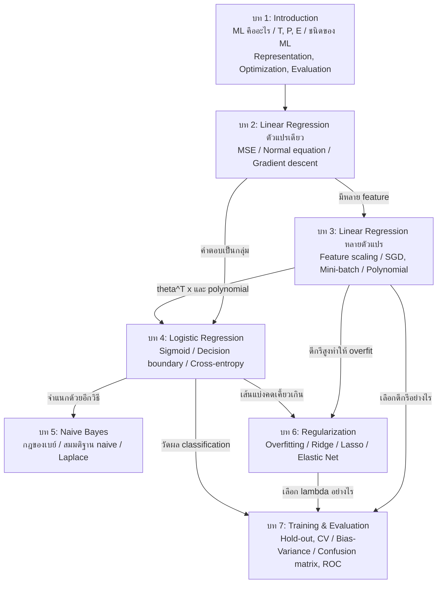
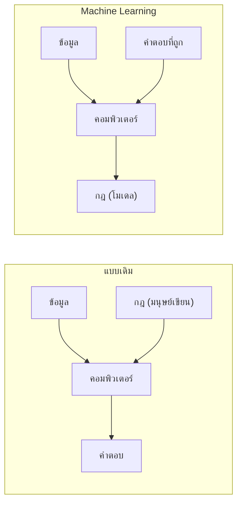
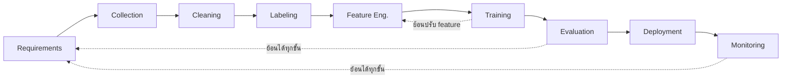
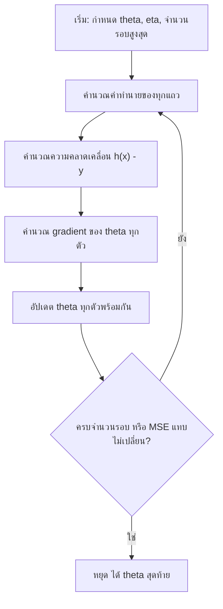
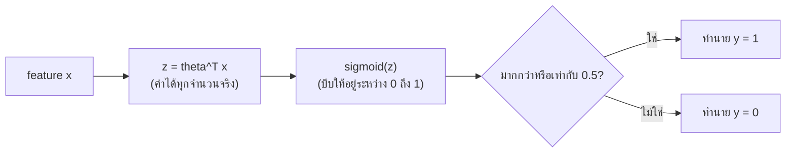
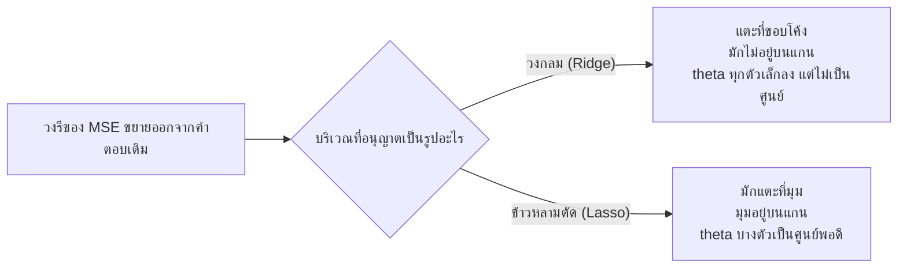
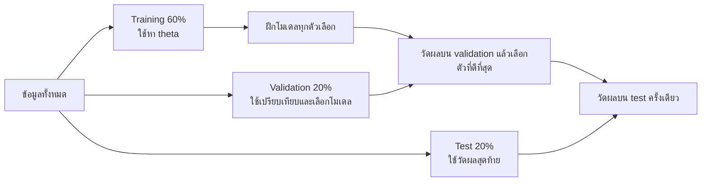

# เตรียมสอบกลางภาค Applied Machine Learning (DADS6003)
### ฉบับอ่านเข้าใจง่าย: เน้นทฤษฎีและการคำนวณพื้นฐาน บทที่ 1–7

เอกสารนี้เรียบเรียงให้เหมือนมีเพื่อนอธิบายเนื้อหาให้ฟังก่อนสอบ เป้าหมายไม่ใช่การจำทุกสูตร แต่คือเข้าใจว่าแต่ละวิธีแก้ปัญหาอะไร ทำงานอย่างไร และต่างจากวิธีอื่นตรงไหน ศัพท์ภาษาอังกฤษยังคงไว้ในวงเล็บ เพราะข้อสอบและสไลด์มักใช้คำเหล่านี้

ข้อสอบเน้นทฤษฎีเป็นหลัก จึงควรอ่าน **ส่วนอ่านรอบแรก** ให้เข้าใจก่อน แล้วจึงกลับไปอ่านรายละเอียดในแต่ละบท ส่วนการคำนวณให้เน้นโจทย์สั้น เช่น MSE, scaling, sigmoid, Naive Bayes, confusion matrix และ F1 Score ไม่จำเป็นต้องเริ่มจากการท่อง derivation ที่ยาว

สัญลักษณ์ที่ใช้ในเอกสาร
- **เฉลย** คือคำตอบของแบบฝึกที่สไลด์เว้นช่องไว้ให้คำนวณในห้อง
- **⚠** คือจุดที่สไลด์อาจพิมพ์ผิดหรือขัดกันเอง ควรถามอาจารย์ก่อนสอบ

ลำดับบทใช้ตามชื่อไฟล์สไลด์ คือบทที่ 4 Logistic Regression และบทที่ 5 Naive Bayes (หน้า Course Outline ในบทที่ 1 เรียง Naive Bayes ก่อน)

---

## อ่านรอบแรก: เรื่องที่ต้องเข้าใจก่อนลงรายละเอียด

### บทที่ 1 — Machine Learning คือการเรียนกฎจากข้อมูล

โปรแกรมแบบเดิมรับ **ข้อมูลกับกฎ** แล้วให้คำตอบ แต่ Machine Learning รับ **ข้อมูลกับตัวอย่างคำตอบ** แล้วเรียนรู้กฎหรือโมเดลขึ้นมาเอง อย่างไรก็ตาม ML ไม่ได้หมายความว่าไม่ต้องเขียนโปรแกรม เราต้องเขียนขั้นตอนเตรียมข้อมูล ฝึกโมเดล วัดผล และนำโมเดลไปใช้ เพียงแต่ไม่ต้องเขียนกฎตัดสินทุกกรณีด้วยตนเอง

โจทย์ ML ที่ชัดเจนควรระบุได้ครบสามอย่างตามแนวคิดของ Tom Mitchell:

- **T — Task:** โมเดลต้องทำงานอะไร
- **P — Performance:** จะวัดความสำเร็จด้วยอะไร
- **E — Experience:** โมเดลเรียนจากข้อมูลหรือประสบการณ์ใด

วิธีแยกประเภทงานให้ดูที่ข้อมูลและคำตอบ หากมีคำตอบกำกับคือ **Supervised Learning**; ไม่มีคำตอบและต้องหารูปแบบเองคือ **Unsupervised Learning**; หากเรียนจากผลตอบแทนของการกระทำต่อเนื่องคือ **Reinforcement Learning** ภายใน supervised learning ถ้าคำตอบเป็นตัวเลขต่อเนื่องเรียก **Regression** แต่ถ้าคำตอบเป็นกลุ่มเรียก **Classification**

อัลกอริทึม ML ทุกตัวมองผ่านกรอบเดียวกันได้ คือ **Representation** บอกว่าโมเดลมีหน้าตาอย่างไร, **Evaluation** บอกว่าใช้เกณฑ์ใดวัดความผิด และ **Optimization** บอกว่าจะหาค่าพารามิเตอร์ที่ดีได้อย่างไร กรอบนี้เป็นสะพานเชื่อมทุกบทที่เหลือ

### บทที่ 2 — Linear Regression หาเส้นที่ทำนายตัวเลขได้ใกล้ที่สุด

Linear Regression ใช้ทำนายค่าตัวเลข โดยโมเดลพื้นฐานคือ

$$
h_\theta(x)=\theta_0+\theta_1x
$$

$\theta_0$ คือจุดตัดแกน และ $\theta_1$ คือความชัน โมเดลวัดความผิดด้วย **Mean Squared Error (MSE)** ซึ่งนำค่าทำนายลบค่าจริง ยกกำลังสอง แล้วหาค่าเฉลี่ย การยกกำลังสองทำให้ค่าบวกและลบไม่หักล้างกัน และลงโทษความผิดขนาดใหญ่มากกว่าความผิดขนาดเล็ก

การหาพารามิเตอร์มีสองแนวทาง **Normal Equation** คำนวณคำตอบโดยตรง ไม่ต้องกำหนด learning rate แต่ช้าเมื่อมี feature จำนวนมากและอาจพบเมทริกซ์ที่หา inverse ไม่ได้ ส่วน **Gradient Descent** ค่อย ๆ ปรับพารามิเตอร์ไปในทิศที่ลดความผิด ต้องกำหนด learning rate และวนหลายรอบ แต่รองรับ feature จำนวนมากได้ดีกว่า

แนวคิดที่ควรตอบให้ได้คือ learning rate ใหญ่เกินไปอาจทำให้ข้ามจุดต่ำสุดและไม่ลู่เข้า ส่วนค่าที่เล็กเกินไปทำให้เรียนช้ามาก

### บทที่ 3 — หลาย feature ทำให้ต้องสนใจสเกลและวิธีอัปเดต

Multiple Linear Regression ขยายจาก feature เดียวเป็นหลาย feature:

$$
h_\theta(x)=\theta_0+\theta_1x_1+\cdots+\theta_dx_d
$$

เมื่อ feature มีสเกลต่างกันมาก Gradient Descent อาจเดินไม่สมดุล จึงใช้ **Feature Scaling** โดย Min-Max Scaling มักแปลงข้อมูลให้อยู่ช่วง 0–1 ส่วน Z-score Standardization ทำให้ค่าเฉลี่ยเป็น 0 และส่วนเบี่ยงเบนมาตรฐานเป็น 1 การ scaling ไม่ได้ทำให้ข้อมูลมีสารสนเทศเพิ่มขึ้น แต่ช่วยให้การ optimization ทำงานง่ายขึ้น

ความต่างของ Gradient Descent สามแบบอยู่ที่จำนวนข้อมูลที่ใช้ต่อหนึ่งครั้งที่อัปเดตพารามิเตอร์:

| วิธี | ข้อมูลต่อหนึ่ง update | ภาพจำ |
|---|---:|---|
| Batch GD | ทั้งชุด | เสถียร แต่หนึ่งก้าวอาจช้า |
| SGD | 1 แถว | ก้าวเร็ว แต่แกว่งมาก |
| Mini-batch GD | ข้อมูลกลุ่มเล็ก | สมดุลระหว่างความเร็วกับความเสถียร |

**Polynomial Regression** เพิ่ม feature เช่น $x^2$ หรือ $x_1x_2$ เพื่อจับความสัมพันธ์ที่โค้ง แม้กราฟจะโค้ง แต่โมเดลยังเป็น linear ในแง่ที่พารามิเตอร์ $\theta$ ทุกตัวถูกนำมาคูณ feature แล้วบวกกัน ข้อควรระวังคือดีกรีสูงอาจทำให้ overfitting

### บทที่ 4 — Logistic Regression เปลี่ยนคะแนนให้เป็นความน่าจะเป็น

Linear Regression ให้ผลได้ตั้งแต่ลบอนันต์ถึงบวกอนันต์ จึงไม่เหมาะจะตีความเป็นความน่าจะเป็น Logistic Regression แก้โดยนำคะแนน $z=\theta^Tx$ ผ่านฟังก์ชัน sigmoid:

$$
\hat{p}=\frac{1}{1+e^{-z}}
$$

ผลลัพธ์ $\hat{p}$ อยู่ระหว่าง 0 กับ 1 และแปลว่าโอกาสที่ข้อมูลอยู่ใน class 1 จากนั้นใช้ threshold เช่น 0.5 เพื่อตัดสิน class เส้นหรือตำแหน่งที่โมเดลเปลี่ยนคำตอบจาก class หนึ่งไปอีก class หนึ่งเรียกว่า **Decision Boundary**

Logistic Regression ใช้ **Cross-Entropy Loss** แทน MSE เพราะ loss นี้เหมาะกับค่าความน่าจะเป็นและลงโทษแรงเมื่อโมเดลมั่นใจแต่ตอบผิด ตัวอย่างเช่น ค่าจริงเป็น 1 แต่โมเดลให้ความน่าจะเป็นใกล้ 0 จะเสียค่าปรับสูงมาก

จุดที่ชอบสับสน: Logistic Regression มีคำว่า regression แต่ใช้ทำ classification; sigmoid สร้างความน่าจะเป็น ส่วน threshold เปลี่ยนความน่าจะเป็นเป็น class

### บทที่ 5 — Naive Bayes จำแนกกลุ่มด้วยความน่าจะเป็น

Naive Bayes เริ่มจากคำถามว่า เมื่อเห็น feature แล้ว แต่ละ class มีโอกาสเป็นไปได้เท่าไร กฎของ Bayes เขียนใจความได้ว่า

$$
P(Y\mid X)\propto P(X\mid Y)P(Y)
$$

$P(Y)$ คือโอกาสเดิมของ class หรือ **prior** และ $P(X\mid Y)$ คือโอกาสเห็นข้อมูลลักษณะนี้เมื่อทราบ class หรือ **likelihood** โมเดลเลือก class ที่มี posterior สูงที่สุด

คำว่า **Naive** มาจากสมมติฐานว่า feature ต่าง ๆ เป็นอิสระต่อกันเมื่อทราบ class แล้ว สมมติฐานนี้มักไม่จริงทั้งหมด แต่ช่วยเปลี่ยนความน่าจะเป็นร่วมที่คำนวณยากให้เป็นผลคูณของความน่าจะเป็นราย feature จึงเรียนเร็วและใช้ข้อมูลไม่มาก

ถ้าค่าหนึ่งไม่เคยปรากฏในข้อมูลฝึก ความน่าจะเป็นจะเป็นศูนย์ และเมื่อคูณกับพจน์อื่นผลทั้งก้อนจะเป็นศูนย์ **Laplace Smoothing** แก้โดยบวกจำนวนเล็กน้อยให้ทุกกรณีก่อนคำนวณ

### บทที่ 6 — Regularization ลดการจำข้อมูลฝึกมากเกินไป

**Overfitting** คือโมเดลทำผลงานดีมากบน training set แต่แย่บนข้อมูลใหม่ สาเหตุมักมาจากโมเดลซับซ้อนเกินเมื่อเทียบกับข้อมูล Regularization แก้โดยเพิ่มค่าปรับเมื่อพารามิเตอร์มีขนาดใหญ่ ทำให้โมเดลเลือกความซับซ้อนเท่าที่จำเป็น

| วิธี | ค่าปรับ | ผลที่มักเห็น |
|---|---|---|
| Ridge | ผลรวม $\theta_j^2$ หรือ L2 | ลดขนาดทุก coefficient แต่ไม่ค่อยเป็นศูนย์ |
| Lasso | ผลรวม $|\theta_j|$ หรือ L1 | บาง coefficient อาจเป็นศูนย์ จึงช่วยเลือก feature |
| Elastic Net | ผสม L1 และ L2 | ประนีประนอมข้อดีของ Ridge และ Lasso |

$\lambda$ ควบคุมความแรงของค่าปรับ ถ้า $\lambda$ ต่ำ โมเดลใกล้เคียงโมเดลเดิมและยังเสี่ยง overfit; ถ้าสูงเกินไป coefficient ถูกหดมากจนโมเดล underfit ดังนั้นไม่ได้หมายความว่ายิ่งสูงยิ่งดี

### บทที่ 7 — การประเมินต้องวัดผลบนข้อมูลที่โมเดลไม่เคยเห็น

หากวัดโมเดลด้วยข้อมูลฝึกเพียงอย่างเดียว เราไม่รู้ว่าโมเดลเรียนรูปแบบจริงหรือแค่จำข้อมูล จึงต้องแยกข้อมูลสำหรับประเมิน **Hold-out** แบ่งครั้งเดียว จึงง่ายและเร็วแต่ผลอาจขึ้นกับการสุ่ม ส่วน **Cross-Validation** แบ่งและประเมินหลายรอบ ช่วยให้ประมาณผลงานเสถียรกว่าแต่ใช้เวลามากกว่า

**High Bias** คือโมเดลง่ายเกินไปและผิดทั้ง train กับ validation จึงเกิด underfitting ส่วน **High Variance** คือ train ดีแต่ validation แย่ จึงเกิด overfitting จำง่าย ๆ ว่า bias คือ “เรียนไม่พอ” ส่วน variance คือ “จำชุดฝึกมากไป”

สำหรับ classification ให้เริ่มจาก Confusion Matrix:

| ค่าจริง / ค่าทำนาย | ทำนาย Positive | ทำนาย Negative |
|---|---:|---:|
| Positive จริง | TP | FN |
| Negative จริง | FP | TN |

- **Accuracy** ตอบว่าโดยรวมทายถูกกี่ส่วน แต่หลอกได้เมื่อ class ไม่สมดุล
- **Precision** ตอบว่าในสิ่งที่โมเดลเตือนว่า positive มีจริงกี่ส่วน
- **Recall** ตอบว่าใน positive จริงทั้งหมด โมเดลจับได้กี่ส่วน
- **F1 Score** สูงเมื่อ precision และ recall ดีทั้งคู่
- **ROC-AUC** มองความสามารถแยก class ครบหลาย threshold
- **PR Curve** เน้นความสัมพันธ์ระหว่าง precision กับ recall และมีประโยชน์เมื่อ positive พบได้น้อย

การเลือก metric ต้องผูกกับผลเสียของความผิดพลาด หากการพลาด positive อันตราย ให้ความสำคัญกับ recall หากการเตือนผิดมีต้นทุนสูง ให้ความสำคัญกับ precision

### สูตรคำนวณพื้นฐานที่ควรใช้เป็น

| เรื่อง | สูตร | วิธีตรวจคำตอบ |
|---|---|---|
| MSE | $\frac{1}{N}\sum(\hat{y}_i-y_i)^2$ | ต้องไม่ติดลบ |
| Min-Max | $\frac{x-x_{min}}{x_{max}-x_{min}}$ | ค่าฝึกมักอยู่ช่วง 0–1 |
| Z-score | $\frac{x-\mu}{\sigma}$ | ค่าเหนือค่าเฉลี่ยเป็นบวก |
| Sigmoid | $\frac{1}{1+e^{-z}}$ | ผลต้องอยู่ระหว่าง 0–1 |
| Accuracy | $\frac{TP+TN}{TP+TN+FP+FN}$ | ตัวส่วนเท่าจำนวนข้อมูลทั้งหมด |
| Precision | $\frac{TP}{TP+FP}$ | มองจากฝั่งที่โมเดลทำนาย positive |
| Recall | $\frac{TP}{TP+FN}$ | มองจากฝั่ง positive จริง |
| F1 | $\frac{2PR}{P+R}$ | ไม่เกิน 1 และถูกดึงลงโดยค่าที่ต่ำกว่า |

### วิธีเขียนตอบข้อสอบทฤษฎี

คำตอบที่ดีไม่ควรมีเพียงคำนิยาม ให้เขียนเป็นลำดับสั้น ๆ ดังนี้:

1. บอกว่าแนวคิดนั้นคืออะไร
2. บอกว่ามันแก้ปัญหาอะไรหรือทำไมจึงจำเป็น
3. อธิบายกลไกหลัก 1–2 ขั้น
4. บอกข้อดี ข้อจำกัด หรือสถานการณ์ที่เหมาะ
5. ยกตัวอย่างสั้น ๆ หากโจทย์ต้องการ

ตัวอย่างคำถาม “ทำไมต้องทำ Feature Scaling” ไม่ควรตอบเพียงว่า “เพื่อให้ข้อมูลอยู่สเกลเดียวกัน” แต่ควรตอบว่า feature ที่มีค่ามากจะทำให้ gradient ของพารามิเตอร์นั้นใหญ่กว่า feature อื่น ส่งผลให้ Gradient Descent เดินไม่สมดุล การ scaling จึงทำให้แต่ละ feature มีช่วงใกล้กันและช่วยให้โมเดลลู่เข้าเร็วขึ้น โดยอาจใช้ Min-Max หรือ Z-score

---

## ส่วนที่ 0 ภาพรวม: ทั้งวิชาคือเรื่องเดียวกัน

ก่อนอ่านทีละบท ควรเห็นภาพรวมก่อนว่าเจ็ดบทนี้ต่อกันอย่างไร เพราะข้อสอบแบบเขียนตอบมักถามให้เปรียบเทียบหรือเชื่อมโยงหลายหัวข้อ

บทที่ 1 ตอบว่า Machine Learning คืออะไร และบอกว่าอัลกอริทึมทุกตัวประกอบด้วยสามส่วน คือ หน้าตาของโมเดล (Representation) วิธีค้นหาโมเดลที่ดีที่สุด (Optimization) และเกณฑ์วัดว่าโมเดลดีแค่ไหน (Evaluation) บทที่ 2 นำกรอบนี้ไปใช้กับโมเดลแรกที่ง่ายที่สุด คือเส้นตรงที่ทำนายตัวเลขจาก feature ตัวเดียว วัดความผิดด้วย MSE และหาคำตอบได้สองวิธี บทที่ 3 ขยายเส้นตรงให้รับได้หลาย feature แล้วแก้ปัญหาที่ทำให้ gradient descent ทำงานไม่ดี รวมถึงทำให้เส้นโค้งได้ด้วย polynomial regression บทที่ 4 เปลี่ยนงานจากทำนายตัวเลขเป็นทำนายกลุ่ม (classification) โดยนำเส้นตรงเดิมมาครอบด้วย sigmoid บทที่ 5 จำแนกกลุ่มด้วยวิธีที่ต่างออกไปโดยสิ้นเชิง คือใช้ความน่าจะเป็นตามกฎของเบย์ บทที่ 6 แก้ปัญหาที่เกิดเมื่อโมเดลซับซ้อนเกินไปจนจำข้อมูลฝึก (overfitting) และบทที่ 7 ปิดท้ายด้วยคำถามว่าจะเลือกโมเดลและวัดผลอย่างไร

วิธีอ่านแผนภาพ: ข้อความบนลูกศรคือปัญหาที่บทต้นทางทิ้งไว้ บทปลายทางคือบทที่ตอบปัญหานั้น

ตารางต่อไปนี้ใช้สามองค์ประกอบของบทที่ 1 อ่านทุกบท จะเห็นว่าแต่ละบทเปลี่ยนเพียงบางช่อง ไม่ได้เริ่มใหม่ทั้งหมด

| บท | หน้าตาโมเดล (Representation) | เกณฑ์วัดตอนฝึก (Evaluation) | วิธีหาคำตอบ (Optimization) |
|---|---|---|---|
| 2 | $\theta_0 + \theta_1 x$ | MSE | Normal equation หรือ Batch GD |
| 3 | $\theta^{T}x$ (รวมพจน์ polynomial ได้) | MSE | BGD, SGD, Mini-batch |
| 4 | $\sigma(\theta^{T}x)$ | Cross-entropy | Gradient descent |
| 5 | $P(Y)\prod_j P(x_j \mid Y)$ | เลือกกลุ่มที่ความน่าจะเป็นสูงสุด | นับจากข้อมูล |
| 6 | เหมือนบท 2 ถึง 4 | Loss เดิม บวกค่าปรับ | SGD (Lasso ใช้ sub-gradient) |
| 7 | ไม่ได้เพิ่มโมเดล | Accuracy, Precision, Recall, F1, MCC, ROC/AUC | แบ่งข้อมูลเพื่อเลือกโมเดล |

---

## ส่วนที่ 1 บทที่ 1: Machine Learning คืออะไร

### 1.1 สองแนวทางในการให้คอมพิวเตอร์ทำงาน

การเขียนโปรแกรมแบบเดิม (traditional approach) คือมนุษย์คิดกฎเองทั้งหมด แล้วป้อนทั้งข้อมูลและกฎ (โปรแกรม) ให้คอมพิวเตอร์ คอมพิวเตอร์มีหน้าที่แค่นำกฎไปใช้กับข้อมูลเพื่อให้ได้คำตอบ ส่วนแนวทาง Machine Learning กลับทิศกัน คือมนุษย์ป้อนข้อมูลพร้อมคำตอบที่ถูกต้องให้คอมพิวเตอร์ แล้วคอมพิวเตอร์สร้างกฎออกมาเอง กฎที่ได้นี้เรียกว่าโมเดล

ความต่างนี้สำคัญเพราะงานหลายอย่างมนุษย์เขียนกฎได้ยาก เช่น อ่านลายมือหรือกรองอีเมลขยะ แต่เรามีตัวอย่างคำตอบที่ถูกจำนวนมาก ML จึงให้คอมพิวเตอร์เรียนกฎจากตัวอย่างแทน

### 1.2 นิยามของ Machine Learning

สไลด์ให้นิยามไว้สองแบบ

**Arthur Samuel (1959)** นิยามว่า ML คือสาขาวิชาที่ทำให้คอมพิวเตอร์มีความสามารถในการเรียนรู้ได้ **โดยไม่ต้องเขียนโปรแกรมสั่งอย่างชัดแจ้ง** (without being explicitly programmed) คำว่าไม่ต้องเขียนอย่างชัดแจ้งหมายถึงไม่ต้องเขียนกฎของงานทีละข้อ ไม่ได้หมายถึงไม่ต้องเขียนโค้ดเลย

**Tom Mitchell (1998)** ให้นิยามที่ตรวจสอบได้ว่าโปรแกรมเรียนรู้จริงหรือไม่ คือ โปรแกรมคอมพิวเตอร์ถูกกล่าวว่าเรียนรู้จากประสบการณ์ **E** (Experience) ต่องาน **T** (Task) โดยวัดด้วย **P** (Performance measure) ถ้าผลงานในงาน T ที่วัดด้วย P **ดีขึ้นเมื่อได้ประสบการณ์ E มากขึ้น** ปัญหาที่ระบุ T, P และ E ได้ครบเรียกว่า **well-posed learning problem** (ปัญหาการเรียนรู้ที่ตั้งโจทย์ชัดเจน)

นิยามของ Mitchell มีประโยชน์ตรงที่บังคับให้ต้องตอบสามคำถาม ระบบต้องทำอะไร (T) เรียนจากอะไร (E) และวัดผลอย่างไร (P) ถ้าขาดข้อใดข้อหนึ่ง เราจะพิสูจน์ไม่ได้ว่าระบบเรียนรู้จริง

| งาน | T (งาน) | P (ตัววัดผล) | E (ประสบการณ์) |
|---|---|---|---|
| ลายมือ | จำแนกรูปตัวเลขที่เขียนด้วยลายมือ | ร้อยละของตัวเลขที่จำแนกถูก | ชุดรูปตัวเลขที่มีคำตอบกำกับ เช่น MNIST |
| หมากฮอส (Checkers) | เล่นหมากฮอส | ร้อยละของเกมที่ชนะคู่แข่ง | การเล่นเกมฝึกซ้อมกับตัวเอง |
| ขับรถอัตโนมัติ | ขับบนทางหลวงสี่เลนโดยใช้เซนเซอร์ภาพ | ระยะทางเฉลี่ยที่ขับได้ก่อนเกิดความผิดพลาด (มนุษย์ตัดสิน) | ลำดับภาพและคำสั่งพวงมาลัยที่บันทึกขณะดูคนขับจริง |
| ตรวจจับ spam | จัดอีเมลว่าเป็น spam หรืออีเมลปกติ | ร้อยละของอีเมลที่จัดถูก | ฐานข้อมูลอีเมลที่บางส่วนมีคนติดป้ายไว้ |

สังเกตว่า P ไม่จำเป็นต้องเป็นร้อยละความถูกต้องเสมอ เช่น ขับรถใช้ระยะทางก่อนพลาด เพราะ P ต้องเลือกให้เหมาะกับงาน

### 1.3 ชนิดของ Machine Learning

สไลด์แบ่ง ML เป็นสามชนิด โดยดูจากลักษณะข้อมูลที่ใช้เรียน

**การเรียนแบบมีผู้สอน (Supervised Learning)** ข้อมูลเป็นคู่ของ input กับคำตอบ เขียนเป็น $D = \{(x_1, y_1), (x_2, y_2), \ldots, (x_n, y_n)\}$ โดย $x_i \in \mathbb{R}^d$ คือ vector ของคุณลักษณะ (attributes) ซึ่งมี $d$ ค่า และ $y_i$ คือคำตอบ (label) ถ้าคำตอบเป็นจำนวนจริง ($y_i \in \mathbb{R}$) เรียกว่าปัญหา **regression** เช่น ทำนายราคาบ้าน ถ้าคำตอบเป็นกลุ่มใดกลุ่มหนึ่ง ($y_i \in \{C_1, \ldots, C_K\}$) เรียกว่าปัญหา **classification** เช่น ทำนายว่าอีเมลเป็น spam หรือไม่ เป้าหมายของการเรียนคือหาพารามิเตอร์ $\theta$ ที่ทำให้ค่าความผิดพลาดที่คาดหวัง (expected loss) $L(y, f(x; \theta))$ ต่ำที่สุด โดย $f$ คือโมเดลและ $L$ คือฟังก์ชันวัดความผิด จุดที่ควรจำคือ regression หรือ classification **ดูจากชนิดของคำตอบ $y$** ไม่ได้ดูจาก feature

**การเรียนแบบไม่มีผู้สอน (Unsupervised Learning)** ข้อมูลมีแต่ input ไม่มีคำตอบ เขียนเป็น $D = \{x_1, x_2, \ldots, x_N\}$ เป้าหมายคือทำความเข้าใจและดึงรูปแบบ โครงสร้าง หรือความสัมพันธ์ที่ซ่อนอยู่ในข้อมูลที่ไม่มีป้ายกำกับ งานหลักมีสามแบบ คือ การจัดกลุ่ม (Clustering) การลดมิติข้อมูล (Dimensionality Reduction) และการหาข้อมูลผิดปกติ (Anomaly Detection) อัลกอริทึมที่สไลด์ยกตัวอย่างคือ K-means, DBScan และ PCA

**การเรียนแบบเสริมกำลัง (Reinforcement Learning)** ระบบได้รับลำดับของสถานะ (states) การกระทำ (actions) และรางวัล (rewards) แล้วเรียนจนได้ **นโยบายที่ดีที่สุด (optimal policy)** ซึ่งคือการจับคู่ว่าในแต่ละสถานะควรทำการกระทำใด เหมาะกับงานที่ไม่มีใครบอกคำตอบที่ถูกของแต่ละขั้น บอกได้แค่ว่าผลออกมาดีหรือไม่ เช่น เกม

**ตัวอย่างการประยุกต์ในสไลด์:** ตรวจจับอีเมล spam, ตรวจจับและจดจำใบหน้า, วิเคราะห์ข้อมูลกีฬา, จดจำรหัสไปรษณีย์, ตรวจจับการโกงบัตรเครดิต, พยากรณ์หุ้น, ผู้ช่วยอัจฉริยะ (เช่น ChatGPT), ระบบแนะนำสินค้า และรถขับเคลื่อนอัตโนมัติ

### 1.4 กระบวนการคิดเมื่อเริ่มโครงการ ML (Machine Learning Process)

สไลด์ให้คำถามเจ็ดข้อที่ควรถามตามลำดับ

1. ผลลัพธ์ที่ต้องการคืออะไร (Business Requirement)
2. ชุดข้อมูลน่าจะมีหน้าตาอย่างไร (ตรงกับ **E**)
3. เป็นปัญหาแบบ supervised, unsupervised หรือ reinforcement (ตรงกับ **T**)
4. จะใช้อัลกอริทึมอะไร (Solutions)
5. จะวัดความสำเร็จอย่างไร (ตรงกับ **P**)
6. จะดูแลรักษาโมเดลที่สร้างขึ้นอย่างไร
7. มีความท้าทายหรือกับดักอะไรบ้าง

สิ่งที่ควรสังเกตคือ คำถามข้อ 2, 3 และ 5 คือ E, T และ P ของ Mitchell และการเลือกอัลกอริทึมเป็นข้อที่ 4 ไม่ใช่ข้อแรก เพราะต้องรู้เป้าหมายและหน้าตาข้อมูลก่อนจึงจะเลือกได้ถูก

### 1.5 วงจรการทำงานของ ML (Machine Learning Operations)

สไลด์แสดงขั้นตอนเก้าขั้น เรียงตามลำดับดังนี้ กำหนดความต้องการของโมเดล (Model Requirements) → เก็บข้อมูล (Data Collection) → ทำความสะอาดข้อมูล (Data Cleaning) → ติดป้ายคำตอบ (Data Labeling) → สร้างและเลือก feature (Feature Engineering) → ฝึกโมเดล (Model Training) → ประเมินโมเดล (Model Evaluation) → นำไปใช้งาน (Model Deployment) → เฝ้าติดตามผล (Model Monitoring)

คำบรรยายรูปในสไลด์อธิบายสองเรื่อง เรื่องแรกคือขั้นตอนแบ่งเป็นสองประเภท ขั้นเก็บข้อมูล ทำความสะอาด และติดป้าย เป็นงานด้านข้อมูล (data-oriented) ส่วนขั้นที่เหลือเป็นงานด้านโมเดล (model-oriented) เรื่องที่สองคือ **วงจรนี้ไม่ได้เดินเป็นเส้นตรง** มีวงย้อนกลับ (feedback loop) หลายจุด ผลจากการประเมินและการเฝ้าติดตามอาจทำให้ต้องย้อนกลับไปขั้นใดก็ได้ก่อนหน้า และขั้นฝึกโมเดลอาจย้อนกลับไปปรับ feature

### 1.6 องค์ประกอบของอัลกอริทึม ML

สไลด์บอกว่าอัลกอริทึม ML ประกอบด้วยสามส่วน การเข้าใจสามส่วนนี้ทำให้อ่านอัลกอริทึมใดก็ได้เป็นโครงเดียวกัน

**1. การแทนโมเดล (Representation)** คือโมเดลมีหน้าตาแบบไหน แบ่งได้สี่กลุ่ม
- ฟังก์ชันเชิงตัวเลข (Numerical functions) เช่น linear regression $y = \theta_0 + \theta_1 x$ หรือ $\theta^{T}x$ และ logistic regression $y = \sigma(\theta^{T}x)$ โดย $\sigma$ คือ activation function
- ฟังก์ชันเชิงสัญลักษณ์ (Symbolic functions) เช่น decision tree และระบบกฎ (เช่น ถ้า A เท่ากับ B แล้ว C)
- ฟังก์ชันที่อิงตัวอย่าง (Instance-based functions) เช่น k-Nearest Neighbors
- โมเดลกราฟความน่าจะเป็น (Probabilistic graphical models) เช่น Bayesian networks

**2. วิธีหาค่าที่ดีที่สุด (Optimization)** คือวิธีค้นหาค่าพารามิเตอร์ที่ทำให้โมเดลดีที่สุด เช่น Gradient Descent, Stochastic Gradient Descent, Adam, AdaGrad, Newton's Method, Hessian Free Method และ Conjugate Gradient

**3. การประเมิน (Evaluation)** คือเกณฑ์วัดว่าโมเดลดีแค่ไหน เช่น Accuracy, MSE, MAE, RMSE, Precision, Recall, F1-Score, ROC AUC, Cohen's kappa และ MCC

**เชื่อมไปบทอื่น:** linear regression และ logistic regression ในหัวข้อ Representation คือบทที่ 2 ถึง 4 Gradient descent และ SGD ในหัวข้อ Optimization คือบทที่ 2 และ 3 ส่วนตัวชี้วัดในหัวข้อ Evaluation ถูกอธิบายละเอียดในบทที่ 7 ซึ่งก็คือ P ของ Mitchell นั่นเอง

---

## ส่วนที่ 2 บทที่ 2: Linear Regression ตัวแปรเดียว

### 2.1 บทนี้ทำอะไร

บทนี้นำสามองค์ประกอบของบทที่ 1 มาใช้จริงเป็นครั้งแรก กับงานที่ง่ายที่สุด คือทำนายตัวเลขหนึ่งค่าจาก feature เพียงตัวเดียวด้วยเส้นตรง แนวคิดในบทนี้ คือการวัดความผิดด้วย MSE และการหาคำตอบด้วย gradient descent จะถูกใช้ต่อในบทที่ 3, 4 และ 6

### 2.2 สัญลักษณ์และโมเดล

ชุดข้อมูล $D$ ประกอบด้วยคู่ $(x_i, y_i)$ จำนวน $N$ คู่ โดย $x_i$ คือ feature (ตัวแปรต้น) และ $y_i$ คือค่าที่ต้องการทำนาย (ตัวแปรตาม) ซึ่งเป็นจำนวนจริง โมเดลมองได้ว่าเป็นฟังก์ชันที่รับข้อมูลทั้งตาราง ($N$ แถว $d$ คอลัมน์) แล้วให้ค่าทำนายหนึ่งค่าต่อหนึ่งแถว เขียนว่า $f: \mathbb{R}^{N \times d} \to \mathbb{R}^{N \times 1}$

เมื่อมี feature ตัวเดียว ($d = 1$) โมเดลคือเส้นตรง

$$h_\theta(x) = \theta_0 + \theta_1 x$$

$\theta_0$ คือจุดที่เส้นตัดแกนตั้ง และ $\theta_1$ คือความชันของเส้น พารามิเตอร์ทุกตัวเป็นจำนวนจริง และจำนวนพารามิเตอร์ทั้งหมดคือ $d + 1$ (หนึ่งตัวต่อ feature บวกจุดตัดแกนอีกหนึ่ง) เลือก $\theta_0, \theta_1$ หนึ่งคู่ก็ได้เส้นตรงหนึ่งเส้น การเรียนคือการเลือกคู่ที่ดีที่สุด

### 2.3 วัดความผิดด้วย MSE และเป้าหมาย arg min

เมื่อมีเส้นตรงหนึ่งเส้น แต่ละจุดข้อมูลจะมีระยะห่างระหว่างค่าทำนายกับค่าจริง เราต้องรวมความผิดของทุกจุดเป็นตัวเลขเดียวเพื่อเทียบเส้นต่างๆ ได้ สไลด์ใช้ค่าเฉลี่ยของความคลาดเคลื่อนยกกำลังสอง (Mean Squared Error)

$$J(\theta_0, \theta_1) = \frac{1}{N}\sum_{i=1}^{N}(h_\theta(x_i) - y_i)^2$$

อ่านว่า สำหรับทุกจุด นำค่าทำนายลบค่าจริง ยกกำลังสอง แล้วหาค่าเฉลี่ย การยกกำลังสองทำให้ความคลาดเคลื่อนบวกกับลบไม่หักล้างกัน และลงโทษจุดที่ผิดมากหนักกว่าจุดที่ผิดน้อย

เป้าหมายของการเรียนเขียนว่า

$$\hat{\theta}_0, \hat{\theta}_1 = \mathrm{arg\,min}_{\theta_0, \theta_1} J(\theta_0, \theta_1)$$

คำว่า **arg min** หมายถึงค่าของ $\theta_0, \theta_1$ ที่ทำให้ $J$ ต่ำที่สุด ไม่ใช่ค่าของ $J$ เอง เพราะสิ่งที่นำไปใช้ทำนายคือพารามิเตอร์

**แบบฝึกในสไลด์:** ข้อมูลสามจุด $(0, 1), (2, 1), (3, 4)$ เทียบสองโมเดล $h^{1}(x) = 3$ กับ $h^{2}(x) = 1 + x$

**เฉลย:** โมเดลแรกมี $\theta_0 = 3, \theta_1 = 0$ (เส้นแนวนอน) ทำนาย 3 ทุกจุด ความคลาดเคลื่อนยกกำลังสองคือ 4, 4, 1 ได้ MSE $= 9/3 = 3$ โมเดลที่สองมี $\theta_0 = 1, \theta_1 = 1$ ทำนาย 1, 3, 4 ความคลาดเคลื่อนยกกำลังสองคือ 0, 4, 0 ได้ MSE $= 4/3 \approx 1.33$ โมเดลที่สองดีกว่าเพราะ MSE ต่ำกว่า

### 2.4 รูปร่างของ J

สไลด์แสดงว่า $J$ เปลี่ยนไปอย่างไรเมื่อเปลี่ยน $\theta$ ถ้าดู $\theta$ ตัวเดียว กราฟของ $J$ เป็นพาราโบลาหงาย ถ้าดูทั้ง $\theta_0$ และ $\theta_1$ จะได้พื้นผิวรูปชามในสามมิติ และเมื่อมองจากด้านบนเป็นวงรีซ้อนกัน (contour) โดยมีเส้นทางของ gradient descent เดินจากขอบเข้าหาก้นชาม

รูปชามนี้สำคัญเพราะมีก้นชามจุดเดียว และที่ก้นชามความชันเป็นศูนย์ คุณสมบัตินี้เป็นที่มาของทั้งสองวิธีหาคำตอบ วิธีแรกคือหาจุดที่ความชันเป็นศูนย์โดยตรง วิธีที่สองคือค่อยๆ เดินลงตามความชันจนถึงก้นชาม

### 2.5 วิธีที่ 1: Analytical approach (Normal equation)

วิธีนี้แก้สมการได้คำตอบในครั้งเดียว ไม่ต้องวนรอบ

$$\theta = (X^{T}X)^{-1}X^{T}y$$

โดย $X$ คือตารางข้อมูลที่เติมคอลัมน์เลข 1 ไว้หน้าสุด เพื่อให้ $\theta_0$ อยู่ในสูตรเดียวกับพารามิเตอร์ตัวอื่น

สไลด์ระบุปัญหาของวิธีนี้ไว้สองข้อ

**ปัญหาที่ 1: $X^{T}X$ ไม่มีอินเวอร์ส (non-invertible)** สูตรต้องหาอินเวอร์สของ $X^{T}X$ แต่บางกรณีเมทริกซ์นี้ไม่มีอินเวอร์ส ตัวอย่างคือมี feature ที่ซ้ำซ้อนกัน (redundant features) เช่น มีคอลัมน์ราคาเป็นบาทและเป็นดอลลาร์ ซึ่งคำนวณจากกันได้ วิธีแก้ในสไลด์คือ SVD (Singular Value Decomposition) และ Moore-Penrose pseudo-inverse ซึ่งเป็นวิธีหาคำตอบที่ใช้ได้แม้เมทริกซ์ไม่มีอินเวอร์ส

**ปัญหาที่ 2: คำนวณช้าเมื่อ feature มาก** การหาอินเวอร์สมีความซับซ้อน $O(n^3)$ เมื่อ $n$ คือจำนวน feature เพราะเมทริกซ์ $X^{T}X$ มีขนาดเท่าจำนวน feature และการหาอินเวอร์สใช้การคำนวณประมาณกำลังสามของขนาดนั้น ถ้า feature เพิ่ม 10 เท่า งานเพิ่มประมาณ 1,000 เท่า วิธีแก้ในสไลด์คือใช้ iterative approach แทน

### 2.6 วิธีที่ 2: Iterative approach (Batch Gradient Descent)

Gradient descent คือการหาค่าต่ำสุดของ $J$ โดย **ปรับ $\theta$ ไปในทิศตรงข้ามกับ gradient** ภาพในหัวคือยืนอยู่บนภูเขาในหมอก มองไม่เห็นก้นหุบ แต่รู้สึกได้ว่าพื้นลาดไปทางไหน วิธีลงไปจุดต่ำสุดคือก้าวไปทางที่ลาดลงทีละก้าว ความสูงคือค่า $J$ ตำแหน่งคือค่า $\theta$ และความลาดคือ gradient

สมการทั่วไปคือ วนซ้ำจนกว่าจะลู่เข้า

$$\theta_j^{t+1} := \theta_j^{t} - \eta \frac{\partial}{\partial \theta_j} J(\theta_0^{t}, \theta_1^{t})$$

ตัวยก $t$ คือรอบที่ $t$ และ $\eta$ (อ่านว่า eta) คือ learning rate หรือขนาดก้าว เช่น 0.001 เมื่อแทนอนุพันธ์ของ MSE ลงไป จะได้สมการปรับค่าที่ใช้จริง

$$\theta_j^{t+1} := \theta_j^{t} - \eta \frac{1}{N}\sum_{i=1}^{N}(h_\theta(x_i) - y_i)\,x_{i,j}, \quad j = 0, 1$$

แยกเป็นสองบรรทัดคือ $\theta_0$ ซึ่งคูณด้วย $x_{i,0} = 1$ และ $\theta_1$ ซึ่งคูณด้วย $x_{i,1}$ (ค่า $x$ ของจุดนั้น)

ความหมายของสมการ: $(h_\theta(x_i) - y_i)$ คือทำนายผิดไปเท่าไรในแต่ละจุด ถ้าเส้นทำนายต่ำกว่าค่าจริงโดยรวม ค่านี้ติดลบ เมื่อนำไปลบ $\theta$ ก็คือการเพิ่ม $\theta$ เส้นจึงยกขึ้นมาหาข้อมูล ค่า $\theta$ ทุกตัวต้องคำนวณจากค่าของรอบเดียวกัน แล้วจึงอัปเดตพร้อมกัน

คำว่า **batch** หมายถึงทุกก้าวใช้ข้อมูลครบทุกแถวในการคำนวณ

**เงื่อนไขหยุด (stopping criteria):** หยุดเมื่อครบจำนวนรอบสูงสุด หรือเมื่อ MSE ของสองรอบติดกันต่างกันน้อยกว่าเกณฑ์ $\epsilon$ เช่น $\epsilon = 0.000001$ ซึ่งแปลว่าเดินต่อก็แทบไม่ได้อะไรเพิ่ม

**ข้อจำกัดของ batch gradient descent:** ต้องกำหนด learning rate และ hyperparameter อื่นเอง และช้าเมื่อข้อมูลมีจำนวนแถวมาก เพราะทุกก้าวต้องคำนวณข้อมูลครบทุกแถว

⚠ อนุพันธ์ที่แท้จริงของกำลังสองมีตัวคูณ 2 (คือ $\frac{2}{N}$) แต่สมการปรับค่าในสไลด์ใช้ $\frac{1}{N}$ ในการสอบให้ใช้สูตรตามสไลด์

### 2.7 เทียบสองวิธี

สไลด์สรุปเป็นตาราง

| Iterative (Gradient descent) | Analytical (Normal equation) |
|---|---|
| ต้องกำหนด hyperparameter | ไม่ต้องกำหนด hyperparameter |
| ใช้ได้ดีเมื่อ feature มาก (large $d$) | ใช้ได้ดีเมื่อข้อมูลหลายแถว (large $N$) |
| ต้องทำ feature scaling | ไม่ต้องทำ feature scaling |
| ไม่มีปัญหาอินเวอร์ส | มีปัญหาอินเวอร์ส |
| $O(n^2)$ | $O(n^3)$ |

วิธีจำ: normal equation แม่นยำในครั้งเดียวและไม่ต้องตั้งค่าอะไร แต่ติดสองเรื่องคืออินเวอร์สและความช้าเมื่อ feature มาก ส่วน gradient descent แก้สองเรื่องนั้นได้ แต่ต้องแลกด้วยการเลือก learning rate และการปรับสเกลของ feature (ซึ่งบทที่ 3 อธิบาย)

### 2.8 ตัวอย่างคำนวณเพิ่มเติม: ทำทั้งสองวิธี

> อ่านส่วนนี้หลังจากเข้าใจความต่างระหว่าง Normal Equation กับ Gradient Descent แล้ว หากข้อสอบเน้นทฤษฎี ให้จำวิธีคิดและความแตกต่างของสองวิธีมากกว่าจำตัวเลขทุกขั้น

ข้อมูล $(2, 12), (5, 9), (1, 6)$ ให้ (1) หา $\theta$ ด้วย normal equation และ (2) ทำ batch gradient descent โดยเริ่ม $\theta_0 = \theta_1 = 0.1$, $\eta = 0.01$ จำนวน 2 รอบ

**เฉลยข้อ (1):** เขียนแถวของ $X^{T}X$ เป็น $[(3,8);(8,30)]$ และเขียน $X^{T}y=(27,75)^{T}$ จะได้ determinant $=90-64=26$ ดังนั้น $\theta_0=105/13\approx8.077$ และ $\theta_1=9/26\approx0.346$

**เฉลยข้อ (2):** รอบที่ 1 ค่าทำนายคือ 0.3, 0.6, 0.2 ความคลาดเคลื่อนคือ $-11.7, -8.4, -5.8$ ผลรวม $-25.9$ และผลรวมของความคลาดเคลื่อนคูณ $x$ คือ $-71.2$ จึงได้ $\theta_0 = 0.1 + 0.01(25.9/3) \approx 0.1863$ และ $\theta_1 = 0.1 + 0.01(71.2/3) \approx 0.3373$ รอบที่ 2 ทำแบบเดียวกันได้ $\theta_0 \approx 0.2655$, $\theta_1 \approx 0.5486$ MSE ลดจาก 80.36 เป็น 68.29 แล้วเป็น 58.65 สองรอบยังห่างจากคำตอบของวิธีที่ 1 มาก ซึ่งแสดงว่า gradient descent ต้องใช้หลายรอบ

**เชื่อมไปบทอื่น:** แถว "ต้องทำ feature scaling" ในตารางเทียบถูกอธิบายในบทที่ 3 และสมการปรับค่าหน้าตานี้ถูกใช้ซ้ำในบทที่ 3 (หลายตัวแปร) บทที่ 4 (logistic regression) และบทที่ 6 (เติมค่าปรับ)

---

## ส่วนที่ 3 บทที่ 3: Linear Regression หลายตัวแปร

### 3.1 บทนี้ทำอะไร

ในงานจริง ค่าที่ต้องการทำนายมักขึ้นกับหลายปัจจัยพร้อมกัน บทนี้ขยายเส้นตรงของบทที่ 2 ให้รับได้หลาย feature และแก้ปัญหาที่ทำให้ gradient descent ทำงานไม่ดี ได้แก่ สเกลของ feature ต่างกัน ข้อมูลมากจนแต่ละก้าวช้า และความแกว่งของ SGD จากนั้นแสดงวิธีทำให้เส้นโค้งได้ด้วย polynomial regression

### 3.2 ข้อมูลและโมเดล

ข้อมูลเขียนเป็นเมทริกซ์ $X \in \mathbb{R}^{N \times d}$ คือมี $N$ แถวและ $d$ คอลัมน์ ค่าแต่ละช่องเขียนว่า $x_{i,j}$ หมายถึงแถวที่ $i$ คอลัมน์ที่ $j$ ตัวอย่างในสไลด์คือข้อมูลบ้าน แต่ละแถวคือบ้านหนึ่งหลัง มีคอลัมน์เลข 1 อยู่หน้าสุด ตามด้วยขนาดบ้าน (2104, 1416, 1534) และราคา (460, 232, 315)

โมเดลขยายจากตัวแปรเดียวเป็นหลายตัวแปร

$$h_\theta(x) = \theta_0 + \theta_1 x_1 + \cdots + \theta_d x_d = \theta^{T}x$$

ในรูปเมทริกซ์ $\theta^{T} = [\theta_0, \theta_1, \ldots, \theta_d]$ และ $x = [x_0, x_1, \ldots, x_d]^{T}$ โดย $x_0 = 1$ การเขียนเป็น $\theta^{T}x$ คือการนำพารามิเตอร์คูณกับ feature ตัวที่ตรงกันแล้วบวกทั้งหมด ข้อดีคือสูตรสั้นและใช้ได้ไม่ว่าจะมีกี่ feature

Cost function ยังเป็น MSE เหมือนเดิม และเป้าหมายยังเป็น arg min เพียงแต่ตอนนี้มีพารามิเตอร์ $d + 1$ ตัว

$$J(\theta_0, \ldots, \theta_d) = \frac{1}{N}\sum_{i=1}^{N}(h_\theta(x_i) - y_i)^2$$

### 3.3 Batch gradient descent หลายตัวแปร

สมการปรับค่ามีโครงเดิม ทำซ้ำจนลู่เข้า โดยใช้ข้อมูลฝึกทุกแถว

$$\theta_j^{t+1} := \theta_j^{t} - \eta \cdot \frac{1}{N}\sum_{i=1}^{N}(h_\theta(x_i) - y_i)\cdot x_{i,j}, \qquad j = 0, 1, \ldots, d$$

สไลด์เขียนแยกทีละบรรทัดตั้งแต่ $\theta_0$ ถึง $\theta_d$ ทุกบรรทัดเหมือนกัน ต่างกันแค่ตัวคูณท้าย $x_{i,j}$ ซึ่งคือคอลัมน์ของ feature ที่พารามิเตอร์ตัวนั้นดูแล ความหมายคือ ความผิดของแต่ละแถวถูกแบ่งความรับผิดชอบให้พารามิเตอร์แต่ละตัวตามขนาดของ feature ที่มันคูณ

### 3.4 ปัญหาที่ 1: สเกลของ feature ต่างกัน → Feature scaling

ปัญหาที่สไลด์ระบุคือ เมื่อ feature ตัวหนึ่งมีค่าใหญ่กว่าอีกตัวมาก ($x_2 \gg x_1$) เช่น ขนาดบ้านเป็นหลักพันแต่จำนวนห้องเป็นหลักหน่วย gradient descent จะช้าหรือไม่เสถียร

เหตุผลคือ gradient ของพารามิเตอร์แต่ละตัวคูณด้วยค่าของ feature ของมัน feature ที่ค่าใหญ่จึงได้ gradient ใหญ่ ขณะที่ learning rate มีค่าเดียวใช้กับทุกพารามิเตอร์ ถ้าตั้ง learning rate ให้เหมาะกับ feature ตัวเล็ก พารามิเตอร์ของ feature ตัวใหญ่จะก้าวกว้างเกินจนแกว่งหรือระเบิด ถ้าตั้งให้เหมาะกับ feature ตัวใหญ่ พารามิเตอร์ของ feature ตัวเล็กจะแทบไม่ขยับ

วิธีแก้คือปรับสเกลของ feature ก่อนเรียน (standardize หรือ normalize) สไลด์ให้สองสูตร

$$\text{Min-Max scaling: } x' = \frac{x - x_{min}}{x_{max} - x_{min}} \qquad \text{Z-score: } x' = \frac{x - \mu}{\sigma}$$

Min-Max แปลงค่าให้อยู่ในช่วง 0 ถึง 1 (ค่าต่ำสุดกลายเป็น 0 ค่าสูงสุดกลายเป็น 1) ส่วน Z-score แปลงให้มีค่าเฉลี่ย 0 และส่วนเบี่ยงเบนมาตรฐาน 1 เมื่อทุก feature อยู่ในสเกลใกล้กัน สไลด์สรุปว่า **gradient จะเคลื่อนที่ในทิศที่สมดุล** (helps gradients move in balanced directions)

### 3.5 ปัญหาที่ 2: ข้อมูลมากจน BGD ช้า → Stochastic gradient descent

Batch GD ใช้ข้อมูลทั้งหมดทุกครั้งที่ปรับค่า ถ้ามีหลายล้านแถว ทุกก้าวต้องคำนวณหลายล้านครั้ง SGD แก้โดยใช้ข้อมูล **หนึ่งแถวที่สุ่มมา** ต่อการปรับค่าหนึ่งครั้ง

$$\text{BGD: } \theta_j^{t+1} := \theta_j^{t} - \eta \cdot \frac{1}{N}\sum_{i=1}^{N}(h_\theta(x_i) - y_i)\cdot x_{i,j}$$

$$\text{SGD: } \theta_j^{t+1} := \theta_j^{t} - \eta(h_\theta(x_i) - y_i)\cdot x_{i,j}$$

ใน SGD เครื่องหมายผลรวมและ $\frac{1}{N}$ หายไป เพราะเหลือข้อมูลแถวเดียว และ $x_i$ ถูกสุ่มเลือกใหม่ทุกรอบ

สไลด์สรุปว่า **SGD มี noise มากกว่า แต่ลู่เข้าเร็วกว่า** ลู่เข้าเร็วเพราะได้ขยับทุกครั้งที่เห็นข้อมูลหนึ่งแถว แทนที่จะรอดูครบทุกแถวก่อนขยับครั้งเดียว มี noise เพราะแถวเดียวที่สุ่มมาไม่ได้เป็นตัวแทนข้อมูลทั้งหมด ทิศของแต่ละก้าวจึงแกว่งไปมา ไม่ได้ชี้ตรงไปที่ก้นชามเหมือน BGD

สไลด์ตั้งคำถามต่อว่า **จะลด noise ของ SGD ได้อย่างไร** คำตอบอยู่ในสองหัวข้อถัดไป

### 3.6 วิธีลด noise ที่ 1: Learning rate scheduling

แนวคิดคือควบคุมขนาดก้าวระหว่างการเรียน ช่วงแรกที่ยังอยู่ไกลจากคำตอบ ใช้ก้าวใหญ่เพื่อเดินเร็ว เมื่อเรียนไปเรื่อยๆ ค่อยๆ ลดขนาดก้าว ความแกว่งรอบก้นชามจึงแคบลง สไลด์ใช้วิธี **Inverse Time Decay**

$$\eta^{t+1} = \frac{\eta^{0}}{1 + \eta^{0}\lambda t}, \qquad t = 1, \ldots, T$$

$\eta^{0}$ คือ learning rate เริ่มต้น $t$ คือรอบ และ $\lambda$ คืออัตราการลด (decay rate) ยิ่ง $t$ มาก ตัวส่วนยิ่งใหญ่ learning rate จึงยิ่งเล็กลง

**ตัวอย่างในสไลด์:** $\eta^{0} = 0.01$, $\lambda = 0.1$, $t = 1$ ได้ $\eta^{2} = \frac{0.01}{1 + 0.01 \cdot 0.1 \cdot 1} = \frac{0.01}{1.001} = 0.0099$

⚠ ค่าที่แท้จริงคือ 0.00999 (ถ้าปัดสี่ตำแหน่งได้ 0.0100) ส่วน 0.0099 คือการตัดทศนิยมทิ้ง ในข้อสอบควรแสดงตัวหาร 1.001 ด้วย

ข้อควรระวัง: $\lambda$ ในสูตรนี้คืออัตราการลดของ learning rate เป็นคนละตัวกับ $\lambda$ ของ regularization ในบทที่ 6 แม้ใช้ตัวอักษรเดียวกัน

### 3.7 วิธีลด noise ที่ 2: Mini-batch gradient descent

Mini-batch เป็นทางสายกลาง คือใช้ข้อมูลครั้งละ $b$ แถว โดย $1 < b < N$ (เช่น $b = 10$) การเฉลี่ยความผิดของหลายแถวทำให้ทิศของก้าวแกว่งน้อยกว่าการใช้แถวเดียว แต่ยังเร็วกว่าการใช้ทุกแถว

| วิธี | ข้อมูลต่อการปรับหนึ่งครั้ง | ลักษณะ (ตามสไลด์) |
|---|---|---|
| BGD | ทั้งหมด $N$ แถว | เส้นทางเสถียรไปสู่จุดต่ำสุด |
| SGD | 1 แถว | เร็ว แต่แกว่ง (noisy) |
| Mini-batch GD | $b$ แถว | ประนีประนอมระหว่างความเสถียรกับความเร็ว |

### 3.8 ทำให้เส้นโค้งได้: Polynomial regression

เส้นตรงจับความสัมพันธ์ที่โค้งไม่ได้ polynomial regression แก้โดยใช้พจน์ที่มีดีกรีสูงขึ้นของ feature เดิม เช่น สอง feature ที่ดีกรี 2

$$h_\theta(x) = \theta_0 + \theta_1 x_1 + \theta_2 x_2 + \theta_3 x_1 x_2 + \theta_4 x_1^{2} + \theta_5 x_2^{2}$$

พจน์ $x_1^2$ และ $x_2^2$ ทำให้เกิดความโค้ง และ $x_1 x_2$ คือพจน์ที่ผลของ feature หนึ่งขึ้นกับอีกตัว สไลด์เรียกโมเดลนี้ว่า polynomial multiple linear regression แม้กราฟจะโค้งเมื่อมองเทียบกับ $x$ แต่ยังคำนวณแบบ linear regression ได้ทุกอย่าง เพราะถ้าตั้งพจน์ใหม่แต่ละตัวเป็น feature หนึ่งตัว โมเดลก็คือผลรวมของพารามิเตอร์คูณ feature เหมือนเดิม

จำนวนพจน์ทั้งหมดคำนวณด้วยสูตร combination

$$\binom{n}{r} = \frac{n!}{r!(n - r)!}, \qquad n = \text{จำนวน feature} + \text{ดีกรี}, \quad r = \text{ดีกรี}$$

**ตัวอย่างในสไลด์:** สอง feature ดีกรี 2 ได้ $\binom{4}{2} = \frac{4!}{2!\,2!} = 6$ พจน์ ตรงกับ $\theta_0$ ถึง $\theta_5$ ในสมการข้างบน

**เชื่อมไปบทอื่น:** $\theta^{T}x$ ของบทนี้ถูกครอบด้วย sigmoid ในบทที่ 4 พจน์ $x_1^2, x_2^2$ ทำให้เส้นแบ่งกลุ่มเป็นวงกลมในบทที่ 4 ถ้าใช้ดีกรีสูงเกินไปจะเกิด overfitting ในบทที่ 6 และคำถามว่าควรใช้ดีกรีเท่าไรถูกตอบในบทที่ 7

---

## ส่วนที่ 4 บทที่ 4: Logistic Regression

### 4.1 บทนี้ทำอะไร

บทที่ 2 และ 3 ทำนายตัวเลข แต่งานจำนวนมากต้องการทำนายกลุ่ม เช่น ทำนายว่าผู้ป่วยเป็นมะเร็งหรือไม่ (cancer prediction) ลูกค้าจะเลิกใช้บริการหรือไม่ (churn prediction) หรือพนักงานจะลาออกหรือไม่ (attrition prediction) งานแบบนี้เรียกว่า classification มีทั้งแบบสองกลุ่ม (binary) และหลายกลุ่ม (multi-class) Logistic regression ให้ผลลัพธ์เป็นความน่าจะเป็นในช่วง 0 ถึง 1 แล้วนำไปตัดสินว่าอยู่กลุ่มไหน แม้ชื่อมีคำว่า regression แต่ใช้ทำ classification

### 4.2 ทำไมใช้เส้นตรงเดิมไม่ได้ และ sigmoid แก้อย่างไร

เส้นตรงของ linear regression ให้ค่าได้ตั้งแต่ลบอนันต์ถึงบวกอนันต์ ไม่มีขอบเขต จึงแปลเป็นความน่าจะเป็นไม่ได้ เพราะความน่าจะเป็นต้องอยู่ระหว่าง 0 ถึง 1 วิธีแก้คือเก็บผลรวมเชิงเส้นไว้เหมือนเดิม แล้วนำไปผ่านฟังก์ชัน sigmoid ซึ่งบีบค่าใดๆ ให้อยู่ในช่วง $(0, 1)$

$$z = \theta^{T}x, \qquad \sigma(z) = \frac{1}{1 + e^{-z}} = \frac{1}{1 + e^{-\theta^{T}x}}$$

กราฟของ sigmoid เป็นเส้นโค้งรูปตัว S ที่มีจุดศูนย์กลางที่ $z = 0$ ผ่านจุด $(0, 0.5)$ เมื่อ $z$ เป็นบวกมาก ค่าเข้าใกล้ 1 เมื่อ $z$ เป็นลบมาก ค่าเข้าใกล้ 0

| Linear regression | Logistic regression |
|---|---|
| $h_\theta(x) = \theta^{T}x$ | $h_\theta(x) = \sigma(\theta^{T}x)$ |

ต่างกันแค่ sigmoid ที่ครอบอยู่ ผลลัพธ์ $h_\theta(x)$ ของ logistic regression คือความน่าจะเป็นที่ข้อมูลนั้นเป็นกลุ่ม 1

### 4.3 เส้นแบ่งกลุ่ม (Decision Boundary)

สไลด์กำหนดกติกาการตัดสินว่า ทำนาย $y = 1$ เมื่อ $h_\theta(x) \ge 0.5$ และทำนาย $y = 0$ เมื่อ $h_\theta(x) < 0.5$ เพราะ sigmoid ให้ค่า 0.5 พอดีเมื่อ $z = 0$ และให้ค่ามากกว่า 0.5 เมื่อ $z > 0$ กติกานี้จึงเท่ากับดูว่า $\theta^{T}x \ge 0$ หรือไม่ เส้นแบ่งระหว่างสองกลุ่มคือจุดที่ $\theta^{T}x = 0$

สไลด์แสดงตัวอย่างสามแบบ

| โมเดล | เส้นแบ่งที่ได้ |
|---|---|
| $h_\theta(x) = \sigma(\theta_0 + \theta_1 x_1)$ | เส้นตั้ง เพราะใช้ feature เดียว |
| $h_\theta(x) = \sigma(\theta_0 + \theta_1 x_1 + \theta_2 x_2)$ | เส้นตรงเอียงบนระนาบสองมิติ |
| $h_\theta(x) = \sigma(-1 + x_1^{2} + x_2^{2})$ | วงกลม $x_1^2 + x_2^2 = 1$ |

ข้อที่ควรเข้าใจคือ เส้นแบ่งแบบที่สามเป็นวงกลมได้เพราะใช้พจน์ $x_1^2$ และ $x_2^2$ (polynomial features แบบบทที่ 3) ไม่ใช่เพราะ sigmoid ถ้าใช้แค่ $x_1, x_2$ เส้นแบ่งจะเป็นเส้นตรงเสมอ

⚠ กราฟวงกลมในสไลด์เขียนว่า "Class 1 (inside)" แต่ถ้าแทนจุด (0, 0) ในสูตร $\sigma(-1 + x_1^2 + x_2^2)$ จะได้ $z = -1$ ซึ่งน้อยกว่าศูนย์ จึงเป็นกลุ่ม 0 ตามสูตร ด้านในวงกลมจึงเป็นกลุ่ม 0 และด้านนอกเป็นกลุ่ม 1 ควรถามอาจารย์

### 4.4 ทำไมไม่ใช้ MSE กับ logistic regression

ถ้านำ MSE ของ linear regression มาใช้ตรงๆ สไลด์บอกว่าไม่เหมาะ ด้วยเหตุผลสองข้อ

ข้อแรก **กราฟของ cost ไม่เป็นชามนูน (non-convex curve)** ใน linear regression MSE เป็นชามที่มีก้นเดียว แต่เมื่อมี sigmoid อยู่ข้างใน กราฟจะมีที่ราบและหลุมย่อย gradient descent อาจติดอยู่ในหลุมที่ไม่ใช่จุดต่ำสุดจริง

ข้อสอง **ลู่เข้าไม่ดี (poor convergence properties)** เมื่อโมเดลทำนายผิดอย่างมั่นใจ เช่น ให้ความน่าจะเป็นเกือบ 0 ทั้งที่คำตอบคือ 1 ความชันของ sigmoid ที่ปลายกราฟเกือบเป็นศูนย์ gradient ของ MSE จึงเล็กมาก โมเดลแทบไม่ขยับในตอนที่ควรขยับมากที่สุด

### 4.5 Cross-entropy loss

สไลด์อธิบายว่า cross-entropy วัดความแตกต่างระหว่างการแจกแจงความน่าจะเป็นสองชุด คือคำตอบจริงกับสิ่งที่โมเดลทำนาย loss แยกเป็นสองกรณีตามคำตอบจริง

ถ้า $y=1$ จะใช้

$$
\text{loss}=-\ln(h_\theta(x))
$$

แต่ถ้า $y=0$ จะใช้

$$
\text{loss}=-\ln(1-h_\theta(x))
$$

แล้วเฉลี่ยทุกแถวเป็น $J(\theta)$

สไลด์แสดงกราฟของสองกรณีนี้ (แกนตั้งชื่อ NLLL) อ่านได้ว่า ในกรณี $y = 1$ ถ้าโมเดลให้ความน่าจะเป็นใกล้ 1 (ทำนายถูกอย่างมั่นใจ) loss ใกล้ 0 แต่ถ้าให้ความน่าจะเป็นใกล้ 0 (ทำนายผิดอย่างมั่นใจ) loss จะสูงมากจนพุ่งขึ้นไม่มีขอบเขต กรณี $y = 0$ กลับกัน พฤติกรรมนี้คือสิ่งที่ต้องการ ยิ่งผิดอย่างมั่นใจ ยิ่งถูกลงโทษหนัก

### 4.6 Negative Log Likelihood Loss: รวมสองบรรทัดเป็นบรรทัดเดียว

สูตรแบบแยกกรณีใช้คำนวณได้แต่ไม่สะดวกตอนหาอนุพันธ์ สไลด์จึงรวมเป็นสูตรเดียวโดยใช้การแจกแจงเบอร์นูลลี (Bernoulli distribution) ซึ่งเป็นการแจกแจงของผลลัพธ์ที่มีสองค่า

$$P(y_i \mid x_i; \theta) = (h_\theta(x_i))^{y_i} \cdot (1 - h_\theta(x_i))^{1 - y_i}$$

เลขยกกำลัง $y_i$ และ $1 - y_i$ ทำหน้าที่เป็นสวิตช์ ถ้า $y_i = 1$ พจน์หลังมีกำลังศูนย์กลายเป็น 1 เหลือ $h$ ถ้า $y_i = 0$ พจน์แรกกลายเป็น 1 เหลือ $1 - h$ จากนั้นใส่ $\ln$ ซึ่งเปลี่ยนผลคูณเป็นผลบวก

$$\ln P(y_i \mid x_i; \theta) = y_i \ln(h_\theta(x_i)) + (1 - y_i)\ln(1 - h_\theta(x_i))$$

ใส่เครื่องหมายลบและเฉลี่ยทุกแถว ได้ Negative Log Likelihood Loss (NLLL)

$$J(\theta) = -\frac{1}{N}\sum_{i=1}^{N}[y_i \ln h_\theta(x_i) + (1 - y_i)\ln(1 - h_\theta(x_i))]$$

สูตรนี้คือ cross-entropy ตัวเดียวกับข้อ 4.5 เขียนรวมเป็นบรรทัดเดียว

### 4.7 ที่มาของ Gradient (อ่านเพิ่มเพื่อเข้าใจ ไม่ใช่จุดเริ่มต้น)

สไลด์หาอนุพันธ์ของ $J(\theta)$ ทีละขั้นโดยใช้สูตรช่วยสองข้อ คือ อนุพันธ์ของ $\ln f$ เท่ากับ $\frac{1}{f}$ คูณอนุพันธ์ของ $f$ และอนุพันธ์ของ $\sigma(f)$ เท่ากับ $\sigma(f)(1 - \sigma(f))$ คูณอนุพันธ์ของ $f$

ขั้นตอนมีดังนี้ ขั้นแรก หาอนุพันธ์ของพจน์ $\ln h$ และ $\ln(1 - h)$ ได้ $\frac{1}{h}$ และ $\frac{1}{1 - h}$ คูณอนุพันธ์ของ $h$ ขั้นที่สอง แทนอนุพันธ์ของ sigmoid ได้ $h(1 - h)x_{ij}$ ขั้นที่สาม $\frac{1}{h}$ ตัดกับ $h$ และ $\frac{1}{1-h}$ ตัดกับ $(1 - h)$ พอดี ขั้นที่สี่ กระจายวงเล็บแล้วพจน์ $y_i h\,x_{ij}$ หักล้างกันเอง เหลือ

$$\frac{\partial J(\theta)}{\partial \theta_j} = \frac{1}{N}\sum_{i=1}^{N}(h_\theta(x_i) - y_i)\,x_{ij}, \qquad j = 0, \ldots, d$$

สไลด์เขียนกำกับว่า **หน้าตาเหมือน gradient descent ของ MSE** (Same form as BGD of MSE) ผลนี้น่าสนใจเพราะ cost function ต่างกันมาก แต่กฎการปรับค่าออกมาเหมือนกันทุกตัวอักษร ความต่างซ่อนอยู่ที่ $h_\theta(x)$ ซึ่งใน logistic regression ผ่าน sigmoid การตัดกันของ $h(1-h)$ ในขั้นที่สามยังเป็นเหตุผลที่ cross-entropy ไม่มีปัญหาลู่เข้าช้าแบบ MSE

### 4.8 เทียบ linear กับ logistic regression

สไลด์สรุปเป็นตารางที่ควรจำทั้งตาราง

| | Linear Regression | Logistic Regression |
|---|---|---|
| หน้าตาโมเดล | $h_\theta(x) = \theta^{T}x$ | $h_\theta(x) = \sigma(\theta^{T}x)$ |
| Cost function | $\frac{1}{N}\sum(h_\theta(x_i) - y_i)^2$ | $-\frac{1}{N}\sum(y_i \ln h_\theta(x_i) + (1 - y_i)\ln(1 - h_\theta(x_i)))$ |
| ตัววัดผล | MSE, $R^2$, MAE | Accuracy, Precision, Recall, F1, AUC |
| การปรับค่า gradient descent | $\theta_j^{(t+1)} = \theta_j^{(t)} - \eta\frac{1}{N}\sum(h_\theta(x_i) - y_i)x_{ij}$ | สูตรเดียวกัน |

### 4.9 ภาคผนวก: Odds, Logit และที่มาของ Sigmoid

> ส่วนนี้ช่วยอธิบายที่มาทางคณิตศาสตร์ หากข้อสอบถามทฤษฎีทั่วไป ให้เน้นว่า Sigmoid เปลี่ยนคะแนนเป็นความน่าจะเป็น และ threshold เปลี่ยนความน่าจะเป็นเป็น class ก่อน

**Odds** คือความน่าจะเป็นที่เหตุการณ์เกิด หารด้วยความน่าจะเป็นที่ไม่เกิด

$$\mathrm{Odds} = \frac{P(\text{เกิด})}{1 - P(\text{เกิด})}$$

ตัวอย่างในสไลด์: ความน่าจะเป็น 0.8 ได้ odds $= 0.8/0.2 = 4$ (เกิด 4 ครั้งต่อไม่เกิด 1 ครั้ง) 0.9 ได้ 9 ความน่าจะเป็น 0.5 ได้ 1 และ 0.2 ได้ 0.25

**Logit function:** สไลด์แสดงกราฟ odds ของภาวะ gastroschisis เทียบกับอายุมารดา ซึ่งเป็นเส้นโค้ง เมื่อใส่ $\ln$ ให้ odds จะได้ความสัมพันธ์เป็นเส้นตรง

$$\ln(\text{Odds}) = \theta_0 + \theta_1 \cdot \text{อายุมารดา}$$

ฟังก์ชันที่นำ $\ln$ ของ odds มาเป็นเส้นตรงของ feature นี้เรียกว่า logit function

**แก้สมการ logit หาความน่าจะเป็น (ตามขั้นในสไลด์)** เริ่มจาก $\ln(\frac{p}{1 - p}) = \beta_0 + \beta_1 x_1 + \cdots + \beta_k x_k$ เขียนย่อด้านขวาว่า $z$

1. ยกกำลัง $e$ ทั้งสองข้าง แล้วกลับเศษเป็นส่วน ได้ $\frac{1 - p}{p} = \frac{1}{e^{z}}$
2. แยกเศษส่วนด้านซ้ายเป็น $\frac{1}{p} - 1$ แล้วบวก 1 ทั้งสองข้าง ได้ $\frac{1}{p} = 1 + \frac{1}{e^{z}}$
3. ทำ 1 ให้มีตัวส่วนร่วม ได้ $\frac{1}{p} = \frac{e^{z} + 1}{e^{z}}$
4. กลับเศษเป็นส่วนอีกครั้ง ได้ $p = P(Y = 1) = \frac{e^{z}}{1 + e^{z}}$

ถ้าหารทั้งเศษและส่วนด้วย $e^{z}$ จะได้ $\frac{1}{1 + e^{-z}}$ ซึ่งคือ sigmoid ความหมายคือ logistic regression ก็คือการใช้เส้นตรงทำนาย log ของ odds และ sigmoid ไม่ได้ถูกเลือกมาเพียงเพราะรูปร่างสวย แต่เป็นผลทางคณิตศาสตร์ของแนวคิดนี้

**เชื่อมไปบทอื่น:** แถวตัววัดผลของตารางเทียบคือหัวข้อของบทที่ 7 เส้นแบ่งที่คดเคี้ยวเกินไปคือภาพ overfitting ของ logistic regression ในบทที่ 6 และบทที่ 5 เสนออีกวิธีหนึ่งในการจำแนกกลุ่ม

---

## ส่วนที่ 5 บทที่ 5: Naive Bayes Classification

### 5.1 บทนี้ทำอะไร

งานยังเป็น classification เหมือนบทที่ 4 คือมีข้อมูล $X$ ที่มี $N$ แถว $d$ feature และแต่ละแถวมีกลุ่ม $y_i \in \{C_1, \ldots, C_k\}$ งานตัวอย่างในสไลด์คือ ทำนายลูกค้าเลิกใช้บริการ ทำนายหุ้น และจำแนกอีเมล แต่วิธีคิดต่างจากบทที่ 4 โดยสิ้นเชิง บทที่ 4 หาเส้นแบ่งด้วย gradient descent ส่วนบทนี้คำนวณความน่าจะเป็นของแต่ละกลุ่มโดยตรงด้วยกฎของเบย์ และการ "ฝึก" คือการนับจากข้อมูล

### 5.2 กฎของเบย์ (Bayes' Rule)

$$\underbrace{P(Y \mid X)}_{\text{Posterior}} = \frac{\underbrace{P(X \mid Y)}_{\text{Likelihood}} \cdot \underbrace{P(Y)}_{\text{Prior}}}{\underbrace{P(X)}_{\text{Marginal}}}$$

กฎนี้มีสี่ส่วน ตามนิยามในสไลด์

- **Posterior** $P(Y \mid X)$ คือความน่าจะเป็นแบบมีเงื่อนไขของ $Y$ เมื่อรู้ $X$ แล้ว ในงานจำแนกคือ ความน่าจะเป็นที่ข้อมูลนี้อยู่กลุ่ม $Y$ เมื่อเห็น feature $X$ ซึ่งคือคำตอบที่ต้องการ
- **Prior** $P(Y)$ คือความเชื่อเริ่มต้นก่อนเห็นข้อมูล ในงานจำแนกคือ กลุ่มนี้พบบ่อยแค่ไหนในข้อมูล
- **Likelihood** $P(X \mid Y)$ คือโอกาสที่จะเห็นข้อมูลแบบ $X$ เมื่อกลุ่มเป็น $Y$ เช่น ในบรรดาผู้หญิง มีกี่ส่วนที่ชื่อ Drew
- **Marginal หรือ Evidence** $P(X)$ คือความน่าจะเป็นของ $X$ ในประชากรทั้งหมด ไม่สนกลุ่ม

### 5.3 ที่มาของกฎของ Bayes (อ่านเพิ่ม)

สไลด์พิสูจน์กฎของเบย์จากนิยามของความน่าจะเป็นแบบมีเงื่อนไขในห้าขั้น

$$P(Y \mid X) = \frac{P(Y \cap X)}{P(X)} \quad (1)$$

สมการ (1) บอกว่า ความน่าจะเป็นของ $Y$ เมื่อรู้ $X$ เท่ากับความน่าจะเป็นที่ทั้ง $X$ และ $Y$ เกิดพร้อมกัน หารด้วยความน่าจะเป็นที่ $X$ เกิด ภาพในหัวคือการตัดประชากรให้เหลือเฉพาะคนที่ $X$ เป็นจริง แล้วดูว่าในนั้นมี $Y$ กี่ส่วน

$$P(X \mid Y) = \frac{P(X \cap Y)}{P(Y)} \quad (2) \qquad\Rightarrow\qquad P(X \mid Y)P(Y) = P(X \cap Y) \quad (3)$$

สมการ (2) คือนิยามเดียวกันในอีกทิศ คูณ $P(Y)$ ทั้งสองข้างได้ (3)

$$P(X \mid Y)P(Y) = P(X \cap Y) = P(Y \cap X) \quad (4)$$

"$X$ และ $Y$ เกิดพร้อมกัน" กับ "$Y$ และ $X$ เกิดพร้อมกัน" คือเหตุการณ์เดียวกัน จึงเท่ากัน นำ (4) ไปแทนตัวเศษของ (1) ได้

$$P(Y \mid X) = \frac{P(X \mid Y)P(Y)}{P(X)} \quad (5)$$

ข้อสังเกต: กฎของเบย์ได้มาจากนิยามโดยตรง จึงถูกต้องเสมอ ไม่ใช่สมมติฐาน ส่วนที่เป็นสมมติฐานของ Naive Bayes จะมาในข้อ 5.6

### 5.4 ตัวอย่างในสไลด์: feature เดียว

ข้อมูล 8 คนมีชื่อและเพศ: Drew (ชาย), Claudia (หญิง), Drew (หญิง), Drew (หญิง), Alberto (ชาย), Karin (หญิง), Nina (หญิง), Sergio (ชาย) ต้องทายเพศของคนใหม่ชื่อ Drew

นับได้ว่ามีชาย 3 คน หญิง 5 คน คนชื่อ Drew มี 3 คน เป็นชาย 1 หญิง 2 ดังนั้น

$$P(\text{ชาย} \mid \text{Drew}) = \frac{P(\text{Drew} \mid \text{ชาย}) \cdot P(\text{ชาย})}{P(\text{Drew})} = \frac{\frac{1}{3} \cdot \frac{3}{8}}{\frac{3}{8}} = \frac{1}{3}$$

$$P(\text{หญิง} \mid \text{Drew}) = \frac{\frac{2}{5} \cdot \frac{5}{8}}{\frac{3}{8}} = \frac{2}{3}$$

ทายว่าเป็นหญิง ค่า evidence $P(\text{Drew})$ คำนวณได้จากผลรวมของทุกกลุ่ม

$$\text{evidence} = \sum_{i=1}^{K} P(X \mid y_i) \cdot P(y_i) = \frac{1}{3} \cdot \frac{3}{8} + \frac{2}{5} \cdot \frac{5}{8} = \frac{3}{8}$$

โดย $K$ คือจำนวนกลุ่ม ความหมายคือ evidence เป็นค่าเดียวกันสำหรับทุกกลุ่ม การตัดสินว่ากลุ่มไหนชนะจึงเทียบแค่ตัวเศษ (likelihood คูณ prior) ก็พอ

### 5.5 หลาย feature: ปัญหาของความน่าจะเป็นร่วม

เมื่อข้อมูลมีหลาย feature คือ ชื่อ, สูงเกิน 170 ซม. หรือไม่, สีตา และความยาวผม

| ชื่อ | สูงเกิน 170 | สีตา | ผม | เพศ |
|---|---|---|---|---|
| Drew | No | Blue | Short | ชาย |
| Claudia | Yes | Brown | Long | หญิง |
| Drew | No | Blue | Long | หญิง |
| Drew | No | Blue | Long | หญิง |
| Alberto | Yes | Brown | Short | ชาย |
| Karin | No | Blue | Long | หญิง |
| Nina | Yes | Brown | Short | หญิง |
| Sergio | Yes | Blue | Long | ชาย |

ต้องทายเพศของคนที่ชื่อ Drew, ไม่สูงเกิน 170, ตาน้ำตาล, ผมสั้น กฎของเบย์ยังเหมือนเดิม แต่ likelihood กลายเป็นความน่าจะเป็นของสี่ค่าพร้อมกัน $P(x_1, x_2, x_3, x_4 \mid Y)$

ปัญหาคือถ้าคิดว่า feature ขึ้นต่อกัน (dependent) ต้องใช้กฎลูกโซ่ของความน่าจะเป็น (chain rule)

$$P(x_1, \ldots, x_d \mid Y) = P(x_1 \mid Y)\,P(x_2 \mid x_1, Y)\,P(x_3 \mid x_2, x_1, Y) \cdots P(x_d \mid x_{d-1}, \ldots, x_1, Y)$$

แต่ละพจน์มีเงื่อนไขซ้อนกันมากขึ้นเรื่อยๆ เช่น "ในบรรดาผู้ชายชื่อ Drew ที่ไม่สูงเกิน 170 และตาน้ำตาล มีกี่ส่วนที่ผมสั้น" ซึ่งแทบไม่มีข้อมูลให้นับ สไลด์ระบุว่า ถ้ามี $d$ ตัวแปรที่แต่ละตัวมีสองค่า ต้องรู้ความน่าจะเป็นของทุกการผสมกัน รวม $2^{d} - 1$ ค่า ซึ่งเพิ่มขึ้นเร็วมากเมื่อ feature มากขึ้น

### 5.6 สมมติฐาน Naive

Naive Bayes แก้ปัญหานี้ด้วยสมมติฐานว่า **feature แต่ละตัวเป็นอิสระต่อกันเมื่อรู้กลุ่มแล้ว** (conditionally independent given class) หมายความว่า เมื่อรู้แล้วว่าเป็นผู้ชาย การรู้ชื่อไม่ช่วยทายสีตาเพิ่มเลย เงื่อนไขที่ซ้อนกันจึงหายไป likelihood เหลือแค่การคูณความน่าจะเป็นทีละ feature

$$P(X \mid y_i) = P(x_1 \mid y_i) \cdot P(x_2 \mid y_i) \cdots P(x_d \mid y_i)$$

แต่ละพจน์นับได้ง่ายจากข้อมูล เช่น $P(\text{ชื่อ = Drew} \mid \text{ชาย})$ คือในบรรดาผู้ชาย มีกี่ส่วนที่ชื่อ Drew คำว่า naive (ไร้เดียงสา) มาจากการที่สมมติฐานนี้ง่ายเกินความจริง

### 5.7 ตัวอย่างการคำนวณในสไลด์

**กลุ่มชาย (3 คน):** ชื่อ Drew 1 ใน 3, ไม่สูงเกิน 170 1 ใน 3, ตาน้ำตาล 1 ใน 3, ผมสั้น 2 ใน 3

$$\frac{1}{3} \cdot \frac{1}{3} \cdot \frac{1}{3} \cdot \frac{2}{3} \cdot P(\text{ชาย}) = \frac{2}{81} \cdot \frac{3}{8} = \frac{1}{108} \approx 0.0092$$

**กลุ่มหญิง (5 คน):** ชื่อ Drew 2 ใน 5, ไม่สูงเกิน 170 3 ใน 5, ตาน้ำตาล 2 ใน 5, ผมสั้น 1 ใน 5

$$\frac{2}{5} \cdot \frac{3}{5} \cdot \frac{2}{5} \cdot \frac{1}{5} \cdot P(\text{หญิง}) = \frac{12}{625} \cdot \frac{5}{8} = \frac{3}{250} = 0.012$$

ทำให้เป็นความน่าจะเป็นที่รวมกันได้ 1 โดยหารด้วยผลรวมของสองค่า

$$P(\text{ชาย} \mid x) = \frac{0.0092}{0.0092 + 0.012} = \frac{0.0092}{0.0212} = 0.43 \qquad P(\text{หญิง} \mid x) = \frac{0.012}{0.0212} = 0.56$$

⚠ สไลด์สรุปว่า **"Final answer is Male"** แต่ตัวเลขในสไลด์เองให้หญิง 0.56 มากกว่าชาย 0.43 คำตอบที่ถูกตามการคำนวณคือ **หญิง** (นอกจากนี้บรรทัดคำนวณของกลุ่มหญิงในสไลด์เขียน $P(Y = \text{Male})$ ทั้งที่ใช้ค่า 5/8 ของหญิง) ควรถามอาจารย์

### 5.8 ข้อดีและข้อเสีย

**ข้อดี:** ฝึกและจำแนกได้เร็ว เพราะการฝึกคือการนับจากข้อมูลรอบเดียว และรองรับข้อมูลที่ไหลเข้ามาต่อเนื่อง (streaming data) ได้ เช่น ระบบกรองอีเมล spam ที่เมื่อผู้ใช้รายงานอีเมลใหม่ ก็แค่บวกตัวนับเพิ่ม ไม่ต้องฝึกใหม่ทั้งหมด

**ข้อเสีย:** สมมติว่า feature เป็นอิสระต่อกัน

สไลด์ตั้งคำถามว่า **สมมติฐานความเป็นอิสระนี้ใช้ได้กับทุกชุดข้อมูลหรือไม่** คำตอบคือไม่ เพราะในข้อมูลจริง feature มักสัมพันธ์กันแม้อยู่ในกลุ่มเดียวกัน เช่น "สูงเกิน 170" กับความสูงเป็นเซนติเมตร ซึ่งบอกเรื่องเดียวกัน เมื่อสมมติฐานไม่จริง โมเดลจะคูณหลักฐานเรื่องเดียวกันซ้ำ และให้ความน่าจะเป็นที่มั่นใจเกินจริง

### 5.9 Feature ที่เป็นค่าต่อเนื่อง

ตัวอย่างที่ผ่านมาทุก feature เป็นกลุ่มค่า (category) จึงหาความน่าจะเป็นด้วยการนับได้ แต่ถ้า feature เป็นตัวเลขต่อเนื่อง เช่น ความสูง 100, 101, 99, 120, ..., 160 ซม. การนับใช้ไม่ได้ เพราะคนใหม่แทบไม่มีทางสูงเท่ากับใครในข้อมูลพอดี สไลด์จึงสมมติว่าค่าในแต่ละกลุ่มกระจายแบบปกติ (Gaussian distribution) แล้วใช้สูตรความหนาแน่น

$$f(x) = \frac{1}{\sqrt{2\pi\sigma_k^{2}}}\,e^{-\frac{(x - \mu_k)^{2}}{2\sigma_k^{2}}}$$

$\mu_k$ คือค่าเฉลี่ย และ $\sigma_k$ คือส่วนเบี่ยงเบนมาตรฐานของ feature นั้น **ในกลุ่ม $k$** (คำนวณแยกต่อกลุ่ม) และ $e = 2.7183$ ความหมายของสูตรคือ ค่าที่อยู่ใกล้ค่าเฉลี่ยของกลุ่มได้ค่าสูง ค่าที่อยู่ห่างได้ค่าต่ำ ค่าที่ได้นำไปใช้แทน $P(x_j \mid C_k)$ ในการคูณ

### 5.10 ปัญหาความน่าจะเป็นเป็นศูนย์ และ Laplacian Correction

เพราะ Naive Bayes ใช้การคูณ ถ้าความน่าจะเป็นตัวใดตัวหนึ่งเป็นศูนย์ ผลคูณของทั้งกลุ่มจะเป็นศูนย์ทันที ไม่ว่า feature อื่นจะเข้าข้างกลุ่มนั้นแค่ไหน ศูนย์เกิดได้ง่ายเพียงเพราะค่านั้นไม่เคยปรากฏในข้อมูลฝึก ซึ่งไม่ได้แปลว่าเป็นไปไม่ได้จริง

**ตัวอย่างในสไลด์:** ข้อมูลฝึก 1,000 แถว รายได้ low 0 แถว, medium 990 แถว, high 10 แถว ถ้าไม่แก้ $P(\text{low}) = 0$ ถ้าใช้ Laplace correction คือบวก 1 ให้ทุกช่องที่นับ

$$P(\text{low}) = \frac{0 + 1}{1000 + 3}$$

ตัวส่วนบวก 3 เพราะรายได้มี 3 ค่า เมื่อบวก 1 ให้ทั้งสามช่อง ตัวนับรวมจึงเพิ่ม 3 ทำให้ความน่าจะเป็นยังรวมกันได้ 1 ถ้าใช้หลักเดียวกันจะได้ $P(\text{medium}) = 991/1003$ และ $P(\text{high}) = 11/1003$ เมื่อข้อมูลมาก การบวก 1 แทบไม่เปลี่ยนค่าที่นับได้อยู่แล้ว แต่ช่วยให้ค่าศูนย์กลายเป็นค่าเล็กๆ ที่ไม่ลบหลักฐานอื่นทิ้ง

**เชื่อมไปบทอื่น:** Naive Bayes เป็นงาน classification เหมือน logistic regression ในบทที่ 4 จึงวัดผลด้วยตัวชี้วัดของบทที่ 7

---

## ส่วนที่ 6 บทที่ 6: Regularization

### 6.1 ปัญหา: Overfitting

บทที่ 3 และ 4 ทำให้โมเดลเก่งขึ้นด้วยการเพิ่ม feature และพจน์ polynomial แต่ความยืดหยุ่นที่เพิ่มขึ้นมีราคา สไลด์เปรียบเทียบสามสภาพด้วยตัวอย่างการทำนายราคาบ้าน

| โมเดล | สภาพ | ลักษณะ |
|---|---|---|
| $\theta_0 + \theta_1 x$ | Underfit | เส้นตรงจับความโค้งของข้อมูลไม่ได้ |
| $\theta_0 + \theta_1 x + \theta_2 x^2$ | Good fit | เส้นโค้งเรียบตามแนวโน้มของข้อมูล |
| $\theta_0 + \theta_1 x + \theta_2 x^2 + \theta_3 x^3 + \theta_4 x^4$ | Overfit | เส้นคดเคี้ยววิ่งผ่านทุกจุด |

นิยามของ overfitting ในสไลด์คือ **เมื่อมี feature มากเกินไป สมมติฐานที่เรียนได้อาจเข้ากับข้อมูลฝึกดีมาก** จน $J(\theta) = \frac{1}{N}\sum(h_\theta(x_i) - y_i)^2 \approx 0$ **แต่ไม่สามารถนำไปใช้ทำนายตัวอย่างใหม่ได้ดี** (fail to generalize) เหตุผลคือข้อมูลฝึกมีความคลาดเคลื่อนสุ่มปนอยู่เสมอ โมเดลที่วิ่งผ่านทุกจุดพอดีจึงจำความคลาดเคลื่อนเหล่านั้นไปด้วย เมื่อเจอข้อมูลใหม่ สิ่งที่จำไว้กลายเป็นความผิด

ปัญหาเดียวกันเกิดกับ logistic regression (โดย $g$ คือ sigmoid) สไลด์แสดงสามโมเดล

| โมเดล | สภาพ |
|---|---|
| $g(\theta_0 + \theta_1 x_1 + \theta_2 x_2)$ | Underfit: เส้นแบ่งตรง ตัดผ่านกลุ่มข้อมูล |
| $g(\theta_0 + \theta_1 x_1 + \theta_2 x_2 + \theta_3 x_1^2 + \theta_4 x_2^2 + \theta_5 x_1 x_2)$ | Good fit: เส้นแบ่งโค้งเรียบ |
| $g(\theta_0 + \theta_1 x_1 + \theta_2 x_1^2 + \theta_3 x_1^2 x_2 + \theta_4 x_1^2 x_2^2 + \theta_5 x_1^2 x_2^3 + \theta_6 x_1^3 x_2 + \cdots)$ | Overfit: เส้นแบ่งคดเคี้ยวอ้อมล้อมทุกจุด |

**ลักษณะที่ใช้สังเกต overfitting:** สไลด์แสดงกราฟ error เทียบกับจำนวนรอบการฝึก เส้น training error ลดลงต่อเนื่อง ส่วนเส้น testing error ลดลงในช่วงแรกแล้ว **กลับเพิ่มขึ้น** ช่วงที่สองเส้นแยกห่างกันคืออาการของ overfitting

### 6.2 วิธีแก้ overfitting

สไลด์ให้สองแนวทาง

**แนวทางที่ 1 ลดจำนวน feature** โดยเลือกเองว่าจะเก็บ feature ใด หรือใช้อัลกอริทึมเลือกโมเดล (model selection algorithm) ข้อจำกัดคือเป็นการตัดสินแบบเก็บหรือทิ้ง ถ้าทิ้ง feature ที่มีประโยชน์อยู่บ้าง ข้อมูลส่วนนั้นจะหายไป

**แนวทางที่ 2 Regularization** เก็บ feature ไว้ทั้งหมด แต่ **ลดขนาดของพารามิเตอร์ $\theta_j$** วิธีนี้ทำงานได้ดีเมื่อมี feature จำนวนมาก ที่แต่ละตัวช่วยทำนายได้คนละเล็กละน้อย

### 6.3 แนวคิด (Intuition)

สไลด์เทียบโมเดลดีกรี 4 ที่คดเคี้ยว กับโมเดลดีกรี 2 ที่โค้งเรียบ แล้วบอกว่า **ถ้าเราลงโทษและบังคับให้ $\theta_3, \theta_4$ มีค่าเล็กมาก เส้นจะเปลี่ยนไป** พจน์ $x^3$ และ $x^4$ แทบไม่มีผล โมเดลดีกรี 4 จึงทำตัวใกล้เคียงโมเดลดีกรี 2 และเส้นเรียบขึ้น ข้อสรุปของสไลด์คือ **วิธีที่ดีในการลด overfitting คือการ regularize โมเดล หรือก็คือการจำกัด (constrain) โมเดล**

ในทางปฏิบัติเราไม่รู้ว่าพจน์ไหนเป็นตัวการ จึงเติม "ค่าปรับ" ตามขนาดของพารามิเตอร์ทุกตัวลงใน cost function แล้วให้การหาค่าต่ำสุดเลือกเองว่าตัวไหนควรเล็ก cost function ใหม่จึงมีสองส่วนที่ดึงคนละทาง ส่วนแรกคือ MSE เดิมซึ่งดึงให้เข้ากับข้อมูล ส่วนที่สองคือค่าปรับซึ่งดึงให้พารามิเตอร์เล็ก สไลด์แนะนำสามวิธี คือ Ridge, Lasso และ Elastic Net ซึ่งต่างกันที่วิธีวัด "ขนาด" ของพารามิเตอร์

### 6.4 Ridge Regression

Ridge พยายาม **เก็บพารามิเตอร์ $\theta$ ให้เล็กที่สุดเท่าที่ทำได้** โดยเติมพจน์ **squared $L_2$-norm** ลงใน cost function เพื่อป้องกัน overfitting

$L_2$-norm (Euclidean norm) คือความยาวของเวกเตอร์พารามิเตอร์ และ squared $L_2$-norm คือความยาวนั้นยกกำลังสอง

$$\lVert\theta\rVert_2 = \sqrt{\theta_1^2 + \theta_2^2 + \cdots + \theta_d^2} \qquad \lVert\theta\rVert_2^2 = \theta_1^2 + \theta_2^2 + \cdots + \theta_d^2$$

$$J(\theta) = \frac{1}{N}\sum_{i=1}^{N}(h_\theta(x_i) - y_i)^2 + \lambda\sum_{j=1}^{d}\theta_j^2$$

$\lambda$ คือ ridge parameter ที่ควบคุมความแรงของการลงโทษ ถ้า $\lambda = 0$ คือ linear regression ธรรมดา ยิ่ง $\lambda$ ใหญ่ พารามิเตอร์ยิ่งถูกบังคับให้เล็ก ผลรวมค่าปรับเริ่มที่ $j = 1$ คือไม่ลงโทษ $\theta_0$

**ผลของ $\lambda$ (กราฟในสไลด์):** กับโมเดลเส้นตรงที่ $\lambda = 0, 10, 100$ เส้นค่อยๆ แบนลงเมื่อ $\lambda$ เพิ่ม กับโมเดล polynomial ที่ $\lambda = 0, 10^{-5}, 1$ เส้นที่ส่ายขึ้นลงมากเมื่อ $\lambda = 0$ ค่อยๆ เรียบขึ้น ถ้า $\lambda$ ใหญ่เกินไป เส้นจะแบนจนจับแนวโน้มของข้อมูลไม่ได้ (underfit)

**Ridge trace (กราฟในสไลด์):** แสดงค่าสัมประสิทธิ์ของห้าตัวแปรของราคาบ้าน (จำนวนห้อง, เขตที่อยู่อาศัย, การเข้าถึงทางหลวง, อัตราอาชญากรรม, ภาษี) เมื่อ $\lambda$ เพิ่มจาก 0 ถึง 200 ทุกเส้นค่อยๆ เข้าหาศูนย์ **แต่ไม่มีเส้นใดเป็นศูนย์พอดี** นี่คือลักษณะเฉพาะของ Ridge

### 6.5 Lasso Regression

Lasso ย่อมาจาก **Least Absolute Shrinkage and Selection Operator** เติมพจน์ **$L_1$-norm** ซึ่งคือผลรวมของค่าสัมบูรณ์ของพารามิเตอร์

$$\lVert\theta\rVert_1 = \lvert\theta_1\rvert + \lvert\theta_2\rvert + \cdots + \lvert\theta_n\rvert$$

$$J(\theta) = \frac{1}{N}\sum_{i=1}^{N}(h_\theta(x_i) - y_i)^2 + \lambda\sum_{j=1}^{d}\lvert\theta_j\rvert$$

คุณสมบัติตามสไลด์คือ Lasso **ลดจำนวน feature** ที่ใช้ และ **เลือก feature ให้อัตโนมัติ (feature selection) ได้โมเดลแบบ sparse** คือพารามิเตอร์หลายตัวเป็นศูนย์พอดี feature ที่พารามิเตอร์เป็นศูนย์ก็คือถูกตัดออกจากโมเดล

**ผลของ $\lambda$ (กราฟในสไลด์):** กับโมเดลเส้นตรงที่ $\lambda = 0, 0.1, 1$ และโมเดล polynomial ที่ $\lambda = 0, 10^{-7}, 1$ ที่ $\lambda = 1$ ทั้งสองกราฟได้ **เส้นแนวนอน** เพราะความชันถูกดันเป็นศูนย์ และกับโมเดล polynomial แม้ $\lambda$ เล็กเพียง $10^{-7}$ เส้นก็เรียบลงมาก

### 6.6 Ridge เทียบกับ Lasso

**กราฟพารามิเตอร์เทียบกับ $\lambda$ (สไลด์ Ridge vs Lasso):** ฝั่ง Ridge ทุกเส้นลดลงแบบโค้ง เข้าใกล้ศูนย์แต่ไม่แตะ ฝั่ง Lasso ทุกเส้นลดลงเป็นเส้นตรง แล้ว **แตะศูนย์ทีละเส้น** ที่ $\lambda$ ต่างกัน

**ภาพเรขาคณิต (สไลด์ Ridge vs Lasso):** ภาพนี้อธิบายว่าทำไม Lasso ได้ศูนย์แต่ Ridge ไม่ได้ ลองนึกระนาบสองมิติที่แกนเป็น $\theta_1$ และ $\theta_2$ จุด $\theta_{\text{normal equation}}$ คือคำตอบของ linear regression ที่ไม่มีค่าปรับ วงรีรอบจุดนั้นคือเส้นที่ MSE เท่ากัน ยิ่งวงรีใหญ่ MSE ยิ่งสูง การมีค่าปรับเทียบเท่ากับการจำกัดว่าพารามิเตอร์ต้องอยู่ภายในบริเวณหนึ่ง สำหรับ Ridge บริเวณนั้นเป็นวงกลมรัศมี $r$ สำหรับ Lasso เป็นสี่เหลี่ยมข้าวหลามตัดที่มีมุมอยู่บนแกน คำตอบคือจุดแรกที่วงรีขยายออกมาแตะบริเวณนั้น

วงกลมมีขอบโค้งเรียบทุกที่ จุดแตะจึงมักไม่อยู่บนแกน พารามิเตอร์ทุกตัวจึงแค่ถูกดึงให้เล็กลง ส่วนข้าวหลามตัดมีมุมแหลมยื่นออกไปบนแกน วงรีมักชนมุมก่อน และมุมคือจุดที่พารามิเตอร์ตัวหนึ่งเป็นศูนย์ ในสไลด์ $\theta_{\text{lasso}}$ อยู่ที่มุมบนแกน $\theta_2$ ซึ่งแปลว่า $\theta_1 = 0$

**เมื่อไรควรใช้อะไร (สไลด์ 17):** Lasso มักทำได้ดีเมื่อมีพารามิเตอร์สำคัญเพียงไม่กี่ตัว และตัวที่เหลือใกล้ศูนย์ คือเมื่อมี feature เพียงไม่กี่ตัวที่มีผลต่อคำตอบจริง ส่วน Ridge ทำได้ดีเมื่อมีพารามิเตอร์ขนาดใหญ่หลายตัวที่มีขนาดใกล้เคียงกัน คือเมื่อ feature ส่วนใหญ่มีผลต่อคำตอบ แต่ในทางปฏิบัติเราไม่รู้ค่าพารามิเตอร์ที่แท้จริง สองข้อนี้จึงเป็นแนวคิดทางทฤษฎี สิ่งที่ควรทำคือ **ใช้ cross-validation เลือกโมเดลที่เหมาะกับข้อมูลชุดนั้น หรือผสมทั้งสองแบบ**

**กรณีศึกษา (Ridge/Lasso use case):** ในทางปฏิบัติ Ridge ทำให้น้ำหนักของสัมประสิทธิ์ต่ำลง ส่วน Lasso ทำให้สัมประสิทธิ์จำนวนมากขึ้นมีน้ำหนักเป็นศูนย์ ผู้ให้ความเห็นในสไลด์เล่าว่า ในงานประสาทวิทยาที่วิเคราะห์ข้อมูล fMRI มีแหล่งสัญญาณหลายแหล่งที่อยู่ใกล้กันและสัญญาณสัมพันธ์กัน จึงนิยมใช้ Ridge เพราะให้สัมประสิทธิ์ใกล้เคียงกันกับแหล่งเหล่านั้น ขณะที่ Lasso จะดันส่วนใหญ่เป็นศูนย์และเก็บไว้เพียงบางแหล่งที่น้ำหนักสูง บทเรียนคือการเลือกขึ้นกับโดเมนของงาน

### 6.7 Elastic Net

Elastic Net คือการผสมพจน์ค่าปรับของ Ridge และ Lasso เข้าด้วยกันแบบง่ายๆ โดยควบคุมสัดส่วนด้วย **mix ratio $\alpha$** (หรือเรียกว่า $l_1$-ratio)

$$\alpha = \frac{\lambda_2}{\lambda_1 + \lambda_2}$$

$\lambda_1$ คือพารามิเตอร์ของ Lasso และ $\lambda_2$ คือพารามิเตอร์ของ Ridge ดังนั้น $\alpha$ คือสัดส่วนของส่วน Ridge เมื่อ $\alpha = 1$ Elastic Net เท่ากับ **Ridge** และเมื่อ $\alpha = 0$ เท่ากับ **Lasso**

$$J(\theta) = \frac{1}{N}\sum_{i=1}^{N}(h_\theta(x_i) - y_i)^2 + (1 - \alpha)\sum_{j=1}^{d}\lvert\theta_j\rvert + \alpha\sum_{j=1}^{d}\theta_j^2$$

**ภาพสองมิติที่ $\alpha = 0.5$ (Elastic Net II):** บริเวณของ Elastic Net อยู่ระหว่างวงกลมของ Ridge กับข้าวหลามตัดของ Lasso คือยังมีมุมบนแกน แต่ขอบระหว่างมุมโป่งออกเป็นเส้นโค้ง

**สรุปภาพของทั้งสามวิธี (Visualization of all regularizations):**

| Norm | รูปบริเวณ | คำบรรยายในสไลด์ | ความหมาย |
|---|---|---|---|
| L1 (Lasso) | ข้าวหลามตัด | Sparsity inducing | ทำให้พารามิเตอร์หลายตัวเป็นศูนย์ |
| L2 (Ridge) | วงกลม | Weight sharing | กระจายน้ำหนักไปทุกพารามิเตอร์ |
| L1 + L2 (Elastic Net) | ผสม | Compromise, two parameters | ประนีประนอม มีพารามิเตอร์สองตัวให้ปรับ |

**คำแนะนำในการเลือก (จากหนังสือ Hands-on Machine Learning, สไลด์ 23):** แทบทุกครั้งควรมี regularization อย่างน้อยเล็กน้อย ไม่ควรใช้ linear regression ธรรมดา **Ridge เป็นค่าเริ่มต้นที่ดี** แต่ถ้าสงสัยว่ามีเพียงไม่กี่ feature ที่มีประโยชน์ ควรใช้ **Lasso หรือ Elastic Net** เพราะดันน้ำหนักของ feature ที่ไม่มีประโยชน์ลงเป็นศูนย์ และโดยทั่วไป **Elastic Net ดีกว่า Lasso** เพราะ Lasso อาจทำงานไม่สม่ำเสมอเมื่อจำนวน feature มากกว่าจำนวนตัวอย่างฝึก หรือเมื่อ feature หลายตัวสัมพันธ์กันสูง

### 6.8 Gradient Descent สำหรับ Regularization (อ่านเพิ่ม)

> สำหรับข้อสอบเชิงทฤษฎี ควรเข้าใจว่าค่าปรับทำให้ coefficient ถูกหดลง ส่วนรายละเอียดการหา gradient และ sub-gradient ให้อ่านเมื่อโจทย์ระบุให้คำนวณหรืออธิบายขั้นตอน optimization

เมื่อเติมค่าปรับลงใน cost function กฎการปรับค่าแบบ SGD จะมีพจน์ของค่าปรับเพิ่มเข้ามาในวงเล็บ ทำซ้ำจนลู่เข้า โดยแต่ละรอบสุ่มข้อมูลหนึ่งแถว

**Ridge**

$$\theta_j^{t+1} = \theta_j^{t} - \eta((h_\theta(x_i) - y_i)x_{i,j} + \lambda\theta_j^{t}), \qquad j = 0, 1, \ldots, d$$

พจน์ $\lambda\theta_j$ ดึงพารามิเตอร์เข้าหาศูนย์ในทุกก้าว โดยดึงแรงตามขนาดของพารามิเตอร์ พารามิเตอร์ใหญ่ถูกดึงแรง พารามิเตอร์เล็กถูกดึงเบา

⚠ สไลด์ SGD ของ Ridge มีพจน์ $\lambda\theta_0$ ในบรรทัดของ $\theta_0$ ด้วย แต่ cost function ของ Ridge รวมค่าปรับตั้งแต่ $j = 1$ (ไม่ลงโทษ $\theta_0$) สองหน้านี้ไม่สอดคล้องกัน ถ้าข้อสอบให้คำนวณ ให้ทำตามสูตรที่โจทย์ให้

**Lasso** cost function ของ Lasso **หาอนุพันธ์ไม่ได้ที่ $\theta_j = 0$** เพราะกราฟของค่าสัมบูรณ์หักมุมเป็นรูปตัว V ตรงจุดนั้น แต่สไลด์บอกว่า gradient descent ยังใช้ได้ถ้าใช้ **sub-gradient vector** แทน ซึ่งคือการกำหนดค่าความชันที่ใช้ ณ จุดหักมุม

$$\theta_j^{t+1} = \theta_j^{t} - \eta[(h_\theta(x_i) - y_i)x_{i,j} + \lambda\,\mathrm{sign}(\theta_j^{t})], \qquad j = 0, \ldots, d$$

ค่า $\mathrm{sign}(\theta_j^{t})$ แบ่งเป็นสามกรณี: มีค่า $-1$ เมื่อ $\theta_j^{t}<0$; ใช้ค่าใดค่าหนึ่งในช่วง $(-1,1)$ เมื่อ $\theta_j^{t}=0$; และมีค่า $+1$ เมื่อ $\theta_j^{t}>0$

พจน์ $\lambda\,\mathrm{sign}(\theta_j)$ ดึงพารามิเตอร์เข้าหาศูนย์ด้วยแรง **คงที่** ไม่ขึ้นกับขนาด ซึ่งต่างจาก Ridge แรงคงที่นี้คือเหตุผลที่ Lasso ดันพารามิเตอร์เล็กๆ ให้เป็นศูนย์ได้

**Elastic Net** รวมพจน์ของทั้งสองแบบตามสัดส่วน $\alpha$

$$\theta_j^{t+1} = \theta_j^{t} - \eta[(h_\theta(x_i) - y_i)x_{i,j} + (1 - \alpha)\,\mathrm{sign}(\theta_j^{t}) + \alpha\,\theta_j^{t}]$$

**เชื่อมไปบทอื่น:** สไลด์ "เมื่อไรควรใช้อะไร" บอกให้ใช้ cross-validation เลือกระหว่าง Ridge กับ Lasso ซึ่งเป็นหัวข้อของบทที่ 7 และบทที่ 7 ใช้ cost function ของ Ridge อธิบายว่า $\lambda$ ส่งผลต่อ bias และ variance อย่างไร

---

## ส่วนที่ 7 บทที่ 7: Model Training and Evaluation

### 7.1 คำถามตั้งต้น: โมเดลไหนดีที่สุด

สไลด์เริ่มด้วยคำถามว่า ถ้ามีโมเดลให้เลือกตั้งแต่เส้นตรง $\theta_0 + \theta_1 x_1$ ไปจนถึงโมเดลที่มีพจน์ดีกรีสูงถึง 10 จะเลือกโมเดลไหน คำถามนี้คือสิ่งที่ทุกบทก่อนหน้าทิ้งไว้ บทที่ 3 ไม่ได้บอกว่าควรใช้ดีกรีเท่าไร บทที่ 6 ไม่ได้บอกว่าควรใช้ $\lambda$ เท่าไร

ถ้าเลือกจาก error บนข้อมูลฝึก เราจะเลือกโมเดลที่ซับซ้อนที่สุดเสมอ เพราะโมเดลดีกรีสูงเข้ากับข้อมูลฝึกได้ดีกว่าเสมอ แต่บทที่ 6 แสดงแล้วว่าโมเดลแบบนั้นอาจ overfit ดังนั้นต้องมีข้อมูลที่โมเดลไม่ได้ใช้ฝึกไว้วัดผล สไลด์ให้สองวิธีแบ่งข้อมูล

### 7.2 สองวิธีแบ่งข้อมูลในการฝึก

**วิธีที่ 1 Hold-out** แบ่งข้อมูลเป็นชุดฝึก (train set) 80% และชุดทดสอบ (test set) 20% ข้อดีคือ **ง่ายและเร็ว** เพราะแบ่งครั้งเดียวและฝึกครั้งเดียว ข้อเสียคือ **overfitting** เพราะมีแค่ชุดฝึกกับชุดทดสอบ ถ้าใช้ชุดทดสอบเลือกโมเดล (เช่น ลองหลายดีกรีแล้วเลือกตัวที่ test error ต่ำสุด) โมเดลที่ได้จะเข้ากับชุดทดสอบชุดนั้นเกินจริง และผลยังขึ้นกับการแบ่งเพียงครั้งเดียว

**วิธีที่ 2 Cross validation** แบ่งข้อมูลเป็นสามส่วน คือ ชุดฝึก (training set) 60% ชุดตรวจสอบ (validation set) 20% และชุดทดสอบ (test set) 20% ข้อดีคือ **ลด variance (overfitting)** เพราะแยกหน้าที่ของข้อมูลชัดเจน ข้อเสียคือ **ช้า**

วิธีอ่านแผนภาพ: ชุดทดสอบไม่ได้ถูกใช้ตัดสินใจใดๆ จนถึงขั้นสุดท้าย ผลที่วัดได้จึงสะท้อนความสามารถกับข้อมูลใหม่ได้ตรงกว่า

### 7.3 Bias และ Variance

สไลด์ให้ชื่อกับต้นเหตุของ underfit และ overfit

| สภาพ | ต้นเหตุ | ตัวอย่างโมเดลในสไลด์ |
|---|---|---|
| Underfit | **High Bias** | โมเดลเส้นตรง $\theta_0 + \theta_1 x$ |
| Good fit | สมดุล (Proper Balance) | โมเดลกำลังสอง $\theta_0 + \theta_1 x + \theta_2 x^2$ |
| Overfit | **High Variance** | โมเดลดีกรีสูง $\theta_0 + \theta_1 x + \theta_2 x^2 + \theta_3 x^3 + \theta_4 x^4$ |

Bias คือความผิดที่เกิดเพราะโมเดลง่ายเกินไป จับรูปแบบจริงของข้อมูลไม่ได้ ผิดอย่างเป็นระบบ เช่น ใช้เส้นตรงกับข้อมูลที่โค้ง ส่วน Variance คือความอ่อนไหวของโมเดลต่อข้อมูลฝึกที่ได้มา โมเดลที่ยืดหยุ่นมากจะเปลี่ยนรูปมากเมื่อข้อมูลฝึกเปลี่ยนเพียงเล็กน้อย เพราะมันไล่ตามความคลาดเคลื่อนสุ่มของข้อมูลชุดนั้น

**วินิจฉัยด้วยดีกรีของ polynomial:** ดีกรีต่ำทำให้ underfit ดีกรีปานกลางได้ good fit ดีกรีสูงทำให้ overfit

**วินิจฉัยด้วยพารามิเตอร์ regularization:** สไลด์ใช้ cost function ของ Ridge $J(\theta) = \frac{1}{N}\sum(h_\theta(x_i) - y_i)^2 + \lambda\sum_{j=1}^{d}\theta_j^2$ แล้วสรุปว่า

- **เพิ่ม $\lambda$ ลด variance แต่เพิ่ม bias** เพราะพารามิเตอร์ถูกบังคับให้เล็ก โมเดลเรียบง่ายลง
- **ลด $\lambda$ ลด bias แต่เพิ่ม variance** เพราะโมเดลมีอิสระมากขึ้น

**ผลของขนาดข้อมูลฝึก:** สไลด์สรุปว่า **การเพิ่มข้อมูลฝึกลด variance แต่ไม่ลด bias** เหตุผลคือ variance เกิดจากโมเดลมีอิสระมากเกินเมื่อเทียบกับข้อมูลที่มี ข้อมูลที่มากขึ้นช่วยตรึงโมเดลไว้ ส่วน bias เกิดจากรูปร่างของโมเดลเอง ข้อมูลมากแค่ไหนเส้นตรงก็ยังเป็นเส้นตรง

### 7.4 ทางเลือกใดแก้ปัญหาใด

สไลด์ถามว่าทางเลือกต่อไปนี้ช่วยลด error ที่เกิดจาก overfit หรือ underfit

| ทางเลือก (ตามสไลด์) | **เฉลย:** แก้ปัญหา | เหตุผล |
|---|---|---|
| เพิ่มข้อมูลฝึก | Overfit (high variance) | ข้อมูลมากขึ้นลด variance (ข้อ 7.3) |
| ใช้ feature น้อยลง | Overfit (high variance) | โมเดลมีอิสระน้อยลง |
| เพิ่ม feature ใหม่ | Underfit (high bias) | ให้ข้อมูลที่โมเดลยังขาดอยู่ |
| เพิ่ม polynomial features | Underfit (high bias) | ทำให้โมเดลโค้งได้ |
| ลด $\lambda$ | Underfit (high bias) | ลด bias (ข้อ 7.3) |
| เพิ่ม $\lambda$ | Overfit (high variance) | ลด variance (ข้อ 7.3) |

กฎจำ: ทุกอย่างที่ทำให้โมเดล **ยืดหยุ่นขึ้น** แก้ underfit ทุกอย่างที่ทำให้โมเดล **ยืดหยุ่นน้อยลง** หรือ **เพิ่มข้อมูล** แก้ overfit

### 7.5 วัดผลงาน classification: Confusion Matrix

สไลด์เปลี่ยนจากเรื่องการเลือกโมเดล มาเป็นเรื่องการวัดผลงานจำแนกกลุ่ม ตัวชี้วัดที่ครอบคลุมคือ confusion matrix, precision, recall, accuracy, F1-score และ ROC/AUC

งานจำแนกกลุ่มทำนายผิดได้สองแบบที่มีผลต่างกัน เช่น บอกว่าไม่มีเนื้องอกทั้งที่มี กับบอกว่ามีทั้งที่ไม่มี ตัวเลขเดียวอย่างร้อยละที่ทายถูกจึงไม่พอ ต้องนับแยกว่าผิดแบบไหนกี่ครั้ง ตารางที่นับแบบนี้คือ confusion matrix

|  | จริงเป็น Positive | จริงเป็น Negative |
|---|---|---|
| **ทำนายว่า Positive** | TP (True Positive) | FP (False Positive) |
| **ทำนายว่า Negative** | FN (False Negative) | TN (True Negative) |

วิธีอ่านชื่อ: คำหลัง (Positive/Negative) คือสิ่งที่โมเดล **ทำนาย** คำหน้า (True/False) บอกว่าทำนายนั้น **ถูกหรือผิด** เช่น FP คือทำนายว่า positive แต่ผิด (จริงๆ เป็น negative) ส่วน FN คือทำนายว่า negative แต่ผิด (จริงๆ เป็น positive) คำว่า positive หมายถึงกลุ่มที่สนใจตรวจจับ ไม่ได้แปลว่าเรื่องดี

**ตัวชี้วัดหลักในสไลด์**

$$\text{Accuracy} = \frac{TP + TN}{TP + FP + TN + FN}$$

Accuracy คือสัดส่วนที่ทายถูกทั้งหมด

$$\text{Recall} = \frac{TP}{TP + FN}$$

Recall คือ ในบรรดาข้อมูลที่เป็น positive จริง โมเดลจับได้กี่ส่วน ตัวส่วนคือ positive จริงทั้งหมด Recall สูงแปลว่าพลาดน้อย

$$\text{Precision} = \frac{TP}{TP + FP}$$

Precision คือ ในบรรดาที่โมเดลทำนายว่า positive ถูกจริงกี่ส่วน ตัวส่วนคือที่ทำนายว่า positive ทั้งหมด Precision สูงแปลว่าเตือนแล้วเชื่อได้

$$\text{Sensitivity (TPR)} = \frac{TP}{TP + FN} \qquad \text{Specificity (TNR)} = \frac{TN}{TN + FP} \qquad \text{FPR} = \frac{FP}{FP + TN}$$

Sensitivity หรือ True Positive Rate คือสูตรเดียวกับ Recall ส่วน Specificity หรือ True Negative Rate คือ ในบรรดา negative จริง โมเดลทายว่า negative ถูกกี่ส่วน และ False Positive Rate คือ ในบรรดา negative จริง ถูกทายผิดเป็น positive กี่ส่วน

$$\text{MCC} = \frac{TP \times TN - FP \times FN}{\sqrt{(TP + FP)(TP + FN)(TN + FP)(TN + FN)}}$$

Matthews Correlation Coefficient ใช้ครบทั้งสี่ช่องของตาราง ตัวเศษคือผลคูณของช่องที่ถูกลบผลคูณของช่องที่ผิด

วิธีจำที่ดีที่สุดสำหรับทุกตัวชี้วัดคือถามว่า **ตัวส่วนคือกลุ่มไหน**

### 7.6 ตัวอย่างในสไลด์: Accuracy, Recall, Precision

**ตาราง 7 แถว** โมเดลให้ความน่าจะเป็น $\hat{y}_{\text{prob}}$ แล้วตัดด้วยเกณฑ์ (threshold) $\ge 0.5$

| id | $y$ จริง | $\hat{y}_{\text{prob}}$ | ทำนาย | **เฉลย:** ช่อง |
|---|---|---|---|---|
| 1 | 0 | 0.5 | 1 | FP |
| 2 | 1 | 0.9 | 1 | TP |
| 3 | 0 | 0.7 | 1 | FP |
| 4 | 1 | 0.7 | 1 | TP |
| 5 | 1 | 0.3 | 0 | FN |
| 6 | 0 | 0.4 | 0 | TN |
| 7 | 1 | 0.5 | 1 | TP |

**เฉลย:** TP = 3, FP = 2, FN = 1, TN = 1 ได้ Accuracy $= 4/7 \approx 0.571$, Recall $= 3/4 = 0.75$, Precision $= 3/5 = 0.60$ อ่านได้ว่า โมเดลจับ positive ได้ 3 ใน 4 แต่ในทุก 5 ครั้งที่เตือน มีเตือนผิด 2 ครั้ง

**ตาราง 10 แถว** มี positive จริงเพียง 2 แถว (แถว 9 และ 10) เทียบสามโมเดล $\hat{y}_1$ ทาย 0 ทุกแถว $\hat{y}_2$ ทาย 1 เฉพาะแถว 9 และ $\hat{y}_3$ ทาย 1 ทุกแถว

| โมเดล | **เฉลย:** TP, FP, FN, TN | Accuracy | Recall | Precision |
|---|---|---|---|---|
| $\hat{y}_1$ (ทาย 0 หมด) | 0, 0, 2, 8 | 0.8 | 0 | หาค่าไม่ได้ (0/0) |
| $\hat{y}_2$ | 1, 0, 1, 8 | 0.9 | 0.5 | 1.0 |
| $\hat{y}_3$ (ทาย 1 หมด) | 2, 8, 0, 0 | 0.2 | 1.0 | 0.2 |

บทเรียนจากตารางนี้สำคัญมาก $\hat{y}_1$ ได้ accuracy ถึง 80% ทั้งที่ไม่จับ positive ได้เลยสักรายการ เพราะ negative มีถึง 80% ของข้อมูล ถ้าดูแค่ accuracy จะคิดว่าโมเดลนี้ใช้ได้ ส่วน $\hat{y}_3$ ได้ recall เต็ม 1.0 แต่เพราะเตือนทุกแถว precision จึงต่ำ ตัวชี้วัดแต่ละตัวจึงหลอกได้ถ้าดูตัวเดียว ต้องดู recall และ precision คู่กัน

**การตรวจจับเนื้องอก (Tumor detection)** สีเหลืองคือพื้นที่เนื้องอกจริง (positive) สีแดงคือพื้นที่ที่โมเดลทำนาย

| โมเดล | ภาพ | **เฉลย:** |
|---|---|---|
| M1 | วงแดงเล็กอยู่ภายในวงเหลือง | Precision สูง เพราะทุกจุดที่ทำนายเป็นเนื้องอกจริง แต่ Recall ต่ำ เพราะจับเนื้องอกได้ส่วนน้อย |
| M2 | วงแดงขนาดใกล้วงเหลืองแต่เยื้องออกไป | Precision และ Recall ปานกลาง ส่วนที่เยื้องออกคือเตือนผิด ส่วนที่ไม่คลุมคือพลาด |
| M3 | วงแดงใหญ่คลุมวงเหลืองทั้งหมด | Recall สูง เพราะคลุมเนื้องอกครบ แต่ Precision ต่ำ เพราะพื้นที่ที่ทำนายส่วนใหญ่ไม่ใช่เนื้องอก |

⚠ คำอธิบายสัญลักษณ์ในสไลด์เขียนว่า "Predicted area (Negative)" แต่จากบริบท สีแดงควรหมายถึงพื้นที่ที่ทำนายว่า **เป็นเนื้องอก** (positive) ควรถามอาจารย์

### 7.7 F1 Score: รวม precision กับ recall เป็นตัวเลขเดียว

เมื่อ precision กับ recall บอกคนละด้าน ก็ควรมีตัวเลขเดียวที่รวมทั้งสอง สไลด์ถามว่าจะเฉลี่ยอย่างไร โดยเทียบสองวิธี

$$\text{ค่าเฉลี่ยเลขคณิต} = \frac{P + R}{2} \qquad F_1 \text{ (ค่าเฉลี่ยฮาร์มอนิก)} = \frac{2 \times P \times R}{P + R}$$

| Model | Precision | Recall | **เฉลย:** ค่าเฉลี่ยเลขคณิต | **เฉลย:** $F_1$ |
|---|---|---|---|---|
| 1 | 0.5 | 0.4 | 0.45 | 0.444 |
| 2 | 0.7 | 0.1 | 0.40 | 0.175 |
| 3 | 0.02 | 1.0 | 0.51 | 0.039 |

ค่าเฉลี่ยเลขคณิตเลือก Model 3 ซึ่งแทบไม่มีประโยชน์ เพราะ precision 0.02 คือเตือนเกือบทุกแถวและผิดเกือบทั้งหมด ค่าเฉลี่ยเลขคณิตยอมให้ recall ที่สูงมาก "ชดเชย" precision ที่ต่ำมากได้ ส่วน F1 เลือก Model 1 ที่สมดุลที่สุด เพราะค่าเฉลี่ยฮาร์มอนิกถูกดึงเข้าหาค่าที่ต่ำกว่าเสมอ F1 จะสูงได้ก็ต่อเมื่อ **ทั้ง precision และ recall สูง**

### 7.8 ROC และ Precision-Recall Curve

ตัวชี้วัดในข้อ 7.5 ถึง 7.7 ขึ้นกับเกณฑ์ที่ใช้ตัด (เช่น 0.5) ถ้าเปลี่ยนเกณฑ์ ตัวเลขทั้งหมดจะเปลี่ยน กราฟสองแบบในสไลด์แสดงผลของโมเดลในทุกเกณฑ์พร้อมกัน

**ROC (Receiver Operating Characteristic)** แกนนอนคือ False Positive Rate แกนตั้งคือ True Positive Rate จุดแต่ละจุดบนเส้นคือเกณฑ์หนึ่งค่า ในสไลด์มีสองเส้น เส้นประทแยงจากมุมล่างซ้ายไปมุมบนขวาชื่อ **No Skill** คือโมเดลที่เดาสุ่ม ส่วนเส้นของ **Logistic** พุ่งขึ้นชันในช่วง FPR ต่ำ แล้วค่อยๆ เข้าใกล้ 1.0 แปลว่าโมเดลจับ positive ได้มากโดยแทบไม่เตือนผิดในช่วงแรก

**AUC** คือพื้นที่ใต้เส้น ROC เส้นที่อยู่สูงเหนือเส้นทแยงและโค้งเข้าหามุมบนซ้ายจะมีพื้นที่มาก ค่า AUC 0.5 เท่ากับเส้น No Skill (เดาสุ่ม) และค่า 1 คือแยกสองกลุ่มได้สมบูรณ์

**Precision-Recall Curve (PR-curve)** แกนนอนคือ Recall แกนตั้งคือ Precision ในสไลด์เส้น **No Skill** เป็นเส้นแนวนอนที่ precision 0.5 ส่วนเส้นของ **Logistic** เริ่มที่ precision 1.0 ในช่วง recall ต่ำ แล้วค่อยๆ ลดลงจนเหลือประมาณ 0.55 ที่ recall 1.0 อ่านได้ว่า ถ้าตั้งเกณฑ์สูง โมเดลเตือนเฉพาะรายที่มั่นใจมาก จึงถูกเกือบหมดแต่จับได้น้อย ถ้าตั้งเกณฑ์ต่ำ โมเดลเตือนเกือบทุกราย จึงจับได้ครบแต่เตือนผิดมากขึ้น

**เชื่อมไปบทอื่น:** ตัวชี้วัดในบทนี้คือ P ของ Mitchell (บทที่ 1) และคือแถวตัววัดผลของ logistic regression ในตารางเทียบของบทที่ 4 ส่วนการวินิจฉัย bias และ variance ใช้ดีกรีของ polynomial (บทที่ 3) และ $\lambda$ ของ Ridge (บทที่ 6) เป็นตัวปรับ

---

## ส่วนที่ 8 ตารางเชื่อมโยงข้ามบท

### 8.1 แนวคิดที่ปรากฏซ้ำในหลายบท

| แนวคิด | ปรากฏที่บท | บทบาทที่เปลี่ยนไป |
|---|---|---|
| $\theta^{T}x$ | 1, 2, 3, 4, 6 | ตัวอย่างใน Representation → เส้นตรง → หลายตัวแปร → ครอบด้วย sigmoid → ถูกจำกัดขนาดด้วยค่าปรับ |
| MSE | 1, 2, 3, 4, 6, 7 | ตัวชี้วัดใน Evaluation → cost ของ linear regression → ไม่เหมาะกับ logistic → ส่วนแรกของ cost ที่มีค่าปรับ → ใช้ใน Ridge function ของบทที่ 7 |
| Gradient descent | 1, 2, 3, 4, 6 | วิธี Optimization → Batch GD → SGD, scheduling, mini-batch → ได้สูตรหน้าตาเดียวกันกับ cross-entropy → เติมพจน์ค่าปรับ |
| Feature scaling | 2, 3 | gradient descent "ต้องทำ feature scaling" → อธิบายเหตุผลและสองสูตร |
| Polynomial features | 3, 4, 6, 7 | ทำเส้นโค้ง → เส้นแบ่งวงกลม → ดีกรีสูงทำให้ overfit → ใช้แก้ underfit และวินิจฉัยด้วยดีกรี |
| $\lambda$ | 3, 6, 7 | อัตราการลดของ learning rate (คนละความหมาย) → ความแรงของค่าปรับ → เพิ่ม $\lambda$ ลด variance เพิ่ม bias |
| Overfitting | 6, 7 | นิยามและวิธีแก้ → เรียกว่า high variance และทางแก้ |
| Cross-validation | 6, 7 | ใช้เลือกระหว่าง Ridge กับ Lasso → วิธีแบ่งข้อมูล 60/20/20 |
| ตัวชี้วัด classification | 1, 4, 7 | รายการใน Evaluation → แถวตัววัดผลของ logistic → นิยามและตัวอย่างครบ |

### 8.2 เทียบสามโมเดลหลัก

| ประเด็น | Linear regression | Logistic regression | Naive Bayes |
|---|---|---|---|
| งาน | ทำนายตัวเลข (regression) | ทำนายกลุ่ม (classification) | ทำนายกลุ่ม (classification) |
| หน้าตาโมเดล | $\theta^{T}x$ | $\sigma(\theta^{T}x)$ | $P(Y)\prod_j P(x_j \mid Y)$ |
| หลักการ | ลด MSE | ลด cross-entropy | กฎของเบย์ + สมมติฐาน naive |
| วิธีหาคำตอบ | Normal equation หรือ gradient descent | Gradient descent | นับจากข้อมูล (ค่าต่อเนื่องใช้ Gaussian) |
| ตัววัดผล | MSE, $R^2$, MAE | Accuracy, Precision, Recall, F1, AUC | ตัวชี้วัดของ classification |

### 8.3 คู่เปรียบเทียบที่มักออกสอบ

| คู่ | ประเด็นหลัก |
|---|---|
| แบบเดิม vs ML | ป้อนกฎได้คำตอบ / ป้อนคำตอบได้กฎ |
| Supervised vs Unsupervised vs Reinforcement | มีคำตอบ / ไม่มีคำตอบ / ได้รางวัลแล้วเรียน policy |
| Iterative vs Analytical | ตาราง 5 แถว: hyperparameter, feature มาก vs ข้อมูลหลายแถว, feature scaling, อินเวอร์ส, $O(n^2)$ vs $O(n^3)$ |
| BGD vs SGD vs Mini-batch | ข้อมูลทั้งหมด / หนึ่งแถว / $b$ แถว; เสถียร / เร็วแต่แกว่ง / ประนีประนอม |
| Min-Max vs Z-score | ช่วง 0 ถึง 1 / ค่าเฉลี่ย 0 ส่วนเบี่ยงเบนมาตรฐาน 1 |
| MSE vs Cross-entropy (สำหรับ logistic) | ไม่นูนและลู่เข้าไม่ดี / ใช้ได้ |
| Ridge vs Lasso vs Elastic Net | squared $L_2$ / $L_1$ / ผสมด้วย $\alpha$; หดทุกตัว / ตัดบางตัวเป็นศูนย์ / ประนีประนอม |
| Hold-out vs Cross validation | ง่ายและเร็วแต่ overfit / ลด variance แต่ช้า |
| High bias vs High variance | underfit / overfit; ทางแก้ตรงข้ามกัน |
| Precision vs Recall | ตัวส่วนคือที่ทำนายว่า positive / ตัวส่วนคือ positive จริง |
| ค่าเฉลี่ยเลขคณิต vs F1 | ค่าสุดโต่งชดเชยกันได้ / ต้องดีทั้งคู่ |
| ROC vs PR-curve | FPR กับ TPR, No Skill ทแยง / Recall กับ Precision, No Skill แนวนอน |

---

## ส่วนที่ 9 คำถามแนวเขียนตอบ

คำถามเหล่านี้คาดจากหัวข้อในสไลด์ ไม่ได้มาจากข้อสอบจริง โครงคำตอบที่ใช้ได้กับทุกข้อคือ **บอกนิยามตามสไลด์ → อธิบายเหตุผลว่าทำไม → บอกข้อดีข้อเสียหรือเมื่อไรใช้ → ยกตัวอย่างจากสไลด์**

1. การเขียนโปรแกรมแบบเดิมกับ ML ต่างกันอย่างไร และนิยามของ Samuel กับ Mitchell (ยกตัวอย่างระบุ T, P, E)
2. Supervised, unsupervised และ reinforcement learning ต่างกันอย่างไร
3. กระบวนการคิดเจ็ดข้อ ข้อใดตรงกับ E, T, P และวงจรการทำงานเก้าขั้นมีลักษณะอย่างไร
4. องค์ประกอบสามส่วนของอัลกอริทึม ML พร้อมตัวอย่าง
5. Analytical กับ iterative approach ต่างกันอย่างไร ปัญหาของ normal equation สองข้อและวิธีแก้
6. ทำไมต้องทำ feature scaling และสองวิธีที่ใช้
7. BGD, SGD และ mini-batch ต่างกันอย่างไร และลด noise ของ SGD ได้อย่างไร
8. Polynomial regression คืออะไร และคำนวณจำนวนพจน์อย่างไร
9. ทำไม linear regression ใช้กับ classification ไม่ได้ และ sigmoid แก้อย่างไร
10. Decision boundary คืออะไร อธิบายสามแบบในสไลด์
11. ทำไม MSE ไม่เหมาะกับ logistic regression และ cross-entropy (NLLL) มาจากไหน
12. อธิบายขั้นการหา gradient ของ cross-entropy และทำไมได้รูปเดียวกับ MSE
13. Odds และ logit คืออะไร และแก้สมการ logit กลับเป็นความน่าจะเป็นได้อย่างไร
14. กฎของเบย์มีส่วนประกอบอะไร และพิสูจน์จากความน่าจะเป็นแบบมีเงื่อนไขอย่างไร
15. สมมติฐานของ Naive Bayes คืออะไร ทำไมต้องมี ข้อดีข้อเสีย และใช้ได้กับทุกชุดข้อมูลหรือไม่
16. Naive Bayes จัดการค่าต่อเนื่องและความน่าจะเป็นเป็นศูนย์อย่างไร
17. Overfitting คืออะไร สังเกตได้อย่างไร และแก้ได้กี่แนวทาง
18. Ridge, Lasso และ Elastic Net ต่างกันอย่างไร (cost function, ผลต่อพารามิเตอร์, ภาพเรขาคณิต, เมื่อไรใช้)
19. SGD ของ Ridge, Lasso และ Elastic Net และทำไม Lasso ต้องใช้ sub-gradient
20. Hold-out กับ cross validation ต่างกันอย่างไร
21. Bias กับ variance คืออะไร ผลของ $\lambda$ และขนาดข้อมูล และทางเลือกหกข้อแก้ปัญหาใด
22. Confusion matrix และตัวชี้วัดต่างๆ ทำไม accuracy อย่างเดียวไม่พอ
23. ทำไม F1 ใช้ค่าเฉลี่ยฮาร์มอนิก
24. อ่านกราฟ ROC และ PR-curve อย่างไร

---

## ส่วนที่ 10 การคำนวณง่ายๆ จากแบบฝึกในสไลด์

| เรื่อง | แบบฝึกในสไลด์ | **เฉลย** |
|---|---|---|
| MSE | ข้อมูล $(0,1), (2,1), (3,4)$; $h^1 = 3$, $h^2 = 1 + x$ | MSE 3 และ 1.33 |
| Normal equation | ข้อมูล $(2,12), (5,9), (1,6)$ | $\theta \approx (8.077, 0.346)$ |
| Batch GD | ข้อมูลเดิม, $\theta = (0.1, 0.1)$, $\eta = 0.01$, 2 รอบ | $(0.1863, 0.3373)$ แล้ว $(0.2655, 0.5486)$ |
| Inverse time decay | $\eta^0 = 0.01, \lambda = 0.1, t = 1$ | $0.01/1.001 \approx 0.00999$ (สไลด์เขียน 0.0099) |
| จำนวนพจน์ polynomial | 2 feature, ดีกรี 2 | $\binom{4}{2} = 6$ |
| Odds | ความน่าจะเป็น 0.8, 0.9, 0.5, 0.2 | 4, 9, 1, 0.25 |
| Naive Bayes (feature เดียว) | ชื่อ Drew | ชาย $1/3$, หญิง $2/3$ |
| Naive Bayes (สี่ feature) | Drew, No, Brown, Short | ชาย $1/108$, หญิง $3/250$ → หญิง (0.56) |
| Laplace | low 0, medium 990, high 10 | $P(\text{low}) = 1/1003$ |
| Confusion matrix | ตาราง 7 แถว, เกณฑ์ 0.5 | Accuracy 0.571, Recall 0.75, Precision 0.60 |
| Confusion matrix | ตาราง 10 แถว, $\hat{y}_1, \hat{y}_2, \hat{y}_3$ | Accuracy 0.8 / 0.9 / 0.2, Recall 0 / 0.5 / 1, Precision หาค่าไม่ได้ / 1 / 0.2 |
| F1 | สามโมเดล | 0.444, 0.175, 0.039 |

ข้อแนะนำเวลาคำนวณ: เขียนสูตรก่อนแทนค่า เก็บเป็นเศษส่วนไว้จนขั้นสุดท้าย และตรวจผลทุกครั้ง เช่น ความน่าจะเป็นของทุกกลุ่มต้องรวมได้ 1, TP + FP + FN + TN ต้องเท่ากับจำนวนแถว และ MSE ต้องลดลงหลังปรับค่าหนึ่งรอบ

---

## ส่วนที่ 11 จุดที่ควรถามอาจารย์ (รวมทุก ⚠)

1. **Naive Bayes:** สไลด์สรุปว่า "Final answer is Male" แต่ตัวเลขในสไลด์ให้หญิง 0.56 มากกว่าชาย 0.43
2. **Decision boundary วงกลม:** กราฟระบุ "Class 1 (inside)" แต่สูตร $\sigma(-1 + x_1^2 + x_2^2)$ ให้ด้านในเป็นกลุ่ม 0
3. **Inverse time decay:** $0.01/1.001 = 0.00999$ แต่สไลด์เขียน 0.0099
4. **Ridge SGD:** สูตรปรับ $\theta_0$ ด้วย $\lambda\theta_0$ แต่ cost function ไม่ลงโทษ $\theta_0$
5. **Lasso sub-gradient:** สไลด์เขียนค่าที่ $\theta_j = 0$ เป็นช่วงเปิด $(-1, 1)$ ในข้อสอบให้ตอบตามสไลด์
6. **Tumor detection:** สัญลักษณ์เขียน "Predicted area (Negative)" แต่บริบทคือพื้นที่ที่ทำนายว่าเป็นเนื้องอก
7. **Gradient descent:** อนุพันธ์ของกำลังสองมีตัวคูณ 2 แต่สมการปรับค่าในสไลด์ใช้ $\frac{1}{N}$
8. **Precision ของ $\hat{y}_1$:** ไม่มีการทำนาย positive เลย ($0/0$) ควรตอบว่าหาค่าไม่ได้หรือ 0
