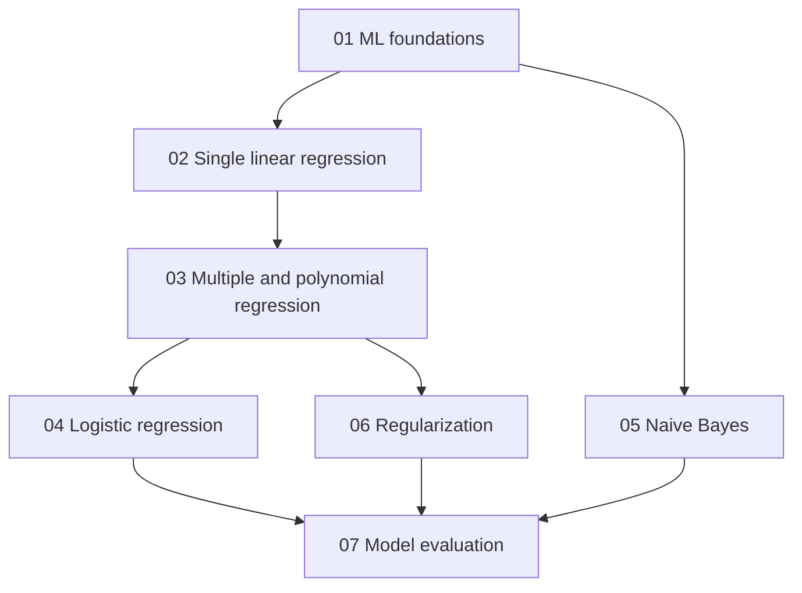

# DADS6003 Applied Machine Learning — Master Notes

ชุด Master Notes นี้เรียบเรียงจากเอกสารใน `lecture/`, `read/` และ `lab/` โดยใช้สไลด์เป็นโครงหัวข้อ ไม่ใช้ความสั้นของสไลด์เป็นเพดานของคำอธิบาย เนื้อหาถูกขยายให้ผู้อ่านที่พบหัวข้อเป็นครั้งแรกสามารถเข้าใจกลไก คำนวณ เขียน code แปลผล และตรวจข้อจำกัดได้โดยไม่ต้องเดาคำอธิบายที่หายไปจากสไลด์

## Recommended Reading Order

| ลำดับ | บท | ผลลัพธ์การเรียนรู้หลัก |
|---:|---|---|
| 1 | [Introduction to Machine Learning](01_introduction.md) | ตั้งโจทย์ด้วย Task–Experience–Performance และแยกประเภท ML |
| 2 | [Single Variable Linear Regression](02_linear_regression.md) | เข้าใจ model, MSE, Normal Equation และ Gradient Descent |
| 3 | [Multiple Linear Regression](03_multiple_linear_regression.md) | ขยายสู่หลาย features, scaling, SGD และ polynomial features |
| 4 | [Logistic Regression](04_logistic_regression.md) | แปลง linear score เป็น probability และตัดสิน class ด้วย threshold |
| 5 | [Naive Bayes Classification](05_naive_bayes_classification.md) | ใช้ Bayes' Rule, conditional independence และ likelihood ตามชนิดข้อมูล |
| 6 | [Regularization](06_regularization.md) | ควบคุม model complexity ด้วย Ridge, Lasso และ Elastic Net |
| 7 | [Model Training and Evaluation](07_model_evaluation.md) | แยก train/validation/test และเลือก metric/model อย่างซื่อสัตย์ |

## Dependency Map

บท 02 สร้างรากฐานเรื่อง hypothesis, loss และ optimization ก่อนขยายเป็นหลาย features ในบท 03 Logistic Regression ในบท 04 ยังคงใช้ linear predictor แต่เปลี่ยน output และ loss ส่วน Naive Bayes ในบท 05 เสนอวิธี classification อีกครอบครัวหนึ่ง บท 06 ควบคุมความซับซ้อนของโมเดล และบท 07 รวมทุกอย่างเข้ากับการเลือกโมเดลและการประเมินข้อมูลใหม่

## Source-to-Chapter Map

| Master Note | Lecture | Reading | Lab |
|---|---|---|---|
| 01 | `dads6003_01_introduction.pdf` | — | — |
| 02 | `dads6003_02_single_linear_regression.pdf` | `read01_linear_regression.pdf` | `linear_regression.ipynb` |
| 03 | `dads6003_03_multiple_linear_regression.pdf` | `read02_multiple_linear_regression.pdf` | — |
| 04 | `dads6003_04_logistic_regression.pdf` | `read03_logistic_regression.pdf` | `logistic_regression.ipynb` |
| 05 | `dads6003_05_naive_bayes_classification.pdf` | — | `naive_bayes.ipynb`, `naive_bayes_spam_email_classifier.ipynb` |
| 06 | `dads6003_06_regularization.pdf` | — | `regularization.ipynb` |
| 07 | `dads6003_07_model_evaluation.pdf` | — | — |

## Cumulative Learning Objectives

เมื่ออ่านครบชุด ผู้อ่านควรสามารถ:

1. แปลงปัญหาธุรกิจเป็น ML task ที่มี target, features และ metric ชัดเจน
2. อธิบายความต่างของ regression และ classification รวมถึงขอบเขตของ supervised/unsupervised learning
3. สร้าง Linear, Polynomial, Logistic และ Naive Bayes models พร้อมอธิบายกลไก
4. ป้องกัน data leakage ด้วยการแยกข้อมูลและใช้ preprocessing workflow ที่ถูกต้อง
5. วินิจฉัย underfitting, overfitting, bias และ variance
6. เลือก regularization และ model complexity จาก validation evidence
7. คำนวณและแปลผล regression/classification metrics ตามต้นทุนของความผิดพลาด
8. ตรวจ code, output และกราฟโดยไม่ถือว่า “รันผ่าน” เท่ากับ “ถูกต้อง”

## Integrated Transfer Challenge

เลือกปัญหาหนึ่งจากงานจริง เช่น lead-time prediction, demand prediction, spam detection หรือ vendor-risk screening แล้วดำเนินการดังนี้:

1. กำหนด Task, Experience และ Performance measure
2. ระบุ prediction time, target, feature availability และ leakage risks
3. สร้าง simple model และ model ที่ซับซ้อนขึ้นอย่างน้อยหนึ่งระดับ
4. ใช้ train/validation/test หรือ cross-validation อย่างเหมาะสม
5. เลือก preprocessing และ regularization จาก training/validation เท่านั้น
6. รายงาน metrics, residuals หรือ confusion matrix ตามชนิดงาน
7. อธิบาย failure modes, uncertainty และข้อจำกัดของข้อสรุป
8. เสนอเกณฑ์ monitor หลังนำไปใช้งาน

## Cumulative Exam Blueprint

| ระดับ | สิ่งที่ควรทำได้ | ตัวอย่างโจทย์ |
|---|---|---|
| Explain | อธิบาย concept และ mechanism | เหตุใด Logistic Regression ไม่ใช้เส้นตรงเป็น probability โดยตรง |
| Apply | คำนวณหรือทำหนึ่งขั้นตอน | คำนวณ MSE, gradient update, posterior หรือ F1 |
| Analyze | วินิจฉัยผลและข้อผิดพลาด | Train score สูงแต่ validation ต่ำเกิดจากอะไร |
| Evaluate | เลือกวิธีพร้อมเหตุผล | เลือก metric/threshold เมื่อ FN แพงกว่า FP |
| Create | ออกแบบ workflow | ออกแบบ pipeline ที่ไม่มี leakage และประเมินได้ซื่อสัตย์ |

## Final Revision Checklist

- [ ] อธิบายความต่างระหว่าง parameter, hyperparameter, loss และ metric ได้
- [ ] ทำ regression และ classification calculation ขนาดเล็กด้วยมือได้
- [ ] อ่าน coefficient โดยไม่สรุปเป็น causality ได้
- [ ] ระบุ preprocessing leakage จากลำดับ code ได้
- [ ] เลือก model complexity และ regularization จากข้อมูลที่ไม่ใช้ fit ได้
- [ ] คำนวณ confusion-matrix metrics และเลือก metric ตามโจทย์ได้
- [ ] อธิบายว่าเหตุใด test set ต้องใช้หลังล็อกการตัดสินใจแล้วได้

